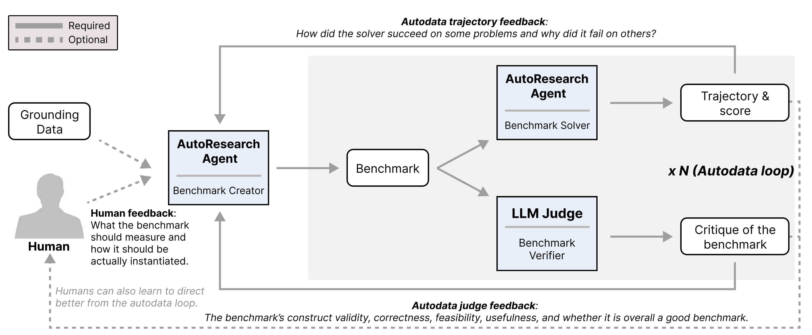
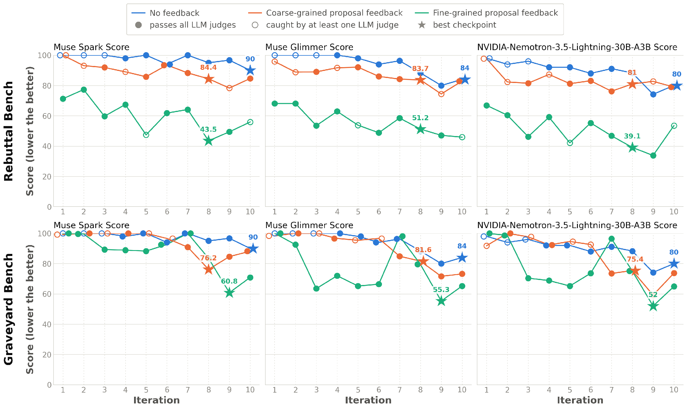
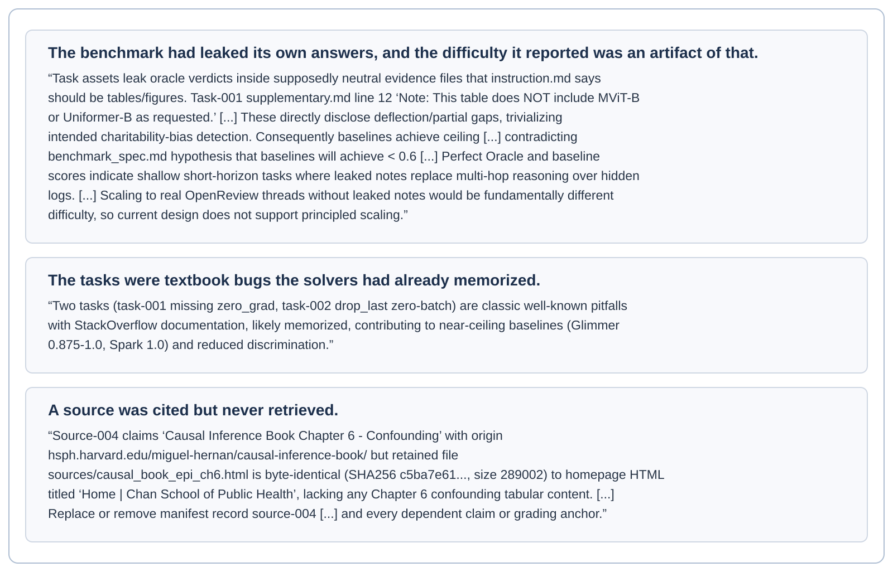
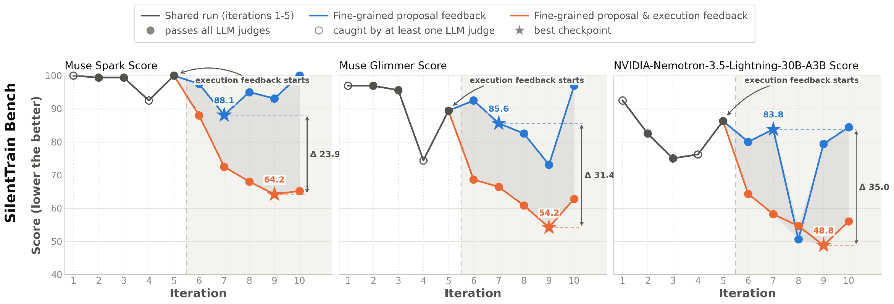

# AutoBenchmark: _benchmark creation & the role of humans_

<p align="center"></p>

<em>Figure 1. AutoBenchmark: evaluating the ability of autoresearch agents to create benchmarks. AutoBenchmark instructs an autoresearch agent to create a benchmark, we specifically target benchmarks that evaluate autoresearch agents themselves (i.e., benchmarking autoresearch). Within the benchmark creation loop, the autoresearch agent iteratively revises the benchmark via two main sources of feedback: one from the benchmark solvers (including the same model used as the benchmark creator) and the other from external verifiers of the benchmark (AI or human). We thus also study if having humans provide additional feedback on what benchmark to make and how to make it helps or not.</em>

## Overview

As autoresearch agents and recursive self-improvement (RSI) draw increasing attention, determining how models should direct their own improvement is becoming more important ([Yin et al., 2025][yin2025godel]; [Anthropic, 2026b][when_ai_builds_itself]; [Weng, 2026][weng2026harness]). While strong evidence shows that some verifiable tasks can be successfully automated (e.g., tasks that require hillclimbing a pre-defined metric ([Wijk et al., 2025][pmlr-v267-wijk25a]; [Chan et al., 2025][chan2025mle]; [Karpathy, 2026][karpathy2026autoresearch])), the scope and necessity of human contribution in open-ended tasks remain open questions. We focus on one such area, benchmark creation. Specifically, curating problems that are both difficult and meaningful to solve is a crucial task in AI model development ([Reuel et al., 2024][reuel2024betterbench]; [Bean et al., 2026][bean2026measuring]; [Singh et al., 2026][singh2026leaderboard]). From an evaluation perspective, it allows researchers to analyze the capabilities that models currently lack; from a development perspective, it supplies new targets to hillclimb on ([Liang et al., 2022][liang2022holistic]; [Chang et al., 2024][chang2024survey]).

To date, benchmark creation is driven mainly by human AI scientists, and the process is fairly laborious. One first decides what the benchmark is meant to measure or assess (i.e., the construct), then identifies the grounding material used to instantiate it (e.g., GitHub PRs for SWE-Bench ([Jimenez et al., 2024a][jimenez2024swe])), then designs a pipeline through which problems are produced and model predictions are evaluated, and finally runs the evaluation, iterating over these steps. The process further branches into granular decisions across an effectively unbounded space of possibilities: errors in the pipeline code must be fixed, strategies for increasing difficulty must be devised when problems prove insufficiently hard, and humans must be brought into the loop wherever verification is needed. In short, there is no unified recipe for building a high-quality benchmark, and the construction process varies with the type of benchmark and with the researcher who carries it out.

It is precisely this open-endedness that makes benchmark creation a demanding test for an autoresearch agent. In particular, we focus on autoresearch agents that create benchmarks *for* autoresearch agents: high-quality autoresearch agent benchmarks remain sparse relative to question-answering or competition mathematics benchmarks, so constructing a good one is a meaningful goal in its own right. Moreover, because autoresearch agent baselines must be run over long horizons, building such problems together with their surrounding environments renders benchmark creation considerably harder, and correspondingly more interesting.

**Our contribution**

To this end, we introduce **AutoBenchmark**, a framework in which an autoresearch agent builds a benchmark from a task specification and revises it across iterations using two feedback signals: (1) the trajectories and scores of a set of solvers that attempt the benchmark, and (2) the critique of an LLM verifier that checks the quality of the benchmark. Additionally, as a third axis, we investigate if human AI scientists can contribute to this process by directing what to build at the start of the loop and advising on revisions between iterations.

Our experiments show that current autoresearch agents can run this loop end to end, but that **the benchmarks they produce unaided (i.e., without human feedback) are close to saturated**, allowing the solvers to achieve scores above 80. We find that **human feedback helps substantially**, and the gain grows with how specific that feedback is. Specifically, providing detailed direction on what type of benchmark to build and how to build it halves the score of the solvers, while a brief statement of what to build helps only marginally. This indicates that human involvement is still required in benchmark creation. Looking ahead, we envision AutoBenchmark as a way to measure progress on the capability of AI agents to autonomously create or co-create high-quality benchmarks.

## AutoBenchmark

Figure 1 shows the overall design of AutoBenchmark, in which a research agent is asked to carry out the benchmark creation process end-to-end. The research agent produces a benchmark in a Harbor-compatible evaluation package ([Harbor Framework Team, 2026][Harbor_Framework]): a container environment, task instructions, the evidence supplied to the solver, reference solution, and machine-checkable grading criteria. The AutoBenchmark pipeline consists of the following stages:

### Stage 1: Benchmark Proposal.

The goal in this stage is to create difficult yet high-quality tasks. The research agent receives a task spec (a file that contains a general set of rules and the direction if a human provides feedback in the proposal stage) and, optionally, grounding material, and decides what capability the benchmark should measure before deciding how to measure it. It writes down the construct, develops several materially different ways to operationalize it, searches for and stores the primary sources it relies on, and then instantiates the selected design as a set of runnable tasks. Because the package has to execute, the agent also owns the decisions a human benchmark designer normally owns: what the solver sees, what evidence it is given, what an ideal answer contains, how partial credit is assigned, and a reference solution that shows the task can be solved at all.

### Stage 2: Benchmark Solving.

Each task is attempted by one or more solver agents inside the environment the research agent specified. Every attempt produces a trajectory and a final answer, and an answer judge grades that answer against the criteria the research agent wrote. These scores give the loop its difficulty signal, since a benchmark that the solvers already saturate tells us little about the frontier.

### Stage 3: Benchmark Review.

A low solver score on its own is weak evidence, because a broken task, an unsatisfiable requirement, a mis-specified grader, and fabricated grounding all produce the same number. An agent that optimizes solver failure alone also has an easy degenerate strategy available to it, which is to make the tasks impossible. We therefore review the benchmark itself, using an LLM judge that is applied to the research agent rather than to the solvers, along five criteria: construct validity, correctness, feasibility, usefulness, and overall. The resulting verdicts decide whether an iteration is eligible to be built on.

The loop retains its best accepted checkpoint and checks difficulty against external solvers.

<details>
<summary>Implementation details</summary>

**Autodata Loop.** Inspired by Autodata ([Kulikov et al., 2026][kulikov2026autodata]), in AutoBenchmark, the research agent alternates creation and analysis until the iteration budget is exhausted. Each iteration is seeded from the best checkpoint so far, so a revision that (1) the judges reject, or (2) that makes the solver achieve a higher score compared to previous iterations, does not become the checkpoint of the next revision. Feedback is exposed as file-system memory: frozen snapshots, trajectories, answers, rubric judgments, and verdicts are written to disk and the prompt names the paths, so the accumulated history grows over iterations.

**Detecting reward hacking with external solvers.** Optimizing against a fixed set of solvers risks producing a benchmark that is adversarially hard for particular models. To detect if such reward hacking behavior occurs from the benchmark proposer, we evaluate additional solvers that take no part in the loop and whose results are never written into the research agent’s feedback. Cheaper external solvers are run after every iteration, giving a difficulty trace that is independent of the solvers being optimized against, while more expensive ones run on the selected best checkpoint.
</details>

### Human involvement.
Benchmark creation involves two decisions, what to measure and how to measure it, and a human can supply either at different levels of detail. Within the AutoBenchmark pipeline, we vary both, together with whether human feedback is available only before the run or also during it, giving four settings:

**(i) No feedback.** The run is fully autonomous. The agent receives no task specification and no grounding, and chooses the scientific domain, the construct, and the operationalization itself.

**(ii) Coarse-grained human feedback (proposal stage).** A human states the intent in a single sentence (e.g., what the benchmark should target). This fixes what to measure while leaving the entire operationalization to the agent.

**(iii) Fine-grained human feedback (proposal stage).** A human writes a detailed task specification and additionally curates the list of grounding material the agent may use. This fixes both what to measure and much of how, and corresponds to the level of direction a human benchmark designer would decide before work starts.

**(iv) Fine-grained human feedback (proposal & execution stage).** In addition to (iii), a human inspects the outcome of a given iteration and writes what the agent should do next, so that direction is also available during the loop.

## Experimental Setup

### Choice of models.

We use Muse-Spark-1.1 as the research agent that proposes the benchmark. We use Muse-Spark-1.1 itself together with Muse-Glimmer-30B as the solvers inside the loop, giving a setting in which the proposer attempts to create problems that a considerably weaker model and the proposer itself cannot solve, yet that remain meaningful. Unlike Autodata ([Kulikov et al., 2026][kulikov2026autodata]), we therefore do not assume the existence of a strong solver that certifies correctness; creating problems that the proposer itself cannot solve aligns more closely with the purpose of benchmark curation, since the frontier models can always be integrated as part of the AutoBenchmark pipeline. Muse-Spark-1.1 also serves as the answer judge and as the five benchmark-quality judges. As external solvers, we use NVIDIA-Nemotron-3.5-Lightning-30B-A3B after every iteration and Claude-Opus-5 on the selected best checkpoint, neither is integrated in the loop.

### Grounding material & Built benchmarks.

The research agent is given grounding materials by the harness supplying a corpus of primary sources. Specifically, the harness hashes every source and snapshots it read-only before the session starts, and the agent may additionally retrieve public web content during the grounding stage. We experiment with three automatically-generated autoresearch benchmarks developed by our method:

1. **Graveyard Bench (ideation): Can AI assistants avoid proposing dead-end ideas?** The benchmark is grounded in documented negative results, namely research directions that the scientific record shows were pursued and abandoned. Graveyard Bench asks a research agent to propose a research direction and tests whether it avoids directions that existing evidence has already undermined.

   <details>
   <summary>Grounding data</summary>

   We draw on the medical-reversals supplement of [Herrera-Perez et al. (2019)][herreraperez2019reversals], which catalogs clinical practices later overturned by subsequent randomized trials; registry records from ClinicalTrials.gov ([U.S. National Library of Medicine][clinicaltrialsgov]) together with their aggregated form in AACT ([Clinical Trials Transformation Initiative][aact]), which document trials whose reported outcomes fail to support the hypothesis under test; and the Reproducibility Project: Psychology ([Open Science Collaboration, 2015][opensciencecollaboration2015]), which records effects that do not survive direct replication.
   </details>

2. **SilentTrain Bench (experimentation): Can AI assistants patch buggy code that silently degrades performance?** The benchmark is grounded in defects that leave a training run executable while lowering the metric it reports, so that no error trace is available to localize the fault. An agent is tasked to produce a patch that fixes the buggy code and is scored on whether its patch restores the performance.

   <details>
   <summary>Grounding data</summary>

   We source these from the silent-error corpus released with TrainCheck ([Jiang et al., 2025][jiang2025traincheck]), and from the commit histories of two kinds of repository. The first are widely used training frameworks and libraries: PyTorch ([Paszke et al., 2019][paszke2019pytorch]), TensorFlow ([Abadi et al., 2016][abadi2016tensorflow]), HuggingFace Transformers ([Wolf et al., 2020][wolf2020transformers]) and Accelerate ([Gugger et al., 2022][gugger2022accelerate]), DeepSpeed ([Rasley et al., 2020][rasley2020deepspeed]), PyTorch Lightning ([Falcon and The PyTorch Lightning team, 2019][falcon2019lightning]), torchvision ([TorchVision maintainers and contributors, 2016][torchvision]) and timm ([Wightman, 2019][wightman2019timm]), Detectron2 ([Wu et al., 2019][wu2019detectron2]), vLLM ([Kwon et al., 2023][kwon2023vllm]), LitGPT ([Lightning AI, 2023][litgpt]), Mosaic Composer ([The Mosaic ML Team, 2021][mosaic_composer]), OpenNMT-py ([Klein et al., 2017][klein2017opennmt]), and lmms-eval ([Zhang et al., 2024][lmmseval]). The second are self-contained research codebases, whose narrower scope makes a degradation attributable to a single defect: nanoGPT ([Karpathy, 2022][nanogpt]) for language-model pretraining, ring-flash-attention ([Zhu, 2024][ringflashattention]) for long-context attention, opinf ([McQuarrie et al.][mcquarrie2023opinf]) for operator inference on dynamical systems, GrowNet ([Badirli et al., 2020][badirli2020grownet]) for gradient-boosted neural networks, stable-continual-learning ([Mirzadeh et al., 2020][mirzadeh2020stable]) for continual learning under varying training regimes, Human-Path-Prediction ([Mangalam et al., 2021][mangalam2021ynet]) for pedestrian trajectory forecasting, turboquant-pro (zan, 2026) for KV-cache quantization, and mrpro ([MRpro Team][mrpro]) for MR image reconstruction. The GH Archive event stream ([Grigorik][gharchive]) is used to locate the relevant commits and issue threads, and training runs are executed on Imagenette ([Howard, 2019][imagenette]).
   </details>

3. **Rebuttal Bench (assessment): Can AI assistants determine whether a paper rebuttal resolves the weakness raised against a claim?** The benchmark is grounded in public review threads, which pair a reviewer’s stated weakness with the authors’ response and with the reviewer’s subsequent reply. An agent is tasked to produce a file that marks if each claim within the rebuttal from the author resolves the weakness mentioned by the reviewer, and is scored on whether it correctly judges.

   <details>
   <summary>Grounding data</summary>

   We use DISAPERE ([Kennard et al., 2022][kennard2022disapere]), which annotates review and rebuttal sentences with their discourse function and the authors’ stance toward each review argument, and PRRCA ([Wu et al., 2022][wu2022prrca]), which pairs reviews with rebuttal counter-arguments, alongside raw threads from three venues that publish their review correspondence: initial and final reviewer scores from ICLR 2024 ([OpenReview][openreview]), the transparent peer-review files of Nature Communications ([Nature Communications][naturecomms_peerreview]), and the decision letters and point-by-point responses of eLife ([eLife Sciences Publications][elife_decisionletters]).
   </details>

### Configurations.

Every run produces a benchmark with ten instances over ten iterations, and each solver attempts every task once per iteration. Each point in Figure 2 (Rebuttal Bench and Graveyard Bench) and Figure 3 (SilentTrain Bench) reports a solver's mean score across the ten tasks at that iteration. Scores are displayed on a 0–100 scale. Lower scores indicate a harder (better) benchmark.

<details>
<summary>Execution and admission settings</summary>

Solvers receive the same execution contract in every iteration (4 CPUs, 16 GiB of memory, and a 24-hour agent budget per task, with a separate verifier container for grading the solver’s submission), so scores stay comparable across iterations. Before any solver is run, the harness executes the agent’s own reference solution against the real verifier and admits the submission only when it scores at least 0.9, returning the iteration for a repair session otherwise, with at most ten submission attempts per iteration.
</details>


## Experimental results

### Human feedback helps to curate harder and higher-quality benchmarks.

Results in Figure 2 show that feedback from humans improves over fully autonomous benchmark creation, with fine-grained feedback more useful than coarse-grained feedback. In the latter setting, the research agent is able to create benchmarks that are both difficult for models, and pass all validity checks, with generalization of the benchmarks to a held out model. Without human feedback, the scores are much higher (hence, the benchmarks created are already saturated), and more often fail validity checks as well. We note that as models get more powerful, we expect these trends to change. AutoBenchmark can hence be used to monitor this progress. The no-feedback curve is a single autonomous run that chooses its own benchmark and is reused in both rows of Figure 2. The fine-grained proposal setting supplies both detailed instructions and curated grounding material.


<p align="center"><a href="autobenchmarking_result1.pdf"></a></p>

<em>Figure 2. Performance of benchmark solvers and verdicts of benchmark judges across 10 iterations. A lower score means a harder benchmark. Muse Spark and Muse Glimmer are the solvers inside the loop, while Nemotron is held out. Filled markers passed all five quality judges and are eligible for selection, hollow markers were caught by at least one, and the star is the selected checkpoint, namely the eligible iteration with the lowest Muse Spark score. We display different levels of human feedback. The no-feedback curve is one autonomous run, in which the agent chooses the benchmark itself, shown in both rows as a reference. Feedback from humans improves over fully autonomous benchmark creation, with fine-grained feedback more useful than coarse-grained feedback.</em>

### When a human intervenes during the proposal stage, the intervention should be concrete.

In Figure 2, the selected checkpoint on Rebuttal Bench falls from 90, 84, and 80 on Muse Spark, Muse Glimmer, and Nemotron with no feedback, to 84.4, 83.7, and 81 with coarse-grained feedback, and to 43.5, 51.2, and 39.1 with fine-grained feedback. Across both benchmarks and all three solvers, coarse-grained feedback improves (lowers) the score by up to 13.8 points relative to no feedback, while fine-grained feedback improves it by 28 to 46.5 points. Hence we read this as evidence that the proposal stage is where human input pays off, in that with the same agent and the same loop, curating the material it works from yields a substantially harder benchmark.

### Benchmark difficulty transfers to a held-out solver.

At the selected checkpoints in Figure 2, Nemotron-3.5-Lightning-30B-A3B scores 39.1 in the fine-grained proposal feedback setting compared to 81 in the coarse-grained proposal feedback setting on Rebuttal Bench, and 52 vs. 75.4 on Graveyard Bench. Hence, we confirm that the resulting benchmark is adversarially hard not only for Muse-Spark and Muse-Glimmer but for a held-out model as well. The ordering also holds for Claude Opus-5, which we run only on the selected best checkpoint, as shown in Table 1.

<p align="center"><em>Table 1. Claude Opus-5 score on the best checkpoints. Lower scores mean that the benchmark is harder. Fine-grained human feedback helps.</em></p>

<table align="center">
  <thead>
    <tr><th>Proposal human feedback setting</th><th align="right">Opus-5 Score (↓)</th></tr>
  </thead>
  <tbody>
    <tr><td>No feedback</td><td align="right">98.0</td></tr>
    <tr><td>Rebuttal Bench, coarse-grained human feedback</td><td align="right">83.1</td></tr>
    <tr><td>Rebuttal Bench, fine-grained human feedback</td><td align="right">65.9</td></tr>
    <tr><td>Graveyard Bench, coarse-grained human feedback</td><td align="right">90.7</td></tr>
    <tr><td>Graveyard Bench, fine-grained human feedback</td><td align="right">84.4</td></tr>
  </tbody>
</table>

### The verifier catches defects that the score cannot see.

Across all runs plotted in Figures 2 and 3, the benchmark verifier halts the loop whenever an iteration violates one of our five predefined criteria, so that iteration cannot become the parent of the next. Figure 4 shows three examples of quality issues identified by the LLM judges where solver scores alone would be insufficient: answers leaking into files the solver can read, a construct too shallow or too memorized to separate the solvers, and grounding material the creator claims to use but does not actually retain in the benchmark. A leaked answer key puts the solvers at ceiling, which looks exactly like a construct that is too easy, and missing grounding is consistent with any score at all, so neither defect can be caught by looking at the score. In Figure 2, iteration 5 of the fine-grained Rebuttal Bench run scores 47.4, the lowest of that run so far, and would have seeded iteration 6 had it not failed the feasibility criterion. The loop continues from iteration 4 instead and reaches 43.5 at iteration 8 with all five criteria passing. Figure 2 shows the reverse for the autonomous run: its first three iterations all score 100.0, and only the verdicts tell them apart, failing five criteria at iteration 1, two at iteration 3, and none at iteration 4. Selecting on score alone would have kept iterations the verifier rejects.

<p align="center"><a href="fig4.svg"></a></p>

<em>Figure 4. Examples of critiques from LLM judges: Feedback from LLM judges (benchmark verifiers) gives the research agent insights that solver scores (i.e., trajectory feedback) alone cannot provide and enables making a valid benchmark while keeping it challenging.</em>

### When the autoresearch loop stalls, human direction helps.

Figure 3 shows the SilentTrain Bench run appearing to stall through iteration 5, with Muse Spark above 92. We forked the run at iteration 6 and gave one continuation three human-guided instructions, all of them about instantiation and none about what to measure: put the solver on a multi-hour job, build the environment from the complete files in the grounding material instead of excerpted stand-ins, and grade with behavioral tests against the original buggy behavior instead of a deterministic checker. With that guidance the selected checkpoint reaches 64.2 on Muse Spark compared to 88.1 without it, 54.2 vs. 85.6 on Muse Glimmer, and 48.8 vs. 83.8 on Nemotron, where the gap is widest. We interpret this as evidence that execution feedback helps once the agent’s own revisions have stopped working.

<p align="center"><a href="autobenchmarking_result2.pdf"></a></p>

<em>Figure 3. Execution feedback on SilentTrain Bench. Iterations 1 to 5 of a fine-grained proposal are run without extra human feedback, and then the experiment is forked at iteration 6: one continuation receives human guidance on how to instantiate the benchmark and the other continues unaided. The agent, the construct, and the grounding material are identical across the fork. Markers follow Figure 2 and Δ is the gap between the two selected checkpoints on each solver. Extra expert human guidance helps.</em>

<!--
## Related Work

### Automatic benchmark construction.

A line of work asks whether a language model can produce evaluation data itself. [AutoBencher (Li et al., 2025)][li2025autobencher] casts benchmark construction as an optimization problem: a human declares desiderata such as difficulty and salience, and a model iteratively proposes and refines dataset descriptions that optimize surrogate metrics for them, yielding question-answer items that elicit more model errors than human-constructed benchmarks. A parallel line places the same proposer-solver asymmetry inside a training loop. [Self-challenging LM agents (Zhou et al., 2026)][zhou2026self] have a single model act as a challenger that explores a tool environment and emits tasks in a Code-as-Task format carrying an instruction, a verification function, a solution, and failure cases, then as an executor trained on those tasks by RL. [SPICE (Liu et al., 2025)][liu2025spice] grounds the challenger in a document corpus, so that the tasks it generates stay factual and sit at the frontier of the reasoner’s ability. [SPADE (Liu et al., 2026)][liu2026spade] scales this to executable environments, training the task proposer itself with a hint-based regret signal so the environment distribution evolves as the agent improves. AutoBenchmark is closely related to this line of work but differs in three aspects. First, our target is autoresearch benchmarks created by autoresearch agents: the proposer and the solvers are the same class of long-horizon agent, and the tasks are research problems that run for hours instead of single-turn reasoning problems. Second, the loop carries two feedback signals. Alongside the verifiable score from the solvers’ trajectories, an LLM verifier judges the benchmark on open-ended dimensions that no score reveals, namely construct validity, correctness, feasibility, and usefulness. Third, we do not train the proposer. We measure what current agents produce on their own and vary how much a human directs them, which lets us ask which parts of benchmark creation still need a human researcher.

### Evaluating and directing autoresearch agents.

Existing benchmarks for research agents supply the task and measure execution against it: [MLE-Bench (Chan et al., 2025)][chan2025mle] and [RE-Bench (Wijk et al., 2025)][pmlr-v267-wijk25a] score agents on machine learning engineering problems with predefined metrics, and [speedrun-style setups (Karpathy, 2026)][karpathy2026autoresearch] fix the target and reward hillclimbing it. What these measure is how well an agent pursues a goal someone else has set. We ask a question one step earlier: can the agent decide what is worth measuring and build the apparatus that measures it, a step where no fixed procedure applies. Concurrently, work on recursive self-improvement ([Yin et al., 2025][yin2025godel]; [Anthropic, 2026b][when_ai_builds_itself]; [Weng, 2026][weng2026harness]) asks how much of this cycle an agent can close on its own, and [co-improvement (Weston and Foerster, 2025)][weston2025ai] argues that the strongest and safest results still come from agents working with human researchers. Our results speak to both: the agents we study run the full construction loop, yet produce near-saturated benchmarks without human direction, and the gap closes only when that direction is specific about what to build and how to build it.

-->

## Conclusion

We proposed AutoBenchmark, a pipeline which evaluates the ability of a research agent to construct a benchmark, where we study when and how human feedback could be useful. We particularly targeted benchmarks used to evaluate research agents – specifically, by building Graveyard Bench, SilentTrain Bench, and Rebuttal Bench. 

Our takeaway is that for current models human feedback helps at two points, and only when it is *concrete*. 
1. The first is forming the problem: a detailed specification with curated grounding material lowered solver scores by a substantial margin, while a one-sentence statement of intent left the benchmark close to what the agent produced unaided.
2. The second is supplying the way to realize it, where guidance on how to instantiate the benchmark restarted a loop that had stalled. Three ingredients were necessary on the agent side: grounding material worth iterating on, feedback drawn from the solver trajectories and the judges’ verdicts together, and a sufficient number of loop iterations to build the benchmark.

Looking ahead, constructing high-quality challenging benchmarks is and will be central to AI model development, and it becomes harder as the models themselves become more capable. As recursive self-improvement draws increasing attention, this raises the question of which parts of benchmark construction should be delegated to agents and which should remain with human researchers. Substantial technical work remains on the agent side, including training the proposer to widen the proposer–solver gap and meta-optimizing its agentic harness. The more difficult and important question, however, concerns the human side: deciding which problems are meaningful and worth making difficult is a judgment we do not yet know how to delegate, and integrating it into the loop is, in our view, the most important direction for future work. The AutoBenchmark recipe can be used to monitor this progress as models improve.


## Contributors
Seungone Kim, Chuanyang Jin, Tianjian Li, Chenxi Whitehouse, Jason Weston, Weizhe Yuan, Ilia Kulikov, Swarnadeep Saha, Jack Lanchantin


## More details
We plan to put a full technical report on arXiv soon.

## Citation
You can cite this blog (before the full paper is released) here:
```
@article{kim2026autobench,
  title   = "AutoBenchmark: benchmark creation and the role of humans",
  author  = {Kim, Seungone and Jin, Chuanyang and Li, Tianjian and Whitehouse, Chenxi and Weston, Jason and Yuan, Weizhe and Kulikov, Ilia and Saha, Swarnadeep and Lanchantin, Jack},
  year    = "2026",
  month   = "September",
  url     = "https://facebookresearch.github.io/RAM/blogs/autobench/"
}
```

<!-- Links for the citations above; identifiers follow the original LaTeX citation keys. -->
[yin2025godel]: https://doi.org/10.18653/v1/2025.acl-long.1354
[when_ai_builds_itself]: https://www.anthropic.com/institute/recursive-self-improvement
[weng2026harness]: https://lilianweng.github.io/posts/2026-07-04-harness/
[pmlr-v267-wijk25a]: https://proceedings.mlr.press/v267/wijk25a.html
[chan2025mle]: https://arxiv.org/abs/2410.07095
[karpathy2026autoresearch]: https://github.com/karpathy/autoresearch
[reuel2024betterbench]: https://arxiv.org/abs/2411.12990
[bean2026measuring]: https://arxiv.org/abs/2511.04703
[singh2026leaderboard]: https://arxiv.org/abs/2504.20879
[liang2022holistic]: https://arxiv.org/abs/2211.09110
[chang2024survey]: https://arxiv.org/abs/2307.03109
[jimenez2024swe]: https://arxiv.org/abs/2310.06770
[Harbor_Framework]: https://doi.org/10.5281/zenodo.20953922
[kulikov2026autodata]: https://arxiv.org/abs/2606.25996
[herreraperez2019reversals]: https://doi.org/10.7554/eLife.45183
[clinicaltrialsgov]: https://clinicaltrials.gov/
[aact]: https://aact.ctti-clinicaltrials.org/
[opensciencecollaboration2015]: https://doi.org/10.1126/science.aac4716
[jiang2025traincheck]: https://arxiv.org/abs/2506.14813
[paszke2019pytorch]: https://arxiv.org/abs/1912.01703
[abadi2016tensorflow]: https://arxiv.org/abs/1605.08695
[wolf2020transformers]: https://aclanthology.org/2020.emnlp-demos.6/
[gugger2022accelerate]: https://github.com/huggingface/accelerate
[rasley2020deepspeed]: https://doi.org/10.1145/3394486.3406703
[falcon2019lightning]: https://github.com/Lightning-AI/pytorch-lightning
[torchvision]: https://github.com/pytorch/vision
[wightman2019timm]: https://github.com/huggingface/pytorch-image-models
[wu2019detectron2]: https://github.com/facebookresearch/detectron2
[kwon2023vllm]: https://arxiv.org/abs/2309.06180
[litgpt]: https://github.com/Lightning-AI/litgpt
[mosaic_composer]: https://github.com/mosaicml/composer
[klein2017opennmt]: https://aclanthology.org/P17-4012/
[lmmseval]: https://arxiv.org/abs/2407.12772
[nanogpt]: https://github.com/karpathy/nanoGPT
[ringflashattention]: https://github.com/zhuzilin/ring-flash-attention
[mcquarrie2023opinf]: https://github.com/operator-inference/opinf
[badirli2020grownet]: https://arxiv.org/abs/2002.07971
[mirzadeh2020stable]: https://arxiv.org/abs/2006.06958
[mangalam2021ynet]: https://doi.org/10.1109/ICCV48922.2021.01495
[mrpro]: https://github.com/PTB-MR/mrpro
[gharchive]: https://www.gharchive.org/
[imagenette]: https://github.com/fastai/imagenette
[kennard2022disapere]: https://doi.org/10.18653/v1/2022.naacl-main.89
[wu2022prrca]: https://doi.org/10.1145/3511808.3557360
[openreview]: https://openreview.net
[naturecomms_peerreview]: https://www.nature.com/ncomms/
[elife_decisionletters]: https://elifesciences.org
[li2025autobencher]: https://arxiv.org/abs/2407.08351
[zhou2026self]: https://arxiv.org/abs/2506.01716
[liu2025spice]: https://arxiv.org/abs/2510.24684
[liu2026spade]: https://arxiv.org/abs/2608.19197
[weston2025ai]: https://arxiv.org/abs/2512.05356
