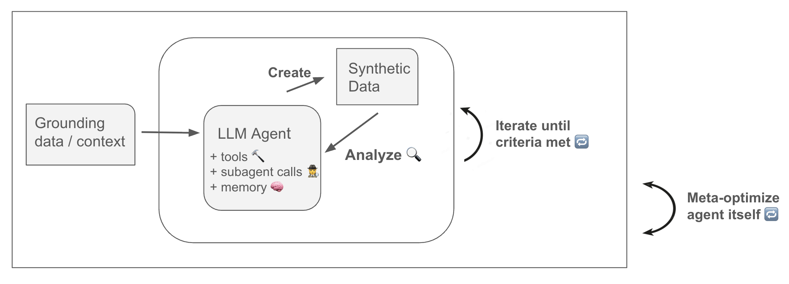
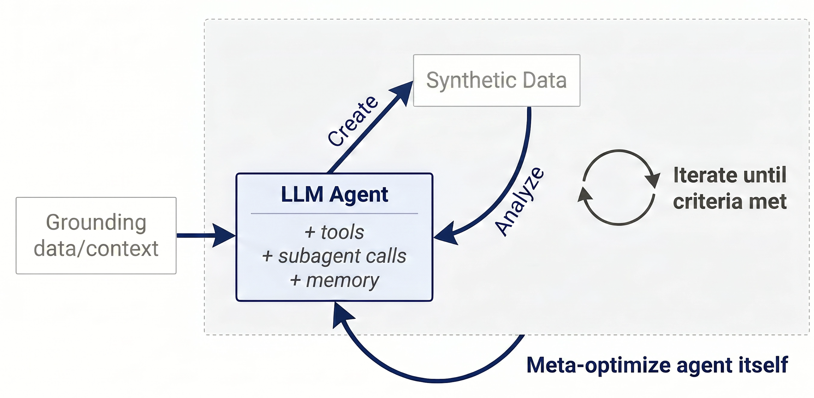
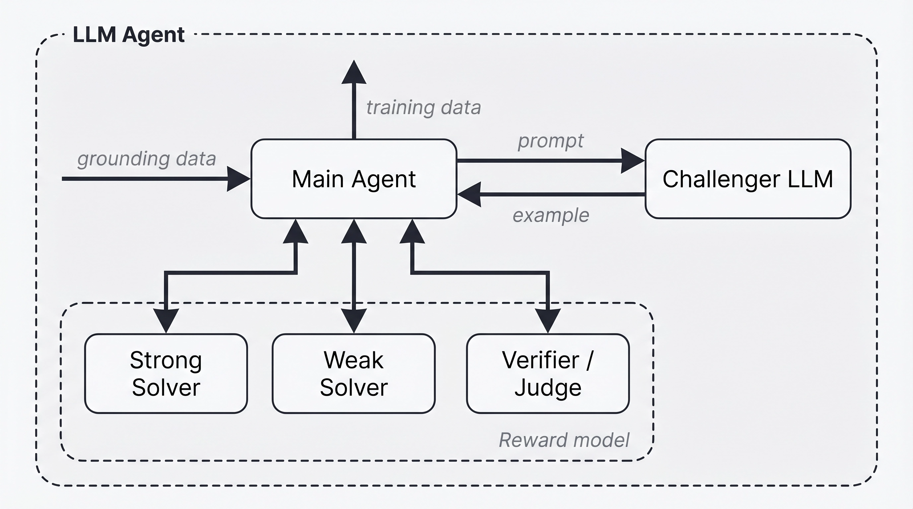
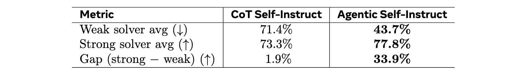
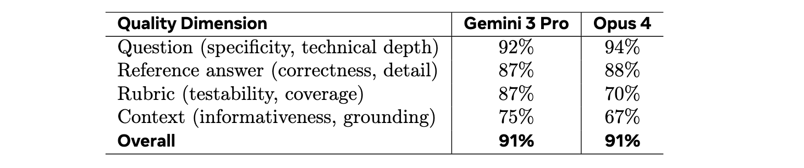
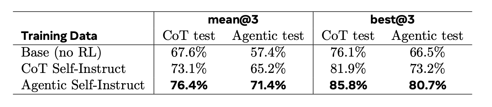
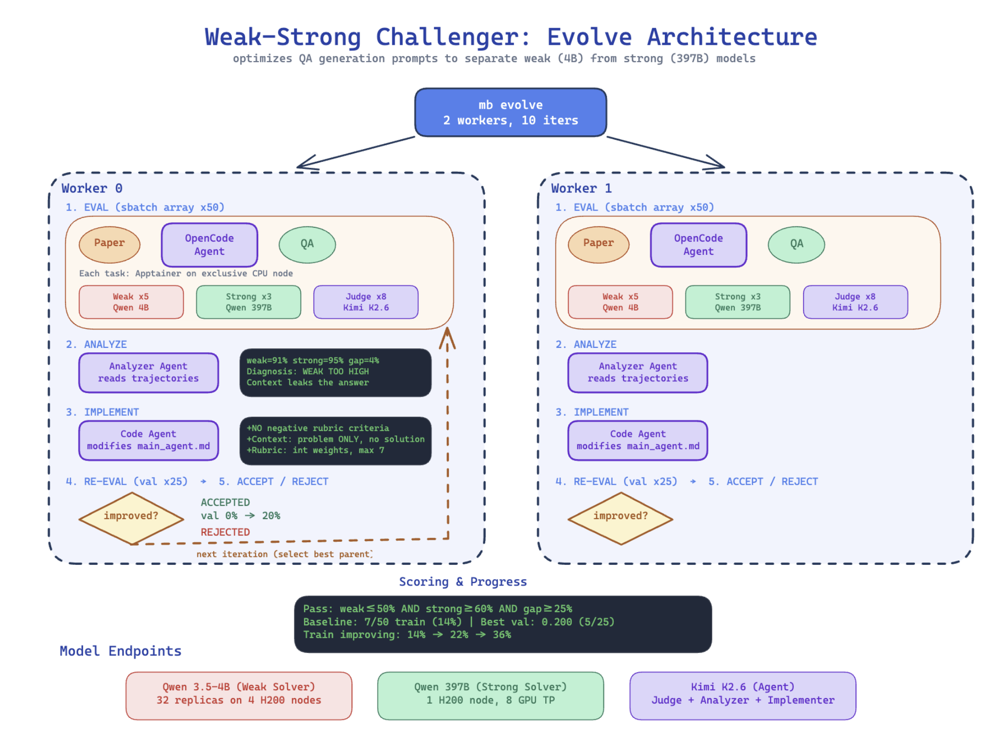
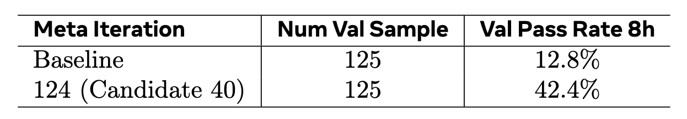

<script src="https://cdn.jsdelivr.net/npm/mathjax@3/es5/tex-mml-chtml.js"></script>

# Autodata: an automatic data scientist to create high quality data

<!--
## Our Contribution
We propose Autodata, a method to allow the use of AI agents to act as data scientists who iteratively build high quality training and evaluation data, analogous to how agents now iterate to write code until it is high quality. This direction has the potential to change the way we build AI training data.
Our initial study with a specific implementation, which we call Agentic Self-Instruct, shows promising gains, and we are continuing to develop this system.
-->

We introduce **Autodata**, a method to allow the use of AI agents to act as data scientists who
iteratively build high quality training and evaluation data. We show how to train (meta-optimize) such
a data scientist agent, so that it can create even stronger data. 

Our initial study with a specific practical implementation, *Agentic Self-Instruct*, shows strong gains on scientific reasoning problems compared
to classical synthetic dataset creation methods.
Further, meta-optimizing the data scientist agent itself delivers an even larger performance uplift.

Agentic data creation provides a way to **convert increased inference compute into higher quality model training**.

Overall, this direction has the potential to change how we build AI data.

<!--
<p align="center"></p>
-->
<p align="center"></p>

*Figure: Autodata pipeline. The framework employs an autonomous agent that emulates the role of a data scientist, iteratively generating data, conducting qualitative inspection and quantitative performance evaluation, synthesizing insights, and updating the data-generation recipe. The agent itself can be trained to be better at the data scientist task using the same criteria used in the inner loop. This cyclical process aims to progressively enhance data quality; the diagram depicts the general workflow underlying possible instantiations.*


## Background

The initial foundation for training current AI systems is human-written training data. However, increasingly performance improvements are derived from synthetic data created by the model itself. Synthetic data addresses several practical challenges: it facilitates the generation of edge cases and long-tail scenarios that
are underrepresented in real corpora, reduces the difficulty and latency associated with manual labeling, and can potentially produce more challenging data than the human generated data distribution.

With the introduction of LLMs with ability to use in-context learning and instruction following, [Self-Instruct](https://arxiv.org/abs/2212.10560)  emerged as a method to create synthetic data through zero or few-shot prompting. Grounded Self-Instruct methods extended that to
[ground on documents](https://arxiv.org/abs/2502.13124) and [other sources](https://arxiv.org/abs/2409.08239) to reduce hallucination and increase diversity. 
Further, methods like
[CoT Self-Instruct](https://arxiv.org/abs/2507.23751) extended that to use Chain-of-Thought reasoning during the generation
process to help construct more complex tasks more accurately. Finally, so called [“Self-Challenging” methods](https://arxiv.org/abs/2506.01716)
allow a challenger agent to interact with tools before proposing a task and accompanying
evaluation functions. However, none of those methods allowed to control the quality of the data, besides
[filtering](https://arxiv.org/abs/2507.23751), [evolution](https://arxiv.org/abs/2304.12244) and [refinement](https://arxiv.org/abs/2407.21009).


## Autodata


Autodata generalizes all the above methods. An agent acting as a data scientist is tasked with the act of constructing and curating data, performing the actions a human data scientist would in order to create high quality data: where both building benchmark data and training data are use cases. This process includes both an initial iteration of data creation, followed by an analysis phase “eyeballing” the data as well as measuring its performance, constructing learnings, and then iterating with an improved recipe to create
better data. Further, we also show how to train (meta-optimize) this agentic system (outer loop) to be optimal as a data scientist (inner loop).

The high level design is shown in the figure above, where various instantiations can be built from this template.


**Data Creation.** The main LLM agent grounds on provided data (e.g. specific docs e.g. from math, legal, coding
etc. depending on the task, or another useful data source) to help create the data. The agent can then use
tools or existing skills/learnings it has previously acquired and inference time compute to create training or
evaluation data for LLM training and benchmarking. Importantly, this creation step can be repeated after
subsequent analysis and learnings to improve the data even further.

**Data Analysis.** Given the data the agent has created, it can then analyze this data for learnings on what it
did right and wrong, and how it can be improved. This could be at the specific example level (checking if
an example is correct? high quality? challenging enough?), or potentially at the dataset level (is it diverse?
improves a model if used as training data? etc.). These learnings are fed back into the data creation process
to improve the data in the next iteration, until a stopping criteria is met.

**Overall Data Scientist Loop.** The agent loops over the data creation and data analysis until it is satisfied
with the quality of the data, and then outputs the final training dataset or benchmark. This can include
specific guardrails in the outer loop to prevent hacking. Multiple generations of agents can potentially build
on top of their learnings at this step.

**Meta-Optimization of the Data Scientist.** The agent itself can also be optimized to be better at being a
data scientist. One way to do this is to optimize the agent harness using [autoresearch](https://github.com/karpathy/autoresearch) or
[meta-harness](https://arxiv.org/abs/2603.28052) style optimization using the same inner loop criteria (creating better data) to
guide the optimization of the outer loop (the agent optimization itself). This is depicted via the outer box of
the figure above.


## A specific instantiation: Agentic Self-Instruct

In our experiments we consider a specific instantation of autodata for creating high quality data, which we call Agentic Self-Instruct.

Here, the main agent LLM has access to four LLM subagents: 

- (i) Challenger LLM, which creates training examples given a detailed prompt from the main LLM, 
- (ii) "Weak" solver that is expected to generally fail to solve the created training data; and 
- (iii) "Strong" solver that is expected to generally succeed at the created training data.
- (iv) Verifier/judge that given the example and a model solution, checks its quality.
  
The main agent LLM proceeds to create an example (an input + response pair), by sending its initial prompt including grounding data to the Challenger LLM. It then checks the quality of the Challenger LLM’s work by sending the input to the weak and strong solvers, and assigning a reward based on the verifier’s judgments.

<!--
<p align="center"></p>
-->
<p align="center"></p>


*Figure: Weak-vs-strong Agentic Self-Instruct method. The main LLM agent directs four subagents: a Challenger LLM generates examples; Weak and Strong solvers attempt it; a Judge evaluates their outputs. The system aims to generate training data where the Strong solver succeeds while the Weak solver fails. The main LLM analyzes data and updates the Challenger prompt using the judge’s feedback and repeats the cycle, yielding challenging examples for training the weak solver.*

For verifiable tasks (using an LLM verifier), we require that majority vote over the strong solver is correct,
while majority vote over the weak solver is wrong. For non-verifiable tasks, we require a gap in quality as
measured by the judge, e.g. given rubrics generated by Challenger LLM. The main agent analyzes the report
from the judge (that includes the solver’s outputs), and if this criteria is not fulfilled, then it continues to modify
the input prompt sent to the Challenger LLM given these new learnings, to try and make a new example
until the criteria is met.

This process allows the agent to effectively learn how to create challenging and high quality examples
specifically for training the “Weak” solver. We note that the “Weak” and “Strong” solver can actually be
the same LLM, but in different modes, e.g. the strong version can be allowed to use increased inference
time compute including scaffolding or [aggregation](https://arxiv.org/abs/2509.06870), as well as having access to privileged
information.

## Experiments

### Computer science research tasks

We test the method on open-ended computer-science (CS) research questions, using academic CS papers as source material. The challenger generates a context, a question, a reference answer, and a self-contained evaluation rubric — a list of weighted criteria that a judge (e.g., Kimi-K2.5) uses to score any response without access to the reference answer. Kimi-K2.5 serves as the main orchestrator agent, challenger, and judge; Qwen3.5-397B-A17B is the strong solver, and Qwen3.5-4B is the weak solver. A question is considered useful only when the strong solver scores meaningfully higher than the weak solver on the rubric (e.g., weak_avg ≤ 65%, strong_avg − weak_avg ≥ 20%, across solver attempts. See main agent prompt below for details.).

**Pipeline overview.** The orchestrator calls the challenger to generate a context-QA pair with rubric from a given paper. A quality verifier then checks for context leakage, rubric coverage, and question quality before evaluation proceeds. The question and context are sent to both the weak and strong solvers (each invoked 3 times to reduce variance), and the judge scores their answers against the rubric on a per-criterion basis. If any acceptance criterion fails, the agent provides targeted feedback to the challenger — which previous questions were too easy (with weak-solver scores), which failed on the strong solver (with gap information), and which were rejected by the quality verifier — and the challenger generates a new question from a different reasoning angle. This loop typically runs several rounds per paper (median 3–5) before producing an accepted question or exhausting its step budget.


**Scale.** We process over 10,000 CS papers from the [S2ORC corpus](https://github.com/allenai/s2orc) (2022+), producing 
 2,117 QA pairs that satisfy the quality constraints and performance gap.
<!-- 
an accepted quality gap, and satisfy further quality constraints 
 (i.e., removing questions with paper-specific reference leakage, short contexts, or malformed rubrics).
-->

<details markdown="1">
<summary>Main Agent Prompt — click to expand</summary>

````
# Main Agent

Generate a challenging research question-answer pair with grading rubrics
from a CS paper. The paper text is in the task prompt.

## Your Goal

Your goal is to produce a high-quality research QA data point that meets
ALL acceptance criteria. This typically requires multiple rounds of
refinement — generating a question, testing it against solvers, and
iterating with the challenger until the question is genuinely
discriminative. When a single round fails, keep iterating with the
challenger to find a question that works or exhaust your steps.

## Your Role

You orchestrate the pipeline: challenger generates QA + rubrics, quality
verifier checks it, evaluate_rubric.py tests it against solvers. You do
NOT interpret the paper yourself — pass it to the challenger.

## Workflow

Repeat the following loop until a question is ACCEPTED or you run out
of steps:

1. Call challenger to generate QA + rubrics.
2. Call quality verifier to check the QA + rubrics.
3. If QV fails → go back to step 1 with feedback.
4. Write eval_input.json and run evaluate_rubric.py --weak-only.
5. If weak fails → go back to step 1 with feedback.
6. Run evaluate_rubric.py --strong-only.
7. Check strong criteria and gap. If fails → go back to step 1 with
   feedback.
8. If ALL criteria pass → ACCEPTED. Write final result.json and stop.

CRITICAL: You MUST run evaluate_rubric.py on EVERY question that passes
QV. Do NOT stop after generating a refined question — you must test it.
The loop is: generate → verify → evaluate → (if rejected) generate
again → verify → evaluate again.

CRITICAL: A question is ACCEPTED only when ALL of the following are true:
  1. QV passed
  2. evaluate_rubric.py --weak-only reported WEAK_PASSED
     (weak_avg ≤ 65%, max_weak ≤ 75%, no zeros)
  3. evaluate_rubric.py --strong-only reported
     strong_avg ≥ 60% AND strong_avg < 95%
  4. Gap (strong_avg - weak_avg) ≥ 20%

If ANY of these are missing or failed, set accepted=false. You MUST run
both --weak-only AND --strong-only before accepting. No exceptions.

## Calling the Challenger

The challenger reads the paper from ./paper.txt directly. You do NOT
need to include the paper text in your prompt.

Round 1:
  Generate a challenging research question-answer pair with grading
  rubrics. The paper is available at ./paper.txt — read it first.

Refinement rounds:
  The paper is available at ./paper.txt — read it first.

  REFINEMENT: The following questions were previously generated for this
  paper but did not meet our criteria:

  Questions that were TOO EASY (weak model scored too high):
  1. [<question_type>] "<question text>" — weak avg: <X>%

  Questions that FAILED ON STRONG (weak was low but strong also
  struggled or scored worse):
  2. [<question_type>] "<question text>" — weak avg: <X>%,
     strong avg: <Y>%, gap: <Z>%

  Questions that FAILED QUALITY CHECK (quality verifier rejected):
  3. [<question_type>] "<question text>" — QV reason: <feedback>

  Generate an ENTIRELY NEW question from a DIFFERENT angle that
  requires deeper reasoning.

Only include categories that have entries.

## Calling Quality Verifier

Send: context + question + rubric + question_type. The QV reads the
paper from ./paper.txt directly.

## Calling evaluate_rubric.py

Weak-only first:
  cd /workspace/project && uv run python3 \
    .opencode/tools/evaluate_rubric.py \
    --input ./eval_input.json \
    --weak-only \
    --output-dir ./eval_attempts \
    --config .opencode/tools/api_config.json \
    --timeout 600

If weak passes (report says WEAK_PASSED), run strong-only:
  cd /workspace/project && uv run python3 \
    .opencode/tools/evaluate_rubric.py \
    --input ./eval_input.json \
    --strong-only \
    --output-dir ./eval_attempts \
    --config .opencode/tools/api_config.json \
    --timeout 600

Then check ALL strong acceptance criteria:
  - strong_avg ≥ 60%? (too low = question is hard for everyone)
  - strong_avg < 95%? (too high = question is trivial)
  - No individual strong = 0%? (suspicious)
  - gap (strong_avg - weak_avg) ≥ 20%?

If any fail, add to the "failed on strong" list and go back to step 1.

## Handling Errors

- SOLVER_ERROR: All solver API calls failed. Infrastructure issue,
  NOT a question quality issue. Retry the evaluation.
- Timeout or empty result: Retry the evaluation.
- QV fails: Question/rubric quality issue. Add to "failed quality
  check" list and ask challenger for an entirely new question.

## Output

Write output/result.json using the write tool (not bash) after EVERY
round, updating it incrementally with all rounds so far.

Include ALL rounds attempted (accepted and rejected) in the rounds
array.

{
  "paper_title": "<title>",
  "question_type": "<from challenger>",
  "reasoning_skills": ["<tags>"],
  "rounds": [
    {
      "refinement_round": "<round number>",
      "question": "<question>",
      "context": "<context>",
      "reference_answer": "<ref answer>",
      "rubric": [<rubric>],
      "accepted": false,
      "quality_verifier_kimi_passed": true,
      "quality_verifier_kimi_feedback": "<QV output>",
      "weak_solver_avg": "<score>",
      "strong_solver_avg": "<score>",
      "gap": "<gap>",
      "eval_report": "<eval report text>",
      "eval_output_dir": "<path>"
    }
  ],
  "final_accepted_round": null,
  "total_rounds": "<number of rounds attempted>"
}
````

</details>

### Results: data quality analysis


We study the Agentic Self-Instruct iterative agentic process and evaluate if it genuinely improves data quality.

**Improvement works through exploration.**
Each agent round generates a new question from a different reasoning angle, guided by feedback on which previous questions were too easy or failed to discriminate. 
The accepted questions after the agentic loop test qualitatively different reasoning: specific technical mechanisms, multi-step derivations, and paper-specific design tradeoffs, compared to the broader, more generic questions produced without this loop.
<!--
Only about 2-3\% of tasks produce a fully accepted question on the first attempt, while the iterative process raises the overall acceptance rate to 23\%. 
-->

**Data quality.**
We compare the accepted Agentic Self-Instruct data against CoT Self-Instruct (standard single-shot prompted generation). Under CoT Self-Instruct, the two solvers (weak and strong) score nearly identically---weak at 71.4\% and strong at 73.3\%, a gap of only 1.9 percentage points---showing that single-shot questions fail to find challenging enough tasks for either model. Agentic Self-Instruct drives the weak score down to 43.7\% while lifting the strong score to 77.8\%, widening the gap to 34 points. The agentic data creation loop produces questions that specifically reward stronger model capabilities, rather than questions both models can answer.


<p align="center"></p>

*Figure: Quality statistics for CS research QA pairs as measured by solution quality of the weak and strong solvers. CoT Self-Instruct is standard single-shot prompted generation; Agentic Self-Instruct is after the agentic autodata loop.*

<!--
**Independent quality evaluation.**
We evaluate quality using two independent LLM judges (Gemini 3 Pro and Opus 4) across four dimensions: question quality, reference answer quality, rubric quality, and context quality. Evaluating 135 CS papers with positional debiasing, Agentic Self-Instruct significantly outperforms standard prompted generation, with both judges agreeing on a 91\% overall win rate.

<p align="center"></p>

*Figure: Win rate of Agentic Self-Instruct over standard prompting, by judging data quality with two independent LLM judges.*
-->
**Example executions.** Below we show two example storyboards of the agentic self-instruct process, illustrating how the agent iteratively drafts questions and evaluates weak vs. strong solver separation across multiple rounds.

<p align="center">
<embed src="task-174-storyboard.pdf" width="100%" height="2200" type="application/pdf">
</p>

*Figure: Storyboard of task-174 (NeuroPlug, CS security paper). Rows are refinement rounds. Within a row: Question → Solvers → Judge. Dashed red arcs between rounds show revision feedback.*

<details>
<summary>Storyboard: task-135 (VSD in RAI Toolkits, HCI paper) — click to expand</summary>

<p align="center">
<embed src="task-135-storyboard.pdf" width="100%" height="2200" type="application/pdf">
</p>

</details>

### Results: RL training

We compare the performance of Qwen-3.5-4B trained on the examples from CoT Self-Instruct versus Agentic Self-Instruct data, using Kimi-K2.6 as the reward model to score responses against the generated rubrics. From each dataset, we hold out 100 examples as a test set and train Qwen-3.5-4B with GRPO for roughly one epoch (batch size 32, learning rate 1e-6). We evaluate each trained model on both test sets (100 examples each) to measure in-distribution and out-of distribution performance. We find the model trained on Agentic Self-Instruct CS data demonstrates a clear advantage, suggesting that the challenging training data produced by the agentic pipeline translates to stronger reasoning performance.
<!--
We train Qwen-3.5-4B with GRPO on 2,017 examples for roughly one epoch from each data source and evaluate on 200 held-out test sets. Scores are rubric-based, judged by Kimi-K2.6.
-->

<p align="center"></p>

*Figure: RL training results on CS research tasks. The autodata agentic-self instruct method outperforms creating data with standard CoT Self-Instruct.*

## Meta Optimization of the Data Scientist

We further apply meta-optimization to the data scientist agent itself, using the same evaluation criteria from the inner loop to guide optimization of the outer loop --- the agent's harness. Concretely, we use an evolution optimization framework that treats the agent's scaffold as code to be iteratively improved.


<p align="center"></p>

*Figure: Meta-optimization of the data scientist agent. An outer optimization loop evaluates the agent’s harness on training papers, analyzes failure trajectories to identify systematic weaknesses (e.g., context leakage), implements harness modifications via a code-editing agent, and re-evaluates on held-out validation papers. Changes are accepted only if they improve the weak-strong separation rate. This process improved validation pass rate from 12.8% to 42.4% over 126 accepted iterations out of 233 total.*

*Method.* The meta-optimizer maintains a population of candidate harnesses, each defined by a code diff relative to the baseline repository. Each iteration proceeds as follows: 
- (1) **Select** a parent from the population via Boltzmann sampling, where candidate $c$ is chosen with probability proportional to $\exp(s_c / T)$ with temperature $T{=}0.1$, strongly favoring high-scoring candidates while maintaining exploration;
- (2) **Evaluate** the parent's harness on a minibatch of training papers, collecting agent trajectories and weak/strong solver scores;
- (3) **Analyze** the trajectories with an LLM agent that reads the full solver exchanges and writes a root-cause analysis of systematic failure patterns;
- (4) **Implement** harness modifications via a code-editing agent that reads the analysis, iteration history, and current harness, then produces an improved diff;
- (5) **Re-evaluate** both parent and mutant on held-out validation papers;
- (6) **Accept or reject** the mutant---it is added to the population only if its validation score strictly exceeds its parent's;
- (7) **Summarize** the outcome into a history log that subsequent analyzers can read. 

<!--
**Setup.** We meta-optimize the CS research paper task from Section~3.2. The meta-optimizer uses Kimi-K2.6 as both the analyzer (which reads evaluation trajectories to diagnose failure patterns) and the implementer (which modifies the agent's harness). The inner-loop agent being optimized also uses Kimi-K2.6 in a multi-agent configuration with separate challenger, main agent, and quality verifier prompts. We use 50 training papers and 25 validation papers. A generated QA pair is considered successful if the weak solver (Qwen3.5-4B) scores <=50\%, the strong solver (Qwen3.5-397B-A17B) scores >=60\%, and the gap is >=25 percentage points, as judged by rubric-based evaluation.
-->

**Setup.** We meta-optimize the CS research paper task. The meta-optimizer uses Kimi-K2.6 as both the analyzer (which reads evaluation trajectories to diagnose failure patterns) and the implementer (which modifies the agent's harness). The inner-loop agent being optimized also uses Kimi-K2.6 in a multi-agent configuration with separate challenger, main agent, and quality verifier prompts. We use 50 training papers and 25 validation papers. 
<!--
A generated QA pair is considered successful if it satisfy all of the criterion's, (e.g., weak_avg ≤ 65%, 60% ≤ strong_avg < 95%, strong_avg − weak_avg ≥ 20%, across solver attempts).
-->

**Results.** Starting from a baseline harness that achieves 12.8\% validation pass rate, the meta-optimizer progressively discovers harness improvements across 233 iterations.

The meta-optimizer identified several systematic failure modes through trajectory analysis --- examining what the weak solver actually said in its responses and identifying that generic answers and rubric format errors were the dominant causes of poor separation. The optimizer addressed these through the following harness modifications, discovered automatically over the course of the iterations:

- **Paper-specific insight enforcement**: The optimizer added instructions requiring that questions test knowledge *specific to the paper*, not generic ML/CS knowledge. A self-test was introduced: ``If a solver could answer correctly without reading this specific paper, the question is too easy.'' This directly addressed weak solvers achieving high scores by producing plausible-sounding generic responses.
- **Context leak prevention**: Strict rules were added requiring the context to describe only the problem domain and setup, never the paper's proposed solution. A self-test was introduced: ``Could someone answer the question by rephrasing sentences from the context? If yes, rewrite.''
- **Positive-only rubric with weight capping**: The optimizer *eliminated* negative-weight rubric criteria, finding that they historically misfired and destroyed strong model scores without improving discrimination. Instead, all criteria use positive integer weights capped at 7, preventing any single criterion from dominating the score. This was a counter-intuitive discovery---penalizing errors seemed helpful in theory but hurt in practice.
- **Structured rubric format**: The optimizer enforced a strict JSON format for rubric criteria with integer weights, eliminating parsing errors (e.g., string weights like ``+8'' instead of the integer 8) that had caused evaluation failures in earlier iterations.


<p align="center"></p>

*Figure: Meta-optimization of the data scientist agent on the CS research paper task. The optimizer iteratively improves the agent’s harness, with each accepted iteration building on the previous best. Validation pass rate (re-evaluated) measures the fraction of generated QA pairs that successfully separate weak and strong solvers, averaged over multiple re-evaluations to reduce noise.*


The progression from 12.8\% to 42.4\% validated pass rate demonstrates that meta-optimizing the data scientist agent's instructions can substantially improve data quality without manual harness engineering, though the modest absolute numbers also highlight the difficulty of reliably generating questions that separate models of different capability levels.


## Conclusion and Next Steps


We believe these initial experiments are just the tip of the iceberg and further exploration and optimization of this approach will bring further gains.


**More tasks, models and baselines.** Future continued work should explore the use of this method across more diverse tasks and models. We envision the ideal system being a general agent that can be used for any kind of data (mathematics, code, general instruction following tasks, safety, and so on) from verifiable to non-verifiable, single-turn to multi-turn and with supporting documents and more complex, e.g. agentic tasks. 

**Hacking & limitations.** We encountered instances of the agents trying to avoid doing the work correctly or trying to "cheat" the goal, e.g. by changing the prompt to the weak solver telling it to be weak, which we have partially addressed, but have plans of investigating stronger safeguards. Similarly, we wish to make sure that data is both challenging and meaningful, for example in the computer science task we found some generated questions and rubrics are overly tied to specific experimental numbers from the paper rather than testing generalizable reasoning.


**Full dataset analysis iteration.** Our initial experiments create quality data at the example level. As detailed at the beginning of this post we would like to expand this to dataset-level analysis in order to improve quality, for example diversity statistics and overall improvements with respect to how it interacts with existing datasets. 
An intermediate step rather than a full dataset analysis is iterative batched analysis, i.e. generating N examples, and then deriving learnings from the current batch in order to generate the next batch.

**From Self-Improvement to Co-improvement.** [Our](https://arxiv.org/abs/2510.24684), and [others](https://arxiv.org/abs/2505.03335), work on [self-play](https://arxiv.org/abs/1703.05407) also involves making a "challenger" which generates training examples for a solver, which can be optimized together with rewards and weight updates, rather than in the agentic way described above. However, a full self-improving loop could consider our autodata system as the challenger, and train it both in learnt skills and its weights – at the same time as training the solver. In this work we have explored an autoresearch-like method to meta-train our agent, but there is much more to explore in this direction. 
Finally, removing humans completely from the loop is unlikely to be desirable in current full model training pipelines, especially when data creation is so important for model capabilities and safe behavior. Incorporating human feedback and ability to do ``co-research'' with the agent is likely a better path, called [co-improvement](https://arxiv.org/abs/2512.05356), which is a main direction of our research.


## Contributors
Ilia Kulikov, Chenxi Whitehouse, Tianhao Wu, Swarnadeep Saha, Weizhe Yuan, Olga Golovneva, Jack Lanchantin, Yoram Bachrach, Jakob Foerster, Xian Li, Han Fang, Sainbayar Sukhbaatar, Jason Weston

## More details
We plan to put a full technical report on arXiv soon.

## Citation
You can cite this blog (before the full paper is released) here:
```
@article{zhang2025rlm,
  title   = "Autodata: an automatic data scientist to create high quality data",
  author  = {Kulikov, Ilia and Whitehouse, Chenxi and Saha, Swarnadeep and Wu, Tianhao and Yuan, Weizhe and Golovneva, Olga and Lanchantin, Jack and Bachrach, Yoram and Foerster, Jakob and Li, Xian and Fang, Han and Sukhbaatar, Sainbayar and Weston, Jason},
  year    = "2026",
  month   = "May",
  url     = "https://facebookresearch.github.io/RAM/blogs/autodata/"
}
```
