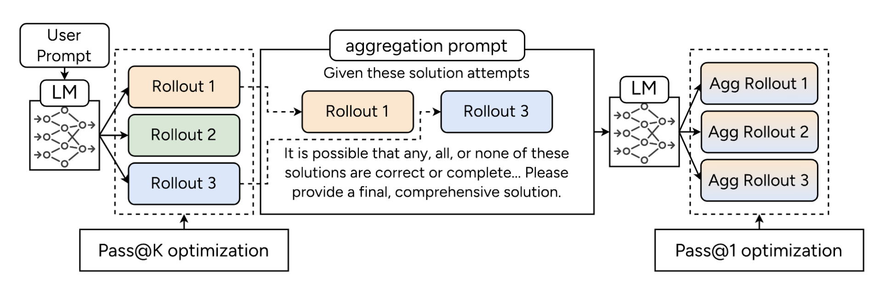
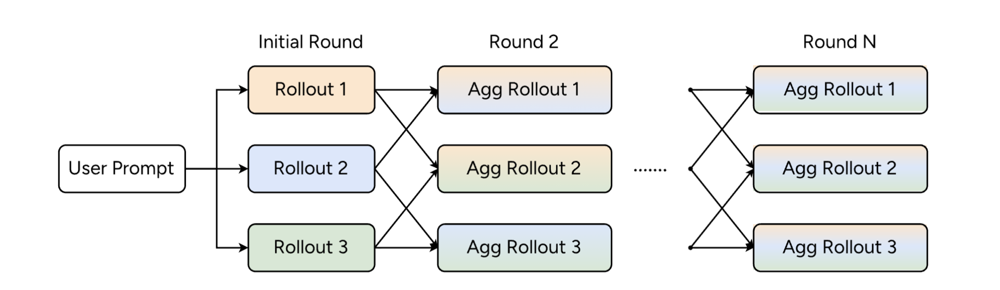
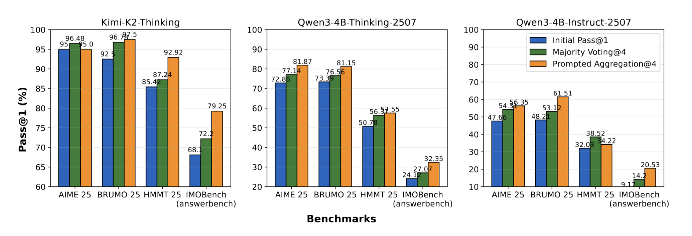
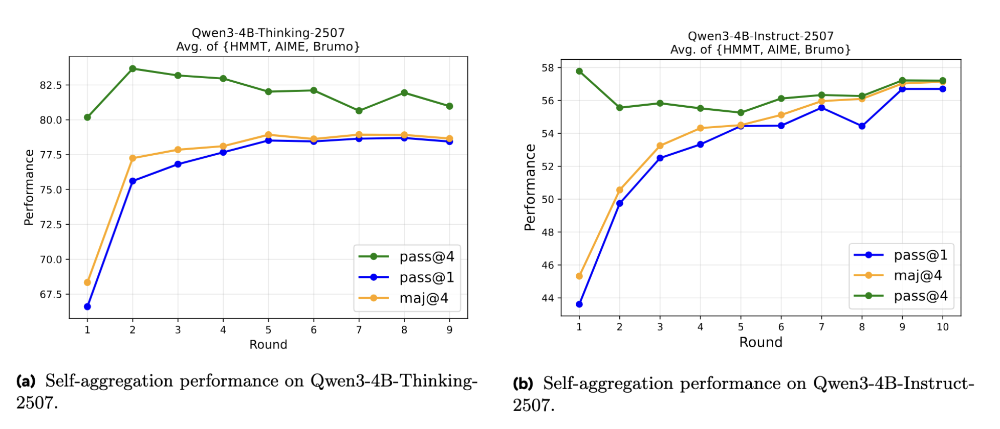
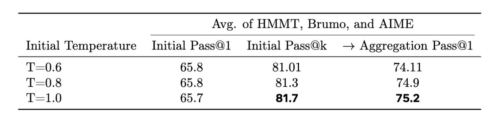
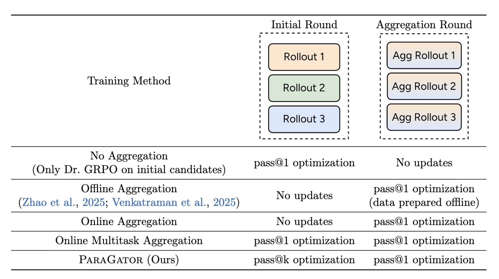
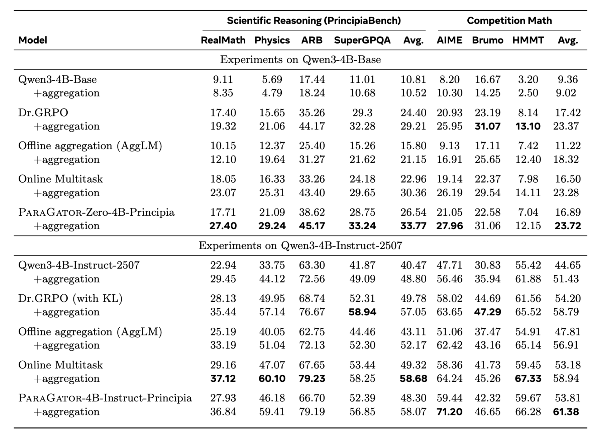
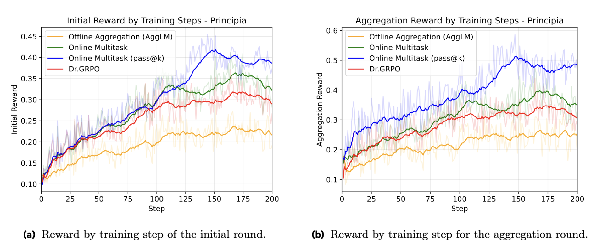

<script>
MathJax = {
  tex: {
    inlineMath: [['$', '$'], ['\\(', '\\)']],
    displayMath: [['$$', '$$'], ['\\[', '\\]']]
  }
};
</script>
<script src="https://cdn.jsdelivr.net/npm/mathjax@3/es5/tex-mml-chtml.js"></script>

# ParaGator: Learning to Aggregate through Online RL


## Our Contribution

We introduce a new reasoning aggregation method called **ParaGator**. Its core claim is that parallel reasoning works best when you **train both stages together**:

- the LLM generator should produce diverse candidates -- train with pass@k
- the LLM aggregator should synthesize those candidates into a final answer

ParaGator thus trains initial candidate generation with pass@k optimization and aggregation with pass@1 optimization, training end-to-end.
This brings large gains, as shown on competition math and scientific reasoning problems.



*Figure: Our parallel thinking scaffolding and training method. We use pass@k optimization for optimizing the initial round of responses and pass@1 optimization (standard RLVR) for optimizing the aggregation rollouts, and train end-to-end.*




*Figure: At inference, during each round we sample rollouts from the past aggregation round, pack them into the aggregation prompt, and perform inference to obtain the next pool of rollouts.*


## Why Existing Aggregation Methods Fall Short


Classical majority vote/self-consistency neither trains aggregation nor uses the LLM to aggregate.
Recent methods like [AggLM](https://arxiv.org/abs/2509.06870) and [RSA](https://arxiv.org/abs/2509.26626) advocate for LLM-based aggregation.

This work identifies two recurring problems in prior approaches:

- they often optimize only the aggregator and treat the generator as fixed
- standard outcome-based RL collapses candidate generation toward one dominant mode

That means the aggregator is trained on the wrong distribution and often sees redundant candidate pools.


## ParaGator

Our method jointly trains a single language model, $\mathcal{M}_\theta$ to (i) generate diverse candidate solutions and 
(ii) aggregate these solutions into a final answer. Both stages are optimized end-to-end using online RL.

### Training

Given a problem $x$, the model first samples a pool of candidate solutions:

$$
y_i \sim \mathcal{M}_\theta(y \mid x), \quad i = 1,\dots,m
$$

Then it aggregates those candidates into a final answer using the same LLM with an aggregation prompt:

$$
\tilde{y} \sim \mathcal{M}_\theta(y \mid p_A, x, y_{1:m})
$$

<!--
That is, the input is the problem concatenated with the candidates in a fixed, structured format:
-->

<p align="center"></p>


<!--
*Figure: Aggregation Prompt.  At inference, during each round we sample rollouts from the past aggregation round, pack them into the aggregation prompt, and perform inference to obtain the next pool of rollouts.*
-->

The initial candidate generation stage is trained with a pass@k objective, while the aggregation stage is trained with standard pass@1.

Crucially, the aggregator is always trained on-policy: during training, it sees candidate pools sampled from the current generator $\mathcal{M}_\theta$, rather than from a frozen or separately trained model. This alignment between training and inference eliminates the off-policy mismatch common in prior self-aggregation methods and ensures that the generator learns to produce candidates that are well-suited for downstream aggregation.

#### Pass@1 Aggregation Optimization

The aggregated solutions use pass@1 performance: the aggregator receives a reward of 1 if and only if its final answer is correct. Unlike the candidate stage, only the single aggregated trajectory is rewarded, pushing the model to reliably synthesize the best answer from the available candidates.

#### Pass@k Candidate Optimization

Pass@k is defined as:

$$
\mathrm{pass@}k = \max[r(y_1), r(y_2), \dots, r(y_k)]
$$

This explicitly rewards the model for putting at least one correct solution into the pool, which encourages diversity instead of mode collapse.

We use the pass@k optimization method described in [Chen et al.](https://arxiv.org/abs/2508.10751), where the advantages of a correct response and an incorrect response are given by:

$$A_\text{correct} = \frac{1 - \mu(x)}{\sigma(x)}, ~~A_\text{incorrect} = \frac{1 - \mu(x) - \frac{\binom{N_{\text{incorrect}} - 1}{k-1}}{\binom{N-1}{k-1}}}{\sigma(x)},$$ 

where $N$ is the group size, $N_\text{incorrect}$ is the number of incorrect rollouts in this group, and $\mu(x)$ and $\sigma(x)$ are the mean and standard deviation of the rewards for the group whose prompt is $x$. 

Compared to standard GRPO, only the advantage of incorrect examples is modified by an offset of $\frac{\binom{N_{\text{incorrect}} - 1}{k-1}}{\binom{N-1}{k-1}}$. In our work, we make a further modification as in Dr.GRPO by removing the division by $\sigma(x)$.

Intuitively, the model is rewarded when at least one of its $m$ attempts solves the problem, which encourages spreading probability mass across complementary solution modes rather than collapsing onto a single trajectory.

### Inference

During training, we optimize a single round of aggregation over one candidate pool. At inference time, however, we naturally generalize this to multiple iterations of aggregation, enabling sequential scaling in addition to the learned parallel sampling.

Concretely, given problem $x$, we first sample an initial pool of $m$ candidates $y_{1:m}^{(0)} \sim \mathcal{M}_\theta(y \mid x)$ and sample $m$ aggregated solutions 

$$\tilde{y}_{1:m}^{(0)} \sim \mathcal{M}_\theta(y \mid p_A, x, y_{1:m}^{(0)})$$

We then form an updated candidate pool 

$$y_{1:m}^{(1)} = \tilde{y}_{1:m}^{(0)}$$ 

from these aggregation rollouts. The model is then prompted again in aggregation mode on $(x, y_{1:m}^{(1)})$ to produce a refined set of solutions $\tilde{y}_{1:m}^{(1)}$, and so on. This continues for $T$ iterations before returning the final aggregated answer.

This iterative procedure preserves the same generator–aggregator interface used during training, while allowing the model at test time to repeatedly refine its reasoning over an evolving pool of candidate solutions under a fixed compute budget.

## Main Experiments


### Self-aggregation improves frontier models

<!--
First, we show that even basic LLM self-aggregation does help for frontier models that we cannot easily train.
This result is important because it justifies that this 
-->

We first show that basic aggregation of parallel generations yields improvements when using frontier open-source models. <!-- , such as Kimi-K2-Thinking. -->
We find that parallel generation + aggregation brings gains across 4 competition math benchmarks (AIME, Brumo, HMMT and IMO-Answerbench)
on top of 3 strong models: Kimi-K2-Thinking, Qwen3-4B-Thinking-2507, and Qwen3-4B-Instruct-2507, compared to standard generation and majority voting.

This motivates that employing and improving aggregation procedures will likely continue to be useful as models scale, and that the results of our
training should generalize beyond the smaller models we employ in our subsequent experiments. 

<!--
*Figure: Parallel generation + aggregation (orange) brings gains across 4 competition math benchmarks on top of 3 strong models: Kimi-K2-Thinking, Qwen3-4B-Thinking-2507, and
Qwen3-4B-Instruct-2507, compared to standard generation (blue) and majority voting (green).*
-->


*Figure: Parallel generation followed by aggregation improves strong open models over standard decoding and majority voting.*


### A Key Empirical Observation: The role of candidate diversity (pass@k) in self-aggregation

Next, we analyze the diversity issue in standard self-aggregation, and show that
self-aggregation requires diversity among the responses to be packed into the aggregation prompt in order to
perform better, motivating our training approach.


We plot the performance of multiple rounds of aggregation, measuring pass@1, pass@4, and majority voting@4. 
We find that the pass@1 performance $\color{blue}{(blue)}$ never exceeds the initial pass@4 $\color{green}{(green)}$, 
showing that the asymptotic performance is bounded by pass@k at the initial round, motivating our pass@k optimization method.

That is, self-aggregation is bounded by the quality and diversity of the initial candidate pool. 
If the pool does not contain enough good or complementary trajectories, aggregation cannot recover much.

<!-- The repeated-aggregation experiments make the same point more directly: -->



*Figure: Repeated aggregation saturates below the initial pass@k bound, which motivates directly training the generator for better candidate diversity.*


Changing the initial sampling temperature also validates this hypothesis. We vary the initial sampling temperature (0.6, 0.8, 1.0) while keeping the aggregation sampling temperature fixed (1.0).
Pass@1 performance is similar at the initial round but a higher initial pass@k results in a higher aggregation pass@1.


<p align="center"></p>

*Figure: Model = Qwen3-4B-Thinking-2507. Effect of initial sampling temperature on decoding performance. Increasing the initial temperature leaves pass@1 nearly unchanged while improving pass@k, resulting in higher aggregation performance.*


### ParaGator Experiments

We validate training our method ParaGator in two regimes: competition math and scientific reasoning.

We compare ParaGator against a number of baselines. For each, we use the same repeated aggregation scaffold, but different training methods:
(i) the base model only, (ii) no aggregation training, just standard Dr.GRPO training, (iii) offline pass@1 aggregation training, (iv) online pass@1 aggregation training,
and  (v) online pass@1 multitask aggregation.

<p align="center"></p>

*Figure: Comparison of training strategies across the initial and aggregation rounds. Columns show whether model parameters are updated via pass@1 or pass@k optimization, or kept fixed.*

#### Competition Math

We first conduct competition math experiments, with fine-tuning starting from  Qwen3-4B-Base
on a subset of the DeepScaleR dataset, consisting of 10k prompts
We generate 32 solutions with the following sampling parameters: {Temp = 1.0, top-p = 1, top-k = −1} and report pass@1 for up to 3 aggregation rounds.

ParaGator delivers the best average performance after aggregation and achieves the strongest results on most benchmarks, demonstrating the benefit of jointly training initial-generation and aggregation behaviors within a unified online multitask framework.


*Figure: Competition math experiments. The best values in each column are bolded. Numbers = Pass@1/Pass@4.*


We plot the reward curves for both the initial round and the aggregation round. The curves show a clear trade-off in prior baselines: Dr.GRPO attains reasonable initial-round reward but lags in aggregation-round reward, while offline aggregation training exhibits the opposite pattern, improving aggregation performance at the expense of the initial round. Online multitask training partially mitigates this mismatch by optimizing both rounds jointly, but still underperforms our method. In contrast, ParaGator consistently achieves the highest reward in both rounds, which translates into the strongest overall pass rates across aggregation steps.


*Figure: Reward curves for training Qwen3-4B-Base on deepscaler using different methods. The baseline* $\color{red}{(Dr.GRPO )}$ *only optimizes the initial round, making the performance lag behind during the aggregation round. Offline aggregation only training* $\color{#FFA500}{(AggLM)}$ *only optimizes the aggregation round, making it lag behind during the initial round. Our proposed method* $\color{blue}{(ParaGator)}$ *achieves the highest reward.*

#### Scientific Reasoning

We train on a subset of the [Principia](https://facebookresearch.github.io/RAM/blogs/principia/) dataset, consisting of a total of 30,000 questions, and report pass@1 scores both on PrincipiaBench, consisting of 2558 questions, as well as the previous
competition math datasets.
We train on two different models: Qwen3-4B-Base and Qwen3-4B-Instruct-2507. 
<!--
The former resembles the “RL-Zero" paradigm, where we
perform RL directly on a base model that has not been post-trained. 
The latter resembles a more practical
setup where we enhance parallel thinking behavior on a strong post-trained model.
-->

Across both backbones, we observe the same specialization trade-off: Dr.GRPO improves the initial-round reward but under-optimizes the aggregation round, while offline aggregation training (AggLM) does the opposite. Online multitask alleviates this mismatch by optimizing both stages jointly, and the pass@k variant achieves the strongest reward in both rounds, consistent with its goal of improving the quality of the candidate set consumed by aggregation.

ParaGator performs strongly in these settings. 
The results suggest that pass@k-aware training is particularly effective for difficult math, where aggregation benefits most from a higher-quality, more solution-bearing candidate pool.



*Figure: Scientific reasoning (PrincipiaBench) and competition math evaluation results. Numbers denote Pass@1. Best values per column and model group are bolded. *



*Figure: Reward curves for training Qwen3-4B-Base on Principia. Optimizing for pass@k during the initial round* $\color{blue}{(ParaGator)}$ *achieves the highest reward on both the initial round and the aggregation round.*


## Conclusion

Scaling test-time compute is only as effective as the diversity and quality of the reasoning paths that are explored. Traditional parallel decoding and self-aggregation methods are bottlenecked by off-policy generations and mode collapse. To overcome these limitations, we introduced ParaGator, a unified online reinforcement learning framework that explicitly aligns and optimizes candidate generations with downstream aggregation.

A core insight is that generation and aggregation require distinct but complementary optimization strategies. In ParaGator, the generator actively explores a diverse, complementary set of solutions through pass@k optimization. Simultaneously, the aggregator is trained via pass@1 optimization to reliably synthesize the on-policy candidates into a final answer.

Extensive evaluations across competition math and scientific reasoning benchmarks validate the strength of this approach. In both base models (e.g., Qwen3-4B-Base) and strong post-trained reasoners (e.g. Qwen3-4B-Instruct-2507), ParaGator consistently improves over standard offline self-aggregation. 

<!--

The gains are particularly pronounced on highly complex tasks, where synthesizing diverse reasoning trajectories is critical. By co-training generation and aggregation end-to-end, ParaGator provides a robust, scalable recipe for improving inference-time reasoning.

The main insight of ParaGator is that aggregation quality is not just an inference trick. It is a training problem. If you want aggregation to work, you need candidate pools that are diverse, on-policy, and useful for synthesis. Pass@k for generation plus pass@1 for aggregation is the paper's answer to that mismatch.
-->

## Contributors
Tianjian Li, Jingyu Zhang, Ping Yu, Swarnadeep Saha, Sainbayar Sukhbaatar, Jason Weston, Ilia Kulikov, Jack Lanchantin.

## More details
More details can be found in the [full technical report](https://arxiv.org/abs/2603.18886) (see section 3).

## Citation
To reference the work in this blog post, please use the following BibTex entry:
```
@article{principia2026,
  title={Reasoning over mathematical objects: on-policy reward modeling and test time aggregation},
  author={Pranjal Aggarwal, Marjan Ghazvininejad, Seungone Kim, Ilia Kulikov, Jack Lanchantin, Xian Li, Tianjian Li, Bo Liu, Graham Neubig, Anaelia Ovalle, Swarnadeep Saha, Sainbayar Sukhbaatar, Sean Welleck, Jason Weston, Chenxi Whitehouse, Adina Williams, Jing Xu, Ping Yu, Weizhe Yuan, Jingyu Zhang, Wenting Zhao},
  journal={arXiv preprint arXiv:2603.18886},
  year={2026}
}
```
