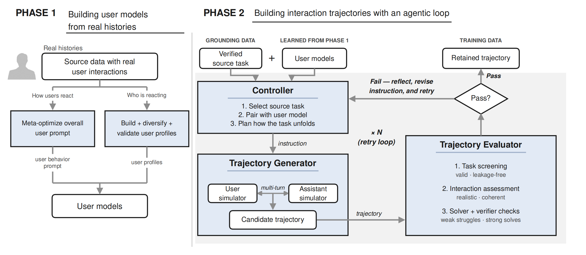
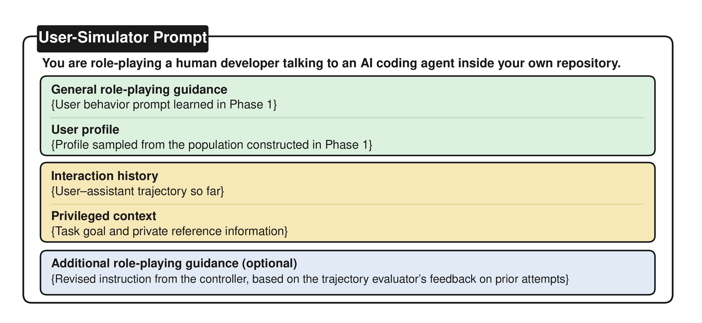
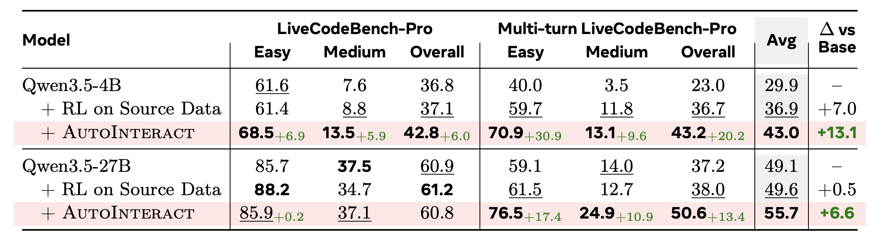
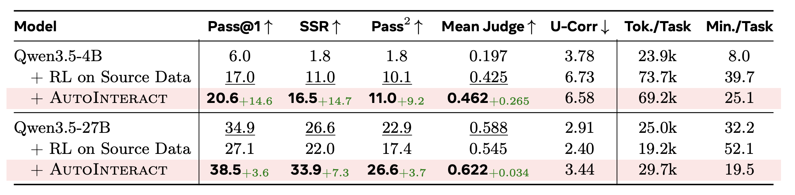
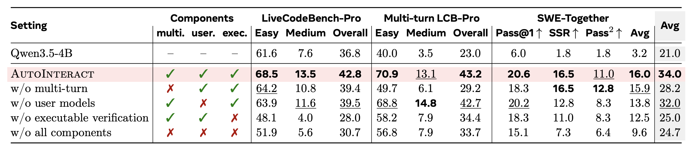
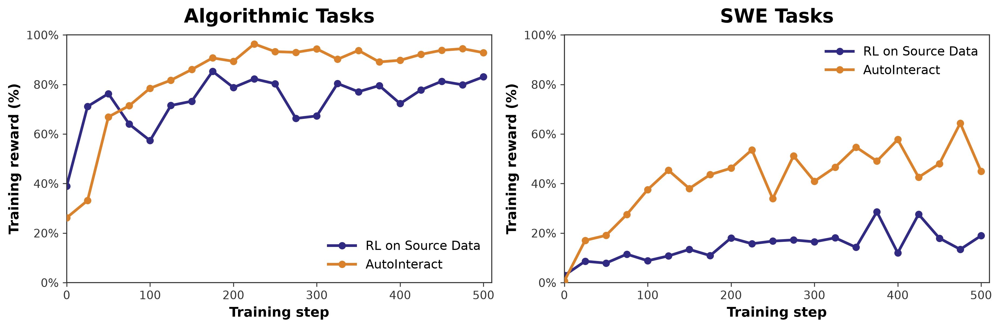
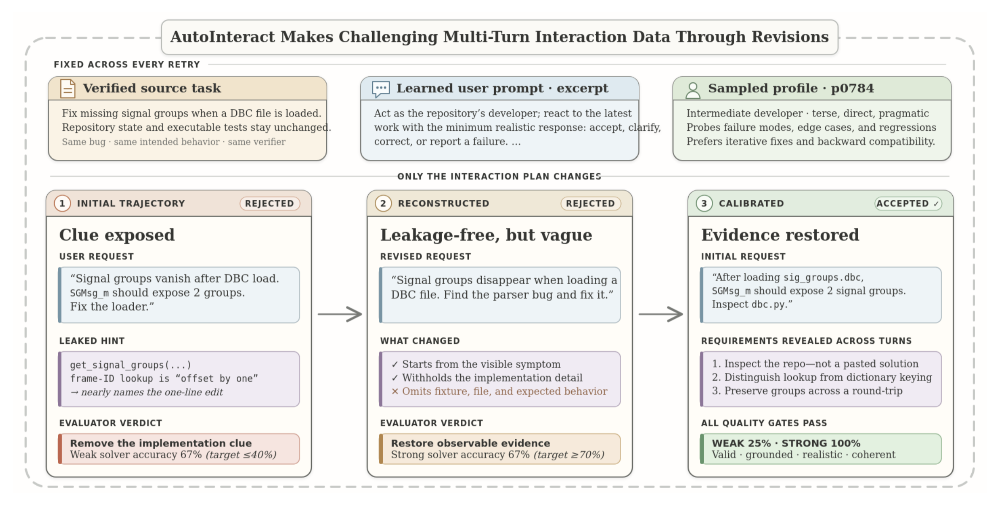

<script>
MathJax = {
  tex: {
    inlineMath: [['$', '$'], ['\\(', '\\)']],
    displayMath: [['$$', '$$'], ['\\[', '\\]']]
  }
};
</script>
<script src="https://cdn.jsdelivr.net/npm/mathjax@3/es5/tex-mml-chtml.js"></script>

<style>
.autointeract-figure {
  overflow-x: auto;
  margin: 1rem auto;
  overscroll-behavior-inline: contain;
  text-align: center;
  -webkit-overflow-scrolling: touch;
}

.autointeract-figure > a {
  display: block;
}

.autointeract-figure img {
  display: block;
  width: var(--desktop-width, 100%);
  max-width: 100%;
  height: auto;
  margin-inline: auto;
  cursor: zoom-in;
}

.autointeract-figure--95 {
  --desktop-width: 95%;
}

.autointeract-figure--90 {
  --desktop-width: 90%;
}

.autointeract-figure--80 {
  --desktop-width: 80%;
}

.autointeract-figure--data {
  --mobile-width: 900px;
}

.autointeract-figure__hint {
  display: none;
}

@media (max-width: 700px) {
  .autointeract-figure img {
    width: var(--mobile-width, 760px);
    max-width: none;
    margin-inline: 0;
  }

  .autointeract-figure__hint {
    position: sticky;
    left: 0;
    display: block;
    box-sizing: border-box;
    width: 100%;
    padding-top: 0.35rem;
    font-size: 0.8rem;
    opacity: 0.7;
  }
}
</style>

# AutoInteract: Training agents to interact with humans

## Overview

**Motivation** Today, AI models are routinely used by humans for coding and research, and further progress in their ability to interact with us increasingly depends on the data and environments they are trained on. However, the most common post-training recipe trains fully specified tasks paired with an automatic verifier, with no human in the loop – which aligns with the fully automatic self-improvement or autoresearch ([Karpathy, 2026][karpathy2026autoresearch]) paradigm. This creates a major discrepancy with real-world applications of agents that work together with users by following their clarifications and feedback ([Jin et al., 2025][jin2025era]; [Wang et al., 2026][wang2026position]). While current training tasks are usually fully specified, users in reality are much less specific. They may start with a goal that is not fully articulated, provide clarifications after seeing the agent's output, revise requests midway, or provide counterexamples when a fix does not hold ([Baumann et al., 2026][baumann2026swe]; [Wu et al., 2026][wu2026swe]). Models that solve tasks without such context can lose track of intent as the interaction goes on ([Laban et al., 2026][laban2026llms]; [Tack et al., 2026][tack2026llms]).

An obvious direction is thus to train models to be better at agent-human interactions. However, common training recipes are not designed for an interactive setup: real interaction logs are scarce, costly, and difficult to convert into verifiable training examples ([Baumann et al., 2026][baumann2026swe]). An alternative is to simulate interactions, but these can be miscalibrated against real user behavior or collapse a heterogeneous user population onto a generic persona ([Cheng et al., 2023][cheng2023compost]). Moreover, ensuring task diversity, factual grounding, and executable verification in synthesized interactions is itself not straightforward. The problem for synthetic data is therefore to construct interaction data that is realistic, grounded in verifiable tasks with high-quality reference solutions, and calibrated in difficulty to the model being trained.

<div class="autointeract-figure autointeract-figure--95">
  <a href="autointeract.png" aria-label="Open the full-size AutoInteract framework figure">
    
  </a>
  <span class="autointeract-figure__hint">Swipe horizontally or tap the image to view it full size.</span>
</div>

<em>Figure 1. **AutoInteract** is a framework for generating realistic, high-quality multi-turn interaction trajectories from verified tasks based on real user histories. In Phase 1, AutoInteract builds user models: modeling how users react by optimizing a history-conditioned user behavior prompt and building a diverse set of user profiles. In Phase 2, an agent combines verified source tasks with its user models to generate candidate tasks with multi-turn interaction trajectories,  and selects them to be challenging, valid, realistic, coherent and profile consistent. If the checks fail, it revises the controller's instruction until a task passes all checks or the retry budget is exhausted.</em>


**Our contribution** We introduce AutoInteract, a framework for generating data to train agents to interact with humans. Inspired by the Autodata method ([Kulikov et al., 2026][kulikov2026autodata]), which uses an agentic data scientist to create high-quality synthetic data, AutoInteract generalizes that approach to treat human–agent interaction itself as the object of synthesis. Starting from a verified source task, our method simulates a multi-turn interaction, including user clarifications, requirement changes, and corrective feedback, while preserving the source task's final reference solution verifiable by an executable test. This consists of two phases: (1) creating user models from real interaction histories by learning behavior over a diverse population of profiles and (2) combining these user models with problem-solving agents in an agentic generate–evaluate–revise loop that simulates realistic, task-grounded interactions with calibrated difficulty for a given model. Models can then be trained with reinforcement learning on this data.

Across algorithmic coding and software engineering tasks, AutoInteract substantially outperforms baselines with both Qwen3.5-4B and Qwen3.5-27B backbones. On LiveCodeBench-Pro ([Zheng et al., 2026][zheng2026livecodebench]) and its multi-turn variant, AutoInteract raises average Pass@1 from $29.9$ to $43.0$ at 4B and from $49.1$ to $55.7$ at 27B, with especially large multi-turn gains from $23.0$ to $43.2$ and from $37.2$ to $50.6$, respectively. On SWE-Together ([Wu et al., 2026][wu2026swe]), it improves Pass@1 from $6.0$ to $20.6$ at 4B and from $34.9$ to $38.5$ at 27B. Our analysis shows that multi-turn synthesis, grounded user models, and executable verification each contribute to performance, while training reward does not saturate as quickly as training on the source data.

Overall, our results show that training can extend beyond solving isolated tasks to help models learn how to work with users. By making interaction itself synthesizable and verifiable, AutoInteract provides a practical way to train agents to incorporate human clarifications, feedback, and evolving requirements while still optimizing for task correctness.

## AutoInteract


AutoInteract is a framework for generating user-centric interaction training and evaluation data. It produces realistic, verifiable, multi-turn tasks between a simulated user and an assistant. Because these trajectories resemble the interactions that assistants encounter in practice, models can learn from them to better handle real user-centric tasks.

AutoInteract first learns a user model from logged interactions, so simulated users reproduce the habits, gaps, and preferences that real users show. The pipeline needs only raw interaction logs with user IDs, so it carries over to any domain where such logs exist. It then performs task-grounded trajectory synthesis, which preserves the source task's existing reference solution and executable verifier. The user simulator privately conditions on the reference solution and executable checks to keep requests across turns consistent with the original task, without revealing this privileged information to the assistant. The final assistant response can therefore be scored by the source task's unchanged verifier.

The method thus runs in two phases, shown in Figure 1.

### AutoInteract Phase 1: Building User Models from Real Histories

Phase 1 builds *user models* from real histories so that we can simulate users realistically. A user model has two parts: (1) a *user behavior prompt*, which gives general role-playing behavior guidance, and (2) a *user profile*, which describes the specific user being simulated. We learn both using an existing corpus of real trajectories of users interacting with coding agents. We learn the user behavior prompt using GEPA ([Agrawal et al., 2026][agrawal2026gepa]), guided by reference-based feedback that measures how closely a simulated next turn matches real user behavior in the same conversation context. We then build a set of user profiles by using an LLM to summarize user traits from the histories, including diversifying and validating steps. Together, the user behavior prompt and the user profiles let us simulate users.

<details markdown="1">
<summary>See more details of building user models from real histories.</summary>

**Building User Models from Real Histories: more details**

Phase 1 builds user models from real interaction histories. Each user model has two parts: (1) a *user behavior prompt*, which gives general role-playing guidance on how users tend to react, and (2) a *user profile*, which describes the specific user being simulated. We learn both components from real data of users interacting with  agents. The user behavior prompt is optimized on observed next-user turns, while the profile population is built from (LLM generated summaries of) behavior across users, diversified, and validated. Together, these two parts determine how a simulated user responds and the interaction style they follow.

### Optimizing a History-Conditioned User Behavior Prompt

The user behavior prompt is a reusable set of instructions for role-playing a human developer. It defines the simulator's role and output format, explains how to use the conversation history and user profile, and describes common user reactions, such as accepting the work, correcting the assistant, reporting a failure, changing a requirement, or ending the interaction. It also asks the simulator to keep follow-up messages short and grounded in the current conversation. The prompt does not describe a specific task or user. To simulate users during trajectory synthesis, we combine it with a sampled user profile, the interaction history, and the source task as private context to the user simulator (Figure 2).

We optimize a single user behavior prompt while keeping the simulator's model weights fixed. We instantiate GEPA ([Agrawal et al., 2026][agrawal2026gepa]), a reflective prompt optimizer that evolves prompts using natural-language evaluation feedback and Pareto-based candidate selection. Each training instance contains a conversation prefix, an assigned user profile, and the real user's next message. Given the prefix and persona, a candidate user behavior prompt generates a simulated next message. An LLM evaluator assigns an overall score based on intent, reaction to the assistant, length, specificity, persona consistency, and realism, and provides textual feedback describing discrepancies from the real turn. For each sampled training minibatch, GEPA uses this feedback to propose a revised user behavior prompt and accepts the revision when it improves the minibatch score. Accepted candidates are evaluated on the validation set to update the per-instance Pareto frontier, and the final user behavior prompt is selected by aggregate validation performance.

### Constructing a Behavior-Grounded Profile Population

We build the user profile population in three steps: build (prompt an LLM to summarize) one profile from each real user's history, diversify these profiles while preserving their interaction patterns, and validate the resulting population. LLMs write and audit the profile text, while behavioral structure and population-level validation use automated, data-driven procedures.

**Profile construction.** For each user ID recorded in the user source data, we aggregate that user's conversations and compute a profile summary, including what kinds of requests they make, how often they correct or push back on the assistant, how often their requirements change, and how much detail they provide. We prompt an LLM to summarize this evidence into a concise natural-language profile. This profile tells the simulator how the user tends to behave across turns, including user vagueness, pushback, requirement changes, verbosity, and the rate at which requirements are revealed across the conversation.

**Profile diversification.** The observed users do not provide enough profiles for large-scale simulation, so we use MAP-Elites ([Mouret and Clune, 2015][mouret2015illuminating]), a quality-diversity method that expands coverage across behavioral types/clusters (also called niches or cells) while retaining high-quality profiles in each type. Clusters are defined by expertise, vagueness, pushback, requirement-change tendency, and verbosity, and only combinations found among real users are kept. Within each cluster, we prompt an LLM to write new profiles that preserve a real user's behavior settings and tone while varying surface details. The settings are inherited from the real profiles, adding diversity without inventing unsupported behavior combinations.

**Profile validation.** Profiles are validated for quality. We employ an LLM to check each generated profile against the user's measured fingerprint, flags unsupported claims and repository-specific details, and provides feedback for revision. During verification, automatic text-similarity checks remove near-duplicates and profiles that are unusually far from all real profiles. Final automatic checks measure behavioral-type coverage, diversity, and distributional similarity to the real users from the source data.
</details>


<div class="autointeract-figure autointeract-figure--80">
  <a href="user_simulator_prompt_refined.png" aria-label="Open the full-size user-simulator prompt figure">
    
  </a>
  <span class="autointeract-figure__hint">Swipe horizontally or tap the image to view it full size.</span>
</div>

<em>Figure 2. **The user-simulator prompt used to generate each user turn.** It combines the learned user behavior prompt and a user profile sampled in Phase 1 with the interaction history and the privileged task context. After a failed attempt, the controller may also add revised role-playing guidance based on the trajectory evaluator's feedback.</em>

### AutoInteract Phase 2: Building Interactions with an Agentic Loop

Phase 2 builds interaction trajectories with an agent controlling  the user simulation inside a loop that generates, evaluates, and improves trajectories. It turns verified source tasks combined with the user models from Phase 1 into realistic, verifiable tasks with multi-turn trajectories. As shown in Figure 1 (right), the agentic loop consists of three modules:

- **Controller**, which selects a verified source task, pairs it with the learned user behavior prompt and a sampled profile, and plans the interaction. After a failed attempt, it uses the evaluator's feedback to revise this plan.

- **Trajectory generator**, which follows the controller's instruction and rolls out a candidate conversation between the user simulator (using the user model)  and the assistant simulator.

- **Trajectory evaluator**, which checks the candidate for validity and leakage, realism and coherence, profile consistency, and difficulty calibrated through solver rollouts and the source task's executable verifier.

Together, these modules form a data generation loop: the controller proposes an interaction, the generator produces it, and the evaluator determines whether to keep it or return it for revision.

Trajectories that fail go back to the controller, which reflects on the failure, revises the instruction, and retries.
Initial generation does not guarantee that a trajectory is realistic, valid, or useful for training. Like Autodata's agentic data scientist, which improves synthetic data through solver and judge feedback ([Kulikov et al., 2026][kulikov2026autodata]), AutoInteract repeatedly generates, evaluates, and revises candidates, but focuses the improvement process on multi-turn trajectories and grounds it in executable verification.

**Multi-objective trajectory evaluation.** The evaluator checks three properties: the task is valid and does not leak private information; the interaction is realistic, coherent, and consistent with the sampled profile; and the difficulty is calibrated so that the target model struggles while a stronger solver succeeds. Solver responses are scored with the source task's executable verifier. This combines semantic checks with execution-based evidence, and a trajectory is kept only when all checks pass.

**Trajectory self-reflection.** When a check fails, the evaluator identifies whether the trajectory is invalid, unrealistic, inconsistent with the profile, too easy for the target model, too difficult for the stronger solver, or overly revealing. The controller turns this diagnosis into guidance for the next rollout. The source task, learned user behavior prompt, and sampled profile remain fixed across attempts, so the controller revises only how the same task unfolds. This generate–evaluate–revise loop continues until the trajectory passes or the retry budget is exhausted.


<details markdown="1">
<summary>See more details of building an agentic loop.</summary>

### Building Interactions with an Agentic Loop: more details


### Interaction Task Synthesis (Controller + Trajectory generator)

Each trajectory begins with a verified source task. The controller pairs the task with the learned user behavior prompt and a sampled profile. At each turn, the user simulator receives the user simulation prompt shown in Figure 2, which combines these two components of the user-model with the visible interaction history, the source task and reference information as a privileged context, and any revised controller guidance from a previous failed attempt. The assistant simulator responds only to the conversation and any repository context it would normally observe. The conversation ends on a user turn, and the requirements expressed across the interaction aim to remain verifiable with the source task's original verifier.

**Scenario-guided algorithmic trajectories.** For self-contained algorithmic tasks, the controller follows several interaction patterns: clarification or requirement change during design, clarification or requirement change after an initial solution, and bug iteration through concrete failing cases. Clarification reveals a requirement that was present from the start, a requirement change introduces a genuinely new need, and bug iteration keeps the specification fixed. These patterns control when information appears visible without changing the final verified task.

**History-conditioned repository trajectories.** Repository-level software engineering tasks are more agentic than self-contained algorithmic tasks, requiring tool-driven repository search, fault localization, editing, testing, and responses to users across turns. Rather than following a fixed scenario, the interaction is shaped by the user behavior prompt and sampled profile. Private task and reference information keep the simulated user factually grounded, while the assistant operates only on the visible conversation and repository state. The cumulative user requests must describe the intended change without revealing private tests or implementation details.
</details>


<details markdown="1">
<summary>See related work</summary>

## Related Work

**User Simulation.** Simulated users have long been used in interactive systems, from agenda-based simulators for training dialogue policies ([Schatzmann et al., 2007][schatzmann2007agenda]) to populations of generative agents that model human behavior at scale ([Park et al., 2023][park2023generative]). LLMs have made user simulators more fluent and general, and they are now widely used in interactive agent benchmarks ([Yao et al., 2024][yao2024tau]; [Barres et al., 2025][barres2025tau]) and as environments for training agents. Yet these simulators may not behave like real users. Assistant-tuned models prompted to play a user often produce turns that are unusually cooperative, well-organized, and similar in style, and stronger assistants can make *worse* simulators ([Naous et al., 2026][naous2026flipping]). Conditioning on a persona label can also represent a group through stereotypes rather than the variation found among real users ([Cheng et al., 2023][cheng2023compost]). Recent work addresses this problem by training simulators on real interactions, either through supervised learning on observed user turns ([Naous et al., 2026][naous2026flipping]) or reinforcement learning for persona consistency ([Abdulhai et al., 2026][abdulhai2026consistently]) and latent user states ([Wu et al., 2026][wu2026humanlm]; [Jin et al., 2026][jin2026thoughttrace]). Large persona libraries provide another way to represent diverse users ([Ge et al., 2024][ge2024scaling]). AutoInteract combines these directions. Rather than updating model weights or drawing profiles from an open-ended persona library, it learns an editable user behavior prompt from real interactions and builds a profile population from measured per-user behavior.

**Multi-Turn Interaction Evaluation and Training.** Models that solve fully specified tasks often perform worse when the same information arrives over several turns ([Laban et al., 2026][laban2026llms]) or when the goal changes during a conversation ([Tack et al., 2026][tack2026llms]). Single-turn evaluation does not capture this problem. Interactive benchmarks test it through feedback and tool loops ([Wang et al., 2024][wang2024mint]), dual-control settings ([Barres et al., 2025][barres2025tau]), preference-elicitation environments ([Qian et al., 2025][qian2025userbench]), and repository sessions reconstructed from real developer–agent transcripts ([Baumann et al., 2026][baumann2026swe]; [Wu et al., 2026][wu2026swe]). Several training methods place a simulated user in the optimization loop: SWEET-RL learns turn-level advantages from privileged training information ([Zhou et al., 2025][zhou2025sweet]); CollabLLM estimates the long-term value of a reply by sampling future conversations ([Wu et al., 2025][wu2025collabllm]); UserRL studies turn- and trajectory-level rewards across user-centered environments ([Qian et al., 2025][qian2025userrl]); and MUA-RL trains multi-turn tool use with an LLM user ([Zhao et al., 2025][zhao2025mua]). These methods keep the interaction environment and user simulator fixed while improving the learning algorithm. AutoInteract instead studies how to construct the interaction data itself.

**Grounded and Verifiable Synthetic Data.** Early work created synthetic post-training data by expanding a small set of seed instructions ([Wang et al., 2023][wang2023self]). Later work increased its scale and diversity through complexity evolution ([Xu et al., 2024][xu2024wizardlm]), direct prompting of aligned models ([Xu et al., 2025][xu2025magpie]), and persona conditioning ([Ge et al., 2024][ge2024scaling]). Because unconstrained generation can introduce errors, later methods ground generated data in documents or structured sources and check whether questions can be answered ([Lupidi et al., 2024][lupidi2024source2synth]; [Yuan et al., 2026][yuan2026naturalreasoning]; [Yu et al., 2025][yu2025cot]). Execution provides an especially strong check. In software engineering, tasks can be generated directly from repositories and validated by running tests ([Pan et al., 2024][pan2024training]; [Jain et al., 2025][jain2025r2e]; [Wei et al., 2026][wei2026swe]; [Yang et al., 2026][yang2026swe]), producing an inexpensive, objective reward that is difficult to exploit. Other work generates tasks that challenge the current solver, either by generating tasks and verifiers together ([Zhou et al., 2026][zhou2026self]; [Zhao et al., 2026][zhao2026absolute]; [Liu et al., 2025][liu2025spice]) or by targeting problems the model cannot yet solve ([Zelikman et al., 2022][zelikman2022star]). These methods still produce fully specified, single-turn tasks. AutoInteract keeps the source task and its executable verifier unchanged but presents the task as an interaction. The same execution reward can then measure both correctness and the model's ability to follow requirements given over several turns. We also use a weak-versus-strong difficulty band, but apply it to what task information is revealed and when, rather than to the task's inherent difficulty.

**Agentic Data Generation and Self-Improvement.** Recent systems use agents to plan, inspect, and revise generated data instead of relying on fixed pipelines. AgentInstruct uses agent workflows to produce large post-training datasets ([Mitra et al., 2024][mitra2024agentinstruct]). Agentic Self-Instruct uses a data-scientist agent to revise a generation recipe based on weak- and strong-solver rollouts and judge feedback, and also improves its own scaffold ([Kulikov et al., 2026][kulikov2026autodata]). Related agents automate parts of the data-science workflow ([Guo et al., 2024][guo2024ds]; [Hong et al., 2025][hong2025data]). This process is related to prompt- and scaffold-optimization methods that revise prompts or instructions using execution feedback ([Madaan et al., 2023][madaan2023self]; [Fernando et al., 2023][fernando2023promptbreeder]; [Yang et al., 2024][yang2024large]; [Lu et al., 2024][lu2024ai]; [Agrawal et al., 2026][agrawal2026gepa]). Our profile expansion also uses quality-diversity search to cover a range of behaviors instead of maximizing a single score ([Mouret and Clune, 2015][mouret2015illuminating]; [Cully et al., 2015][cully2015robots]). AutoInteract differs from Agentic Self-Instruct in three ways. First, it improves a multi-turn trajectory rather than a single example. Second, it includes a simulated user learned from real histories and evaluates realism directly. Third, the source task, sampled profile, and user behavior prompt remain fixed across retries, so the agent can revise only the multi-turn interaction. Holding these inputs fixed prevents the agent from meeting the difficulty target by changing the task in a way that disconnects it from the source, a problem reported in unconstrained agentic data loops ([Kulikov et al., 2026][kulikov2026autodata]).

</details>


## Experimental Setup

### Training Setup

**User Model Data.** We learn the user behavior prompt and user profiles from SWE-Chat ([Baumann et al., 2026][baumann2026swe]), a corpus of real trajectories of users interacting with coding agents, where each trajectory records a user ID and how that user responds in different situations.

**Source Data.** For algorithmic coding, we extract the code subset of Dolci-Think-RL-32B, the reinforcement-learning corpus used to train OLMo 3 ([Olmo et al., 2025][olmo2025olmo]). Our extraction contains 12,120 Python problems, each represented by a natural-language specification and a list of executable assertions that serve as its ground-truth verifier. For repository-level SWE, we use SWE-smith ([Yang et al., 2026][yang2026swe]). Each instance provides an issue-style problem statement, a reproducible buggy repository state, relevant code context, an executable environment, tests that must change from failing to passing, and regression tests that must remain passing. We construct a deterministic pool of 19,000 function-level, pytest-backed instances across 117 repository environments, prioritizing compact fixes with bounded test suites.

**Data Generation Configuration.** In Phase 1, Kimi-K2.6 ([Kimi Team, 2026][kimi2026k26]) is used throughout user-model construction. For user behavior prompt learning, it simulates and judges next-user turns and performs GEPA prompt rewriting; for user-profile construction, it drafts, expands, reformats, and verifies the profiles. In Phase 2, Kimi-K2.6 serves as the user simulator, controller, trajectory evaluator, and strong solver, while the target model itself serves as the assistant simulator and weak solver: Qwen3.5-4B when generating data for the 4B-scale runs and Qwen3.5-27B for the 27B-scale runs. Data are therefore synthesized separately for each target scale, so the difficulty band is calibrated to the model that will be trained on it. For each candidate trajectory, the weak and strong solvers each generate three responses, which are scored by the source task's executable verifier. A trajectory passes only when the weak solver scores at most $40\%$ and the strong solver scores at least $70\%$; failed candidates may undergo up to five self-improvement rounds.

**Training Configuration.** Each synthesized trajectory becomes a training prompt ending on the final user turn, and the model generates only the final assistant response. Rewards come from the source task's executable verification: for algorithmic tasks, the reward is the fraction of assertions passed; for SWE tasks, it is the fraction of previously failing tests fixed, with reward set to zero if any previously passing test regresses. Both rewards lie in $[0,1]$. We train all RL variants using the prime-rl framework ([Prime Intellect, 2025][primeintellect2025prime-rl]) with a DAPO-style group-relative objective ([Yu et al., 2026][yu2026dapo]), using 32 prompts and $G=8$ responses per prompt, for 256 responses per update. Training uses temperature 1.0, reasoning enabled, a maximum sequence length of 81,920 tokens, and AdamW with a constant learning rate of $1\times10^{-6}$, weight decay 0.01, gradient-norm clipping at 1.0, and up to 500 steps.

### Evaluation Setup

**Models and Baselines.** We use Qwen3.5-4B and Qwen3.5-27B as the target models throughout and compare AutoInteract against two baselines: (1) **Base**, the off-the-shelf post-trained checkpoint at each scale without further optimization, which establishes the starting performance; and (2) **RL on Source Data**, which applies reinforcement learning directly to the single-turn source data.

**Evaluation Benchmarks.** For algorithmic coding, we first evaluate on **LiveCodeBench-Pro** ([Zheng et al., 2026][zheng2026livecodebench]), a challenging benchmark for competitive programming. We use all 706 tasks with executable test cases: 391 easy, 251 medium, and 64 hard Codeforces problems. Models produce C++ solutions, which are scored by exact acceptance under the benchmark's test cases and original time and memory limits. We additionally construct **Multi-turn LiveCodeBench-Pro** from the same task pool to isolate interaction-following ability from underlying problem difficulty. For each source problem, we generate a conversation using one of the five interaction scenarios previously described and retain only conversations that pass validity and realism checks. The original problem identity and test suite are preserved, so the final C++ response is judged by the unchanged LiveCodeBench-Pro verifier. For repository-level SWE, we use **SWE-Together** ([Wu et al., 2026][wu2026swe]), a benchmark of 109 sandboxed repository tasks reconstructed from real user–agent sessions. Its reactive user simulator continues the interaction according to the original user's intent, allowing evaluation of both task correctness and how much corrective effort the user must provide.

<em>Table 1: **Evaluation on algorithmic benchmarks.** We report Pass@1 on LiveCodeBench-Pro and its multi-turn variant, broken down by difficulty. Avg is the unweighted mean of the two **Overall** scores, and $\Delta$ vs Base is its absolute pp gain over the corresponding baseline performance; green subscripts denote per-benchmark pp gains over the same baseline performance. The Hard subset is omitted because accuracy is consistently 0. Best per column within each backbone block in **bold**, second best <u>underlined</u>. AutoInteract achieves the best average at both model scales.</em>

<div class="autointeract-figure autointeract-figure--90 autointeract-figure--data">
  <a href="table2.png" aria-label="Open the full-size LiveCodeBench-Pro results table">
    
  </a>
  <span class="autointeract-figure__hint">Swipe horizontally or tap the image to view it full size.</span>
</div>


<em>Table 2. **Evaluation on SWE-Together.** SWE-Together evaluates multi-turn repository-level issue resolution in collaboration with a simulated user. Each task is run twice, and a run counts as correct when the judge scores it at least $0.85$. Pass@1 is the percentage of correct runs, Pass^2 the percentage of tasks correct on both runs, and SSR the percentage of tasks whose two-run average reaches the threshold. Mean Judge is the average continuous correctness score, with no-patch runs scored $0$. U-Corr is user correction effort, computed as corrections plus $0.2\times$ nudges from an LLM tagger that labels each follow-up user message. Tok./Task and Min./Task are task-averaged output and reasoning tokens and wall-clock minutes across the two runs. Green subscripts denote gains over the same baseline performance. Best and second-best correctness results within each backbone block are in **bold** and <u>underlined</u>, respectively. AutoInteract outperforms all baselines on every correctness metric.</em>

<div class="autointeract-figure autointeract-figure--90 autointeract-figure--data">
  <a href="table3.png" aria-label="Open the full-size SWE-Together results table">
    
  </a>
  <span class="autointeract-figure__hint">Swipe horizontally or tap the image to view it full size.</span>
</div>

## Experimental Results

### Main Results

Our main results are given in Table 1 for LiveCodeBench-Pro and Multi-turn LiveCodeBench-Pro and Table 2 for SWE-Together. Our findings are summarized below.

**Grounded multi-turn data improves interactive coding at both scales, without trading away single-turn ability.** At the 4B scale, AutoInteract reaches an average of $43.0$: $+13.1$ over the baseline performance and $+6.1$ over RL on the original source tasks (Table 1). At the 27B scale, it reaches $55.7$: $+6.6$ over the baseline performance and $+6.1$ over source-task training, where the latter only improves over the initial baseline by $+0.5$. Our method achieves particularly large gains on Multi-turn LiveCodeBench-Pro, where the model must recover a specification that arrives over several turns: $23.0 \rightarrow 43.2$ at 4B scale and $37.2 \rightarrow 50.6$ at 27B scale. These gains do not come from specializing for conversation: although AutoInteract trains only on multi-turn trajectories, single-turn LiveCodeBench-Pro rises in parallel at 4B scale from $36.8$ to $42.8$, whereas training on the same tasks in their original single-turn form leaves it flat ($37.1$), although at 27B it remains essentially unchanged ($60.9 \rightarrow 60.8$). Gains concentrate on easy and medium problems; hard Codeforces tasks remain out of reach at both scales for all methods.

**Real-user-grounded interaction data improves repository-level issue resolution.** On SWE-Together at 4B, AutoInteract raises Pass@1 from $6.0$ to $20.6$ and SSR from $1.8$ to $16.5$, outperforming RL on the source tasks by 3.6 points on Pass@1 and 5.5 points on SSR (Table 2, see caption for metric definitions). Consistency improves alongside accuracy: Pass^2 and mean judge score both increase, indicating that solved sessions are reproduced rather than won once by chance. At the 27B scale, AutoInteract is the only method that improves Pass@1 ($34.9 \rightarrow 38.5$), and it adds $7.3$ points of SSR, whereas RL on the source tasks regresses to $27.1$. The interaction also becomes cheaper for the user: at the 4B scale, AutoInteract needs fewer corrections than the source-data run ($6.58$ vs. $6.73$) while solving more tasks, with $69.2$ k tokens and $25.1$ minutes per task against $73.7$ k and $39.7$, and at 27B it is the fastest configuration ($19.5$ vs. $32.2$ and $52.1$ minutes) at the cost of slightly more corrections ($3.44$ vs. $2.91$). The baseline's low U-Corr at 4B scale ($3.78$) is not evidence of efficiency, since it abandons most sessions early at $6.0$ Pass@1.


<em>Table 3. **Multi-turn interaction data, grounded user models, and executable verification are all necessary in AutoInteract.** We evaluate Qwen3.5-4B on the same three benchmarks as Tables 1 and 2 for various ablations. *w/o multi-turn* runs the full pipeline but builds each verified task as a single turn instead of a user–assistant interaction; *w/o user models* drops Phase 1 (Section [Building User Models from Real Histories](#autointeract-phase-1-building-user-models-from-real-histories)) and simulates the user with one fixed prompt instead of the behavior-grounded profile population; *w/o executable verification* does not execute solver answers against the source verifier during data generation and instead uses an LLM judge to compare them with the ground truth; and *w/o all three components* combines these three ablations. The SWE-Together **Avg** is the unweighted mean of Pass@1, SSR, and Pass^2; the rightmost Avg is the unweighted mean of the two **Overall** scores and the SWE-Together **Avg**.</em>

<div class="autointeract-figure autointeract-figure--data">
  <a href="table4.png" aria-label="Open the full-size AutoInteract ablation results table">
    
  </a>
  <span class="autointeract-figure__hint">Swipe horizontally or tap the image to view it full size.</span>
</div>

<div class="autointeract-figure autointeract-figure--data">
  <a href="training_reward.png" aria-label="Open the full-size training reward figure">
    
  </a>
  <span class="autointeract-figure__hint">Swipe horizontally or tap the image to view it full size.</span>
</div>

<em>Figure 3. **Training on AutoInteract tasks does not saturate as quickly as training on the source data.** Training reward versus optimization step for Qwen3.5-4B RL runs on the source data (blue) and on AutoInteract tasks (orange). In the algorithmic domain (left), AutoInteract starts from lower reward but continues improving and eventually reaches a higher reward than source-task training. In the SWE domain (right), AutoInteract also continues improving and reaches substantially higher reward, while source-task training saturates much earlier.</em>

<div class="autointeract-figure autointeract-figure--data">
  <a href="task_evolution.png" aria-label="Open the full-size task evolution figure">
    
  </a>
  <span class="autointeract-figure__hint">Swipe horizontally or tap the image to view it full size.</span>
</div>

<em>Figure 4. **AutoInteract makes challenging multi-turn interaction data through revisions.** The source task, learned user behavior prompt, and sampled profile remain fixed. Stage 1 points directly to the likely code change, making the trajectory too easy: the weak solver scores 67%, above the 40% limit. Evaluator feedback leads Stage 2 to remove that clue, but the revision also omits the example file and expected behavior, leaving too little evidence: the strong solver scores 67\%, below the 70% target. Stage 3 restores this evidence, identifies the relevant code area, and adds follow-up requirements without revealing the solution. The final trajectory is accepted with weak- and strong-solver scores of 25% and 100% and passes all validity, leakage, and realism checks.</em>

### Ablations

**Multi-turn training data is key to learning how to work with users.** The *w/o multi-turn* variant uses the learned user models and executable verification but presents each task in a single turn without simulating a multi-turn interaction between the user and assistant. This lowers average performance from $34.0$ to $28.2$, driven primarily by the drop on Multi-turn LiveCodeBench-Pro ($43.2 \rightarrow 29.2$; Table 3). Training on interactions with user clarifications, feedback, and evolving requirements is therefore necessary for learning to incorporate information across turns and drives higher performance in multi-turn interaction settings.

**User models learned from real histories prepare models for diverse users.** The *w/o user models* variant uses multi-turn synthesis and executable verification but relies on the initial, fixed user behavior prompt without optimization against real-user interactions and omits the diverse user profiles. Average performance falls from $34.0$ to $32.0$, with the clearest degradation in SWE-Together reliability (SSR: $16.5 \rightarrow 12.8$). Learning both general user behavior and user-specific variation from real histories produces training interactions that better prepare models to adapt to how real users behave and to differences among users.

**Executable verification is critical for reliable data selection.** The *w/o executable verification* variant uses multi-turn synthesis and the learned user models but relies on an LLM judge to assess solver answers and screen task validity without executing the answers against the verifier. Average performance falls from $34.0$ to $25.0$, similar to *w/o all components* at $24.7$ (Table 3). Executable verification is necessary both to evaluate the weak and strong solvers correctly for difficulty calibration and to provide a reliable signal for correctness and validity that catches invalid synthesized problems an LLM judge can miss.

### Analysis

**Self-improvement rounds make the data more useful and increase data yield.** AutoInteract's agentic trajectory self-improvement revises each failed trajectory for up to five rounds, using evaluator feedback to target its failures. Across self-improvement rounds, the fraction of trajectories in the 4B-scale data pool that are accepted by the trajectory evaluator increases from 9.4\% after initial generation to 28.1\% after five revision rounds for algorithmic tasks, and from 26.6\% to 50.9\% for SWE tasks. Revisions supply $52.4\%$ of accepted trajectories; $85.5\%$ of recovered SWE trajectories arrive in the first two rounds, while algorithmic gains span all five. Initial failures differ by domain: $83.2\%$ of algorithmic candidates are too easy, while $35.3\%$ of SWE candidates leak implementation details and $22.2\%$ remain too hard for the strong solver. The loop uses additional inference compute to address each trajectory's failure and perform domain-specific calibration. These rounds produce high-quality trajectories at the target difficulty, and training on AutoInteract trajectories does not saturate as quickly as source-task training, eventually reaching higher reward in both domains (Figure 3).

**Trajectory self-improvement adjusts how and when task information is revealed.** Figure 4 illustrates this effect with one example. The source task, learned user behavior prompt, and sampled profile remain fixed, so solver outcomes reflect only how the task turns are built. Stage 1 gives away the likely code change and fails the weak-solver difficulty constraint. Stage 2 removes that clue but withholds needed evidence, falling below the strong-solver solvability target. Stage 3 restores the example file, expected behavior, and follow-up requirements without exposing the solution, yielding weak- and strong-solver scores of $25\%$ and $100\%$ and passing every quality check. Together, these targeted revisions turn a rejected trajectory into useful training data without changing its underlying task. The loop therefore does not uniformly make tasks harder; it adjusts what is revealed and when to balance difficulty, solvability, grounding, and realism.


## Conclusion

We presented AutoInteract, a framework that aims to improve agent-human interaction by creating realistic, grounded multi-turn tasks calibrated to the model being trained. It combines user models learned from real interaction histories with an agentic data creation loop that uses judge and execution feedback to control data quality and difficulty. Across algorithmic and software engineering tasks, training on these data significantly improves RL performance over baselines. Overall, AutoInteract shifts the focus from training agents to solve verifiable tasks independently to training them to collaborate with users on those tasks, incorporating clarifications, feedback, and evolving requirements across multiple turns to arrive at correct solutions. This approach can generalized to a broader set of tasks, offering a path toward more effective human-agent interaction in the future.  In particular, leveraging humans and AIs complementary skills for research, termed *co-improvement* (rather than self-improvement) looks like [the fastest and safest way towards superintelligence](https://arxiv.org/abs/2512.05356), and any advancement in this interaction ability will thus be beneficial. 


## Contributors
Chuanyang Jin, Seungone Kim, Tong Chen, Eryk Helenowski. Ping Yu, Jason Weston, Swarnadeep Saha, Ilia Kulikov

## More details
We plan to put a full technical report on arXiv soon.

## Citation
You can cite this blog (before the full paper is released) here:
```
@misc{jin2026autointeract,
  title   = "AutoInteract: Training agents to interact with humans",
  author  = {Jin, Chuanyang and Kim, Seungone and Chen, Tong and  Helenowski, Eryk  and Yu, Ping and Weston, Jason and Saha, Swarnadeep and Kulikov, Ilia},
  year    = "2026",
  month   = "October",
  url     = "https://facebookresearch.github.io/RAM/blogs/autointeract/"
}
```

<!-- Links for the citations above; identifiers follow the original LaTeX citation keys. -->

[abdulhai2026consistently]: https://arxiv.org/abs/2511.00222
[agrawal2026gepa]: https://arxiv.org/abs/2507.19457
[barres2025tau]: https://arxiv.org/abs/2506.07982
[baumann2026swe]: https://arxiv.org/abs/2604.20779
[cheng2023compost]: https://aclanthology.org/2023.emnlp-main.669/
[cully2015robots]: https://doi.org/10.1038/nature14422
[fernando2023promptbreeder]: https://arxiv.org/abs/2309.16797
[ge2024scaling]: https://arxiv.org/abs/2406.20094
[guo2024ds]: https://arxiv.org/abs/2402.17453
[hong2025data]: https://arxiv.org/abs/2402.18679
[jain2025r2e]: https://arxiv.org/abs/2504.07164
[jin2025era]: https://arxiv.org/abs/2509.25137
[jin2026thoughttrace]: https://arxiv.org/abs/2605.20087
[karpathy2026autoresearch]: https://github.com/karpathy/autoresearch
[kimi2026k26]: https://www.kimi.ai/blog/kimi-k2-6
[kulikov2026autodata]: https://arxiv.org/abs/2606.25996
[laban2026llms]: https://arxiv.org/abs/2505.06120
[liu2025spice]: https://arxiv.org/abs/2510.24684
[lu2024ai]: https://arxiv.org/abs/2408.06292
[lupidi2024source2synth]: https://arxiv.org/abs/2409.08239
[madaan2023self]: https://arxiv.org/abs/2303.17651
[mitra2024agentinstruct]: https://arxiv.org/abs/2407.03502
[mouret2015illuminating]: https://arxiv.org/abs/1504.04909
[naous2026flipping]: https://arxiv.org/abs/2510.06552
[olmo2025olmo]: https://arxiv.org/abs/2512.13961
[pan2024training]: https://arxiv.org/abs/2412.21139
[park2023generative]: https://arxiv.org/abs/2304.03442
[primeintellect2025prime-rl]: https://github.com/PrimeIntellect-ai/prime-rl
[qian2025userbench]: https://arxiv.org/abs/2507.22034
[qian2025userrl]: https://arxiv.org/abs/2509.19736
[schatzmann2007agenda]: https://aclanthology.org/N07-2038/
[tack2026llms]: https://arxiv.org/abs/2607.20734
[wang2023self]: https://arxiv.org/abs/2212.10560
[wang2024mint]: https://arxiv.org/abs/2309.10691
[wang2026position]: https://arxiv.org/abs/2608.12355
[wei2026swe]: https://arxiv.org/abs/2502.18449
[wu2025collabllm]: https://arxiv.org/abs/2502.00640
[wu2026humanlm]: https://arxiv.org/abs/2603.03303
[wu2026swe]: https://arxiv.org/abs/2606.29957
[xu2024wizardlm]: https://arxiv.org/abs/2304.12244
[xu2025magpie]: https://arxiv.org/abs/2406.08464
[yang2024large]: https://arxiv.org/abs/2309.03409
[yang2026swe]: https://arxiv.org/abs/2504.21798
[yao2024tau]: https://arxiv.org/abs/2406.12045
[yu2025cot]: https://arxiv.org/abs/2507.23751
[yu2026dapo]: https://arxiv.org/abs/2503.14476
[yuan2026naturalreasoning]: https://arxiv.org/abs/2502.13124
[zelikman2022star]: https://arxiv.org/abs/2203.14465
[zhao2025mua]: https://arxiv.org/abs/2508.18669
[zhao2026absolute]: https://arxiv.org/abs/2505.03335
[zheng2026livecodebench]: https://arxiv.org/abs/2506.11928
[zhou2025sweet]: https://arxiv.org/abs/2503.15478
[zhou2026self]: https://arxiv.org/abs/2506.01716
