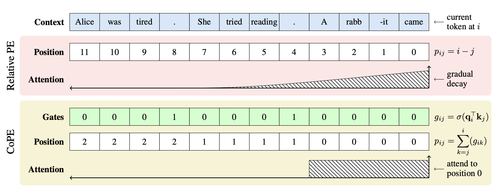
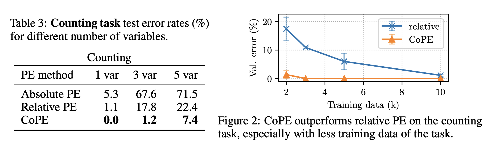

# Contextual Position Encoding (CoPE): Learning to Count What's Important

- Contextual Position Encoding (CoPE) is a new position encoding method that allows positions to be conditioned on context by incrementing position only on certain tokens determined by the model.
- CoPE allows more general position addressing such as attending to the i-th particular word, noun, or sentence.
- In particular, CoPE computes gate values conditioned on the context first, then uses that to assign positions to tokens using a cumulative sum. This allows positions to be contextualized, and represent the count of different units like words, verbs or sentences. CoPE operates on each attention head and so can attend to different position types on each.

<p align="center"></p>

## Papers

This work is based on the following paper: [Contextual Position Encoding: Learning to Count What's Important](https://arxiv.org/pdf/2405.18719).

## Setup

The following setup is recommened to reproduce experiments:

1. Create conda environment

```bash
conda create --name cope python=3.9
conda activate cope
```

2. Install dependencies. Our experiments were run with `transformers` version 4.42.4, you can specify it in `requirements.txt` to reproduce results in the paper:
```bash
conda install pytorch=2.2 pytorch-cuda=12.1 -y --strict-channel-priority --override-channels -c pytorch -c nvidia -c conda-forge
pip install -r requirements.txt
```

## Run model training end evaluation

We created a script that reproduces 3- and 5-variable runs for the Counting Task described in the [paper](https://arxiv.org/pdf/2405.18719). Simply run it on a GPU node:

```bash
bash run.sh
```

In the paper we reported the average test error rates of 3 random seeds.

<p align="center"></p>

## Contributors
Olga Golovneva, Tianlu Wang, Janice Lan, Jason Weston, Sainbayar Sukhbaatar

## Citation
If you use our model in your own work, please cite with the following BibTex entry:
```
@article{golovneva2024contextual,
  title={Contextual Position Encoding: Learning to Count What's Important},
  author={Golovneva, Olga and Wang, Tianlu and Weston, Jason and Sukhbaatar, Sainbayar},
  journal={arXiv preprint arXiv:2405.18719},
  year={2024}
}