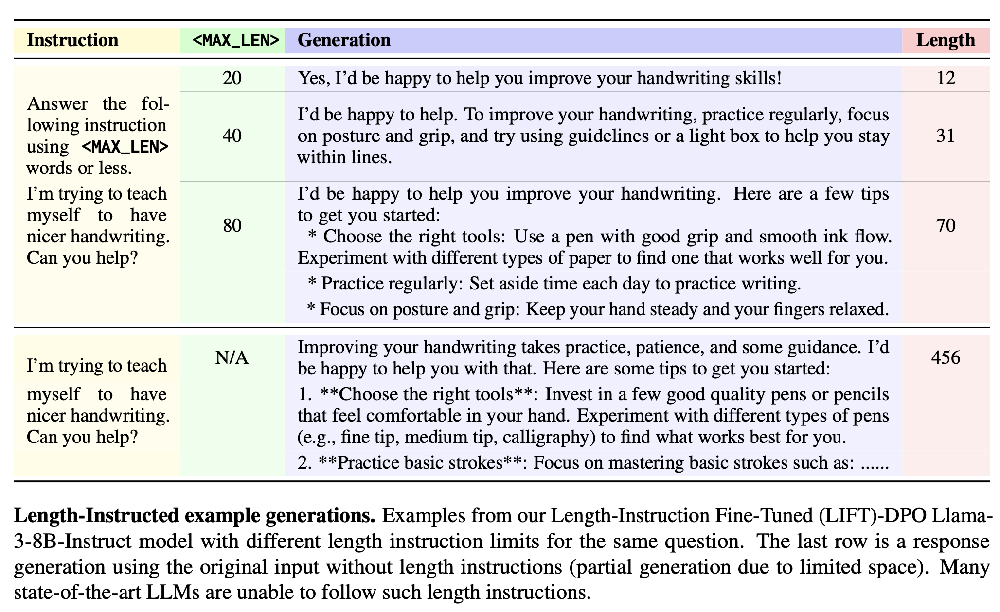

# Following Length Constraints in Instructions

Arxiv link: [Yuan et al. (2024)](https://arxiv.org/abs/2406.17744).

<p align="center"></p>

## Abstract

Aligned instruction following models can better fulfill user requests than their unaligned counterparts. However, it has been shown that there is a length bias in evaluation of such models, and that training algorithms tend to exploit this bias by learning longer responses. In this work we show how to train models that can be controlled at inference time with instructions containing desired length constraints. Such models are superior in length instructed evaluations, outperforming standard instruction following models such as GPT4, Llama 3 and Mixtral.

## AlpacaEval-LI \& MT-Bench-LI: New Length-Instructed Benchmarks
To evaluate the ability of current instruction following models to follow length instructions, we build length-instructed (LI) benchmarks, AlpacaEval-LI and  MT-Bench-LI.

In this paper, we also develop a method called Length-Instruction Fine-Tuning (LIFT) for improving instruction following models at length instruction following. Results reveal that:
<ol>
<li>Current state-of-the-art LLMs fail to follow length instructions</li>
<li>LIFT-DPO models perform well on AlpacaEval-LI and MT-Bench-LI</li>
<li>LIFT-DPO models show no performance degradation on standard AlpacaEval 2</li>
<li>LIFT-DPO can follow out-of-distribution length instructions better than existing methods</li>
</ol>


## AlpacaEval-LI \& MT-Bench-LI: New Length-Instructed Benchmarks
We introduce two new length-instructed benchmarks **AlpacaEval-LI** and **MT-Bench-LI**.

### AlpacaEval-LI
The AlpacaEval-LI consists of 802 length-instructed prompts from [Alpaca Eval](https://huggingface.co/datasets/tatsu-lab/alpaca_eval/tree/main). Download [AlpacaEval-LI prompts from s3](https://dl.fbaipublicfiles.com/length_instruct/v1/data/AlpacaEval-LI/length_instructed_alpaca_baseline.json). Below is a length-instructed example from the AlpacaEval-LI evaluation set.
```
{
    "dataset":"helpful_base",
    "instruction":"Answer the following instruction using 56 words or less.\n\nWho created the Superman cartoon character?",
    "output":"Superman, the iconic comic book superhero, was created by writer Jerry Siegel and artist Joe Shuster. Superman first appeared in Action Comics #1, which was published by Detective Comics, Inc. (later DC Comics) in June 1938. The character's immense popularity established him as one of the most enduring and recognizable figures in the superhero genre.",
    "generator":"AlpacaEval-LI",
    "max_len":56,
    "original_instruction":"Who created the Superman cartoon character?"
}
```
In particular,
- `original_instruction`: the original prompt from alpaca eval
- `instruction`: the length-instructed prompt.
- `max_len`: target length limit (in words).
- `output`: the reference output to pairwise compare against.

Command to Run AlpacaEval-LI Evaluation: Coming soon.

### MT-Bench-LI
The MT-Bench-LI consists of 240 length-instructed prompts from [MT-Bench](https://github.com/lm-sys/FastChat/tree/main/fastchat/llm_judge). See [downloadable MT-Bench-LI questions from s3](https://dl.fbaipublicfiles.com/length_instruct/v1/data/MT-Bench-LI/question.jsonl) for more details. Below is an example of length-instructed MT-Bench-LI prompt:
```
{
      "question_id": 162,
      "category": "writing",
      "turns": ["Answer the following instruction using 180 words or less.\n\nDraft a professional email seeking your supervisor's feedback on the 'Quarterly Financial Report' you prepared. Ask specifically about the data analysis, presentation style, and the clarity of conclusions drawn. Keep the email short and to the point."],
      "max_len": [180],
      "original_turns": ["Draft a professional email seeking your supervisor's feedback on the 'Quarterly Financial Report' you prepared. Ask specifically about the data analysis, presentation style, and the clarity of conclusions drawn. Keep the email short and to the point.", "Take a moment to evaluate and critique your own response."]
}
```
In particular,
- `original_turns`: the original multi-turn questions from MT-Bench.
- `turns`: the length-instructed question. Only turn1 question is included for length-instructed evaluation.
- `max_len`: target length limit (in words) for turn1 question.

To run pairwise MT-Bench-LI evaluation, please download [MT-Bench-LI pairwise baseline answers](https://dl.fbaipublicfiles.com/length_instruct/v1/data/MT-Bench-LI/length_instructed_turn1_baseline.jsonl), as well as [MT-Bench-LI reference answers](https://dl.fbaipublicfiles.com/length_instruct/v1/data/MT-Bench-LI/reference_answer.jsonl).

Command to Run MT-Bench-LI Evaluation: Coming soon.

## Citation
If you use the dataset or models in your own work, please cite with the following BibTex entry:
```
@misc{yuan2024followinglengthconstraintsinstructions,
      title={Following Length Constraints in Instructions},
      author={Weizhe Yuan and Ilia Kulikov and Ping Yu and Kyunghyun Cho and Sainbayar Sukhbaatar and Jason Weston and Jing Xu},
      year={2024},
      eprint={2406.17744},
      archivePrefix={arXiv},
      primaryClass={cs.CL}
      url={https://arxiv.org/abs/2406.17744},
}
```
