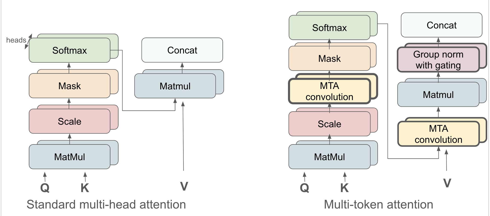

# Multi-Token Attention

- Motivation: soft attention looks at two tokens at a time to weigh their importance. But often it’s not enough! Suppose you are reading a history book, and you want to find what happened in Rome in 1417. You need to match both city and date *mentioned together*.
- The high level goal is to make it possible to use the similarities of multiple vector pairs to determine where attention must focus.
- We add convolutions for keys, queries, and attention heads to allow conditioning on neighboring tokens!

<p align="center"></p>

## Papers

This work is based on the following paper: [Multi-Token Attention](https://arxiv.org/pdf/2504.00927).

## Setup

1. Create conda environment following [Lingua instructions](https://github.com/facebookresearch/lingua)
2. Add RAM installation:

```bash
cd ~/RAM

pip install -e .
```

3. Pull submodules:

```bash
git submodule update --init --recursive
```

## Run model training

1. Activate your environment:

```bash
conda activate <path_to_lingua_environment>
export PYTHONPATH=<path_to_ram>/RAM/public_repos/lingua
```

2. Start distributed training:
```bash
cd projects/mta/

python -m lingua.stool script=train config=./configs/300M_mta.yaml nodes=4 qos=lowest
```

300M-830M configurations assume 4 nodes for training, 1B configuration assums 8 nodes.

3. Generate text completion:
```bash
python -m generate ckpt=<path_to_checkpoint>/consolidated dump_dir=/tmp max_gen_len=16
```


## Contributors
Olga Golovneva, Tianlu Wang, Jason Weston, Sainbayar Sukhbaatar

## Citation
If you use our model in your own work, please cite with the following BibTex entry:
```
@article{golovneva2025multi,
  title={Multi-Token Attention},
  author={Golovneva, Olga and Wang, Tianlu and Weston, Jason and Sukhbaatar, Sainbayar},
  journal={arXiv preprint arXiv:2504.00927},
  year={2025}
}