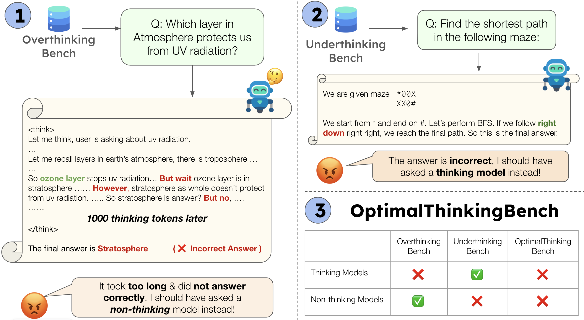

# OptimalThinkingBench: Evaluating Over and Underthinking in LLMs

- OptimalThinkingBench is a unified benchmark that evaluates both overthinking and underthinking in LLMs to encourage development of models that balance performance and efficiency.
- The benchmark consists of two sub-benchmarks: OverthinkingBench with simple queries where long thinking doesn't improve performance, and UnderthinkingBench with complex reasoning tasks where thinking is necessary.
- We introduce thinking-adjusted accuracy metrics (AUCOAA) to measure overthinking and combine it with underthinking accuracy through an F1 score to track optimal thinking.
- Evaluation of 33 models shows no model achieves optimal balance: thinking models generate hundreds of tokens on extremely simple queries without performance gains, while non-thinking models fail on complex reasoning.

<p align="center"></p>

## Paper

This work is based on the following paper: [OptimalThinkingBench: Evaluating Over and Underthinking in LLMs](https://arxiv.org/abs/2508.13141).

## Setup

The following setup is tested only on h100/h200 gpus. We recommend the below steps to reproduce experiments:

### 1. Create conda environment

```bash
conda create --name otb
conda activate otb
```

### 2. Install dependencies

```
pip install -e .
```

### 3. Quickstart

If you want to run a single command to prepare data, generate outputs and evaluate, you can use the following command:

```
otbench run --model <model_name> --run_locally
```

### 4. Step by Step Evaluation on OptimalThinkingBench (Optional)

1. Prepare dataset:

```
otbench prepare
```

This downloads data from HuggingFace and saves it to `data/otb_full`.

2. Generate model outputs:

```
otbench generate --model <model_name> --dataset data/otb_full --output final_outputs/otbench/{{model}}.jsonl --multiprocessing 1 --temperature 0.6 --num_gens 8 --run_locally
```

3. Evaluate:

```
otbench eval final_outputs/otbench/<model_name>.jsonl --model <model_name>
```

## Contributors
Pranjal Aggarwal, Seungone Kim, Jack Lanchantin, Sean Welleck, Jason Weston, Ilia Kulikov, Swarnadeep Saha

## Citation
If you use our benchmark in your own work, please cite with the following BibTex entry:
```
@article{aggarwal2025otb,
  title={OptimalThinkingBench: Evaluating Over and Underthinking in LLMs},
  author={Aggarwal, Pranjal and Kim, Seungone and Lanchantin, Jack and Welleck, Sean and Weston, Jason and Kulikov, Ilia and Saha, Swarnadeep},
  journal={arXiv preprint arXiv:2508.13141},
  year={2025}
}
