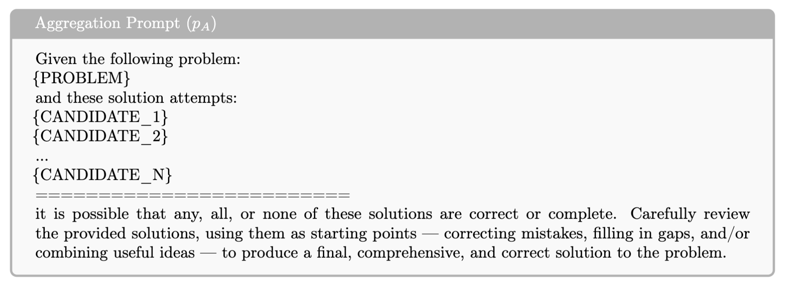

<script>
MathJax = {
  tex: {
    inlineMath: [['$', '$'], ['\\(', '\\)']],
    displayMath: [['$$', '$$'], ['\\[', '\\]']]
  }
};
</script>
<script src="https://cdn.jsdelivr.net/npm/mathjax@3/es5/tex-mml-chtml.js"></script>

# Learning to Aggregate through Online Reinforcement Learning


## Our Contribution

We develop RLLM, a framework for reinforcement learning (RL) that **unifies** the post-training paradigm, enabling the policy model to excel across **easy-to-verify, hard-to-verify, and non-verifiable tasks**. 

Reinforcement Learning with an LM as Reward Model (RLLM) first trains an LM-as-RM on on-policy synthetic judgments using RL and  uses its generative rewards to optimize the policy itself. 

The LM-as-RM exploits an LLM's:
- (1) reasoning capabilities to produce higher-quality reward signals and
- (2) instruction-following capabilities to allow flexible reward design.

We show that training the RLLM reward model on-policy (via responses sampled from the policy model) yields **improved results**.


*Figure: *


*Figure: *


## Why This Matters

## How does it work?



*Figure: *


## Experimental Results

We perform a number of experiments across different settings and backbones for both the LM and the LM-as-RM.

Overall, across all these settings, RLLM achieves consistently higher accuracy and win rates than RLVR and RLHF, with particularly large gains when trained on hard-to-verify problems.


*Figure: Performance comparison of post-trained Qwen3-1.7B models on (a) verifiable tasks (average of five math benchmarks) and (b) non-verifiable instruction-following tasks. Models are trained via RLHF (with *Skywork-Reward-V2-Llama-3.1-8B* as scalar-RM), RLVR (with *Math-Verify* as rule-based verifier) and, our RLLM (with *J1-Qwen3-32B* as LM-as-RM). Post-training data for verifiable tasks is either (1) easy-to-verify, (2) hard-to-verify, (3) reference-free, or (4) reference-based.*

Let's dig a little deeper into the results.


### Self-aggregation improves frontier models


*Figure: *


### The role of candidate diversity (pass@k) in self-aggregation


*Figure: *


*Figure: *


### Main Experiments


*Figure: *


#### Competition Math


*Figure: *


*Figure: *

#### Scientific Reasoning


*Figure: *


*Figure: *

## Conclusion

Scaling test-time compute is only as effective as the diversity and quality of the reasoning paths that are explored. Traditional parallel decoding and self-aggregation methods are bottlenecked by off-policy generations and mode collapse. To overcome these limitations, we introduced \method{}, a unified online reinforcement learning framework that explicitly aligns and optimizes candidate generations with downstream aggregation.

Our core insight is that generation and aggregation require distinct but complementary optimization strategies. In \method{}, the generator actively explores a diverse, complementary set of solutions through pass@k optimization. Simultaneously, the aggregator is trained via pass@1 optimization to reliably synthesize the on-policy candidates into a final answer.

Extensive evaluations across competition math and scientific reasoning benchmarks validate the strength of this approach. In both base models (e.g., Qwen3-4B-Base) and strong post-trained reasoners (e.g. Qwen3-4B-Instruct-2507), \method{} consistently improves standard offline self-aggregation. The gains are particularly pronounced on highly complex tasks, such as AIME and Principia, where synthesizing diverse reasoning trajectories is critical. By co-training generation and aggregation end-to-end, \method{} provides a robust, scalable recipe for improving inference-time reasoning.


## Contributors
Tianjian Li, Jingyu Zhang, Ping Yu, Swarnadeep Saha, Sainbayar Sukhbaatar, Jason Weston, Ilia Kulikov, Jack Lanchantin.

## More details
More details can be found in the [full technical report](https://arxiv.org/abs/2603.18886) (see section 3).

## Citation
To reference the work in this blog post, please use the following BibTex entry:
```
@article{principia2026,
  title={Reasoning over mathematical objects: on-policy reward modeling and test time aggregation},
  author={Pranjal Aggarwal, Marjan Ghazvininejad, Seungone Kim, Ilia Kulikov, Jack Lanchantin, Xian Li, Tianjian Li, Bo Liu, Graham Neubig, Anaelia Ovalle, Swarnadeep Saha, Sainbayar Sukhbaatar, Sean Welleck, Jason Weston, Chenxi Whitehouse, Adina Williams, Jing Xu, Ping Yu, Weizhe Yuan, Jingyu Zhang, Wenting Zhao},
  journal={arXiv preprint arXiv:2603.18886},
  year={2026}
}
```
