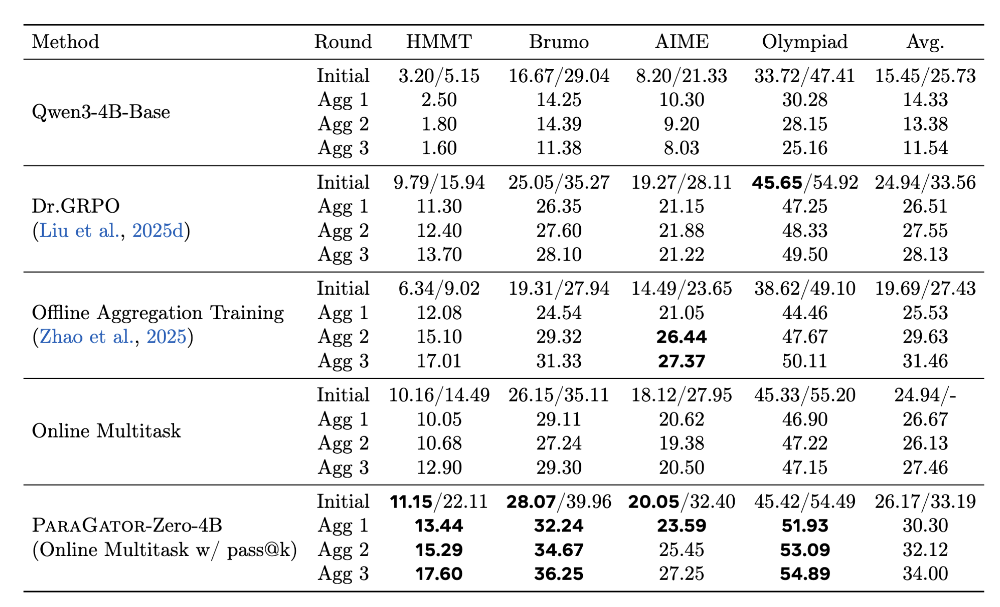
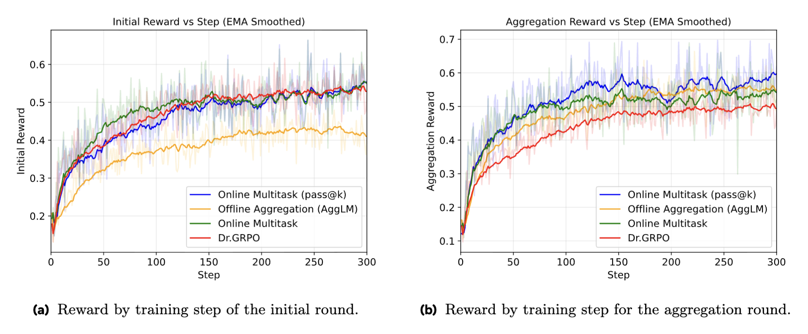

<script>
MathJax = {
  tex: {
    inlineMath: [['$', '$'], ['\\(', '\\)']],
    displayMath: [['$$', '$$'], ['\\[', '\\]']]
  }
};
</script>
<script src="https://cdn.jsdelivr.net/npm/mathjax@3/es5/tex-mml-chtml.js"></script>

# ParaGator: Learning to Aggregate through Online RL


## Our Contribution

We introduce a new reasoning aggregation method called **ParaGator**. Its core claim is that parallel reasoning works best when you **train both stages together**:

- the LLM generator should produce diverse candidates -- train with pass@k
- the LLM aggregator should synthesize those candidates into a final answer

ParaGator thus trains initial candidate generation with pass@k optimization and aggregation with pass@1 optimization, training end-to-end.
This brings large gains, as shown on competition math and scientific reasoning problems.


*Figure: Our parallel thinking scaffolding and method. We use pass@k optimization for optimizing the initial round of responses and pass@1 optimization (standard RLVR) for optimizing the aggregation rollouts, and train end-to-end.*


*Figure: At inference, during each round we sample rollouts from the past aggregation round, pack them into the aggregation prompt, and perform inference to obtain the next pool of rollouts.*


## Why Existing Aggregation Methods Fall Short


Classical majority vote/self consistency neither trains aggregation, nor uses the LLM to aggregate.
Recent methods like [AggLM](https://arxiv.org/abs/2509.06870) and [RSA](https://arxiv.org/abs/2509.26626) advocate for LLM-based aggregation.

This work identifies two recurring problems in prior approaches:

- they often optimize only the aggregator and treat the generator as fixed
- standard outcome-based RL collapses candidate generation toward one dominant mode

That means the aggregator is trained on the wrong distribution and often sees redundant candidate pools.


## ParaGator

Given a problem $x$, the model first samples a pool of candidate solutions:

$$
y_i \sim \mathcal{M}_\theta(y \mid p_C, x), \quad i = 1,\dots,m
$$

Then it aggregates those candidates into a final answer:

$$
\tilde{y} \sim \mathcal{M}_\theta(y \mid p_A, x, y_{1:m})
$$

The candidate stage is trained with a pass@k objective, while the aggregation stage is trained with pass@1.

The paper defines pass@k as:

$$
\mathrm{pass@}k = \max[r(y_1), r(y_2), \dots, r(y_k)]
$$

That objective explicitly rewards the model for putting at least one correct solution into the pool, which encourages diversity instead of mode collapse.


## Main Experiments


### Self-aggregation improves frontier models

Parallel generation + aggregation (orange) brings gains across 4 competition math benchmarks (AIME, Brumo, HMMT and IMO-Answerbench) on top of 3 strong models: Kimi-K2-Thinking, Qwen3-4B-Thinking-2507, and
Qwen3-4B-Instruct-2507, compared to standard generation (blue) and majority voting (green).


*Figure: Parallel generation + aggregation (orange) brings gains across 4 competition math benchmarks on top of 3 strong models: Kimi-K2-Thinking, Qwen3-4B-Thinking-2507, and
Qwen3-4B-Instruct-2507, compared to standard generation (blue) and majority voting (green).*
*Figure: parallel generation followed by aggregation improves strong open models over standard decoding and majority voting.*


### A Key Empirical Observation: The role of candidate diversity (pass@k) in self-aggregation

Self-aggregation is bounded by the quality and diversity of the initial candidate pool. If the pool does not contain enough good or complementary trajectories, aggregation cannot recover much.


The repeated-aggregation experiments make the same point more directly:


*Figure: repeated aggregation saturates below the initial pass@k bound, which motivates directly training the generator for better candidate diversity.*


*Figure: Performance of repeated aggregation is upper bounded by the initial pass@k (green) for both Qwen3-4B-Thinking-2507 (left) and Qwen3-4B-Instruct-2507 (right). The asymptotic performance is upper-bounded by the pass@k at the initial round.*


<p align="center"></p>
*Figure: Model = Qwen3-4B-Thinking-2507. Effect of initial sampling temperature on decoding performance, averaged over HMMT, Brumo, and AIME. Increasing the initial temperature leaves pass@1 nearly unchanged while improving pass@k, resulting in higher aggregation performance.*


### ParaGator experiments

blah blah

<p align="center"></p>
*Figure: Comparison of training strategies across the initial and aggregation rounds. Columns show whether model parameters are updated via pass@1 or pass@k optimization, or kept fixed.*

#### Competition Math


*Figure: *


*Figure: *

#### Scientific Reasoning


*Figure: *


*Figure: *

## Conclusion

Scaling test-time compute is only as effective as the diversity and quality of the reasoning paths that are explored. Traditional parallel decoding and self-aggregation methods are bottlenecked by off-policy generations and mode collapse. To overcome these limitations, we introduced \method{}, a unified online reinforcement learning framework that explicitly aligns and optimizes candidate generations with downstream aggregation.

Our core insight is that generation and aggregation require distinct but complementary optimization strategies. In \method{}, the generator actively explores a diverse, complementary set of solutions through pass@k optimization. Simultaneously, the aggregator is trained via pass@1 optimization to reliably synthesize the on-policy candidates into a final answer.

Extensive evaluations across competition math and scientific reasoning benchmarks validate the strength of this approach. In both base models (e.g., Qwen3-4B-Base) and strong post-trained reasoners (e.g. Qwen3-4B-Instruct-2507), \method{} consistently improves standard offline self-aggregation. The gains are particularly pronounced on highly complex tasks, such as AIME and Principia, where synthesizing diverse reasoning trajectories is critical. By co-training generation and aggregation end-to-end, \method{} provides a robust, scalable recipe for improving inference-time reasoning.


The main insight of ParaGator is that aggregation quality is not just an inference trick. It is a training problem. If you want aggregation to work, you need candidate pools that are diverse, on-policy, and useful for synthesis. Pass@k for generation plus pass@1 for aggregation is the paper's answer to that mismatch.


## Contributors
Tianjian Li, Jingyu Zhang, Ping Yu, Swarnadeep Saha, Sainbayar Sukhbaatar, Jason Weston, Ilia Kulikov, Jack Lanchantin.

## More details
More details can be found in the [full technical report](https://arxiv.org/abs/2603.18886) (see section 3).

## Citation
To reference the work in this blog post, please use the following BibTex entry:
```
@article{principia2026,
  title={Reasoning over mathematical objects: on-policy reward modeling and test time aggregation},
  author={Pranjal Aggarwal, Marjan Ghazvininejad, Seungone Kim, Ilia Kulikov, Jack Lanchantin, Xian Li, Tianjian Li, Bo Liu, Graham Neubig, Anaelia Ovalle, Swarnadeep Saha, Sainbayar Sukhbaatar, Sean Welleck, Jason Weston, Chenxi Whitehouse, Adina Williams, Jing Xu, Ping Yu, Weizhe Yuan, Jingyu Zhang, Wenting Zhao},
  journal={arXiv preprint arXiv:2603.18886},
  year={2026}
}
```
