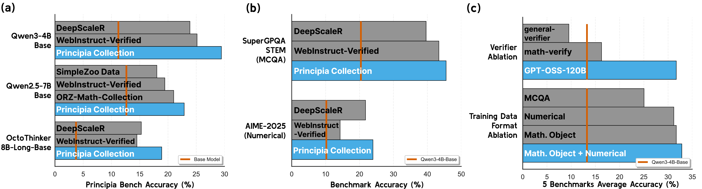
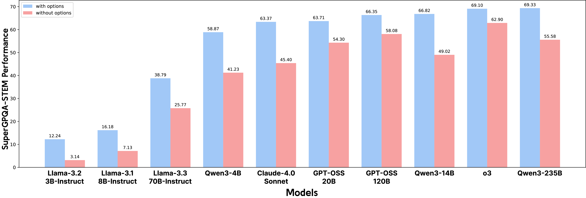
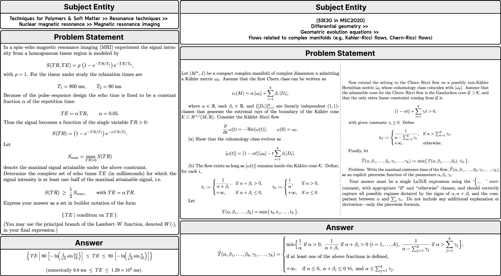
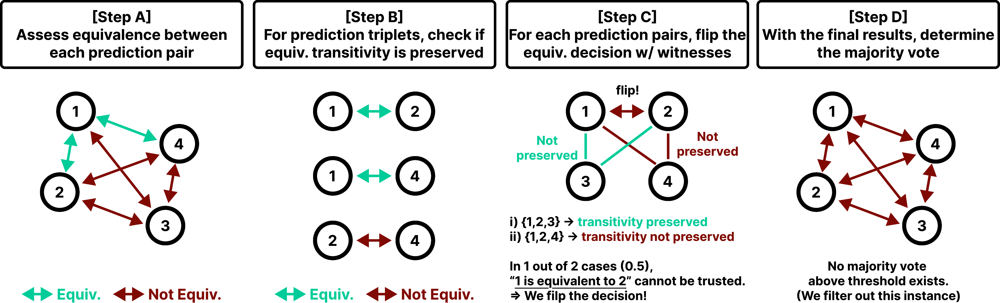

# Principia: Training LLMs to Reason over Mathematical Objects


## Our Contribution

This work develops an LLM evaluation benchmark and training data for reasoning problems whose answers are not numerical values or multiple-choice answers, but full **mathematical objects**.

The core claim is simple: if you want models that can help with real scientific and mathematical work, you need to train on such data & test whether they can derive things like equations, sets, matrices, intervals, and piecewise functions. *We show that this ends up **improving the overall reasoning ability of your model for all tasks.***

Benchmark: [PrincipiaBench on HuggingFace](https://huggingface.co/datasets/facebook/principia-bench)

Training data: [Principia Collection on HuggingFace](https://huggingface.co/datasets/facebook/principia-collection)

</br>




*Figure: RL training on the Principia Collection improves performance on PrincipiaBench and transfers to numerical and MCQA benchmarks.*

## Why This Matters

A large fraction of current reasoning evaluation still rewards models for producing either:

- a numerical answer
- a multiple-choice option

Those formats are convenient to grade, but they hide important weakness: a model does not learn how to manipulate complex objects successfully, e.g. it can learn to solve an MCQ by reasoning backward from the options rather than deriving the answer from first principles. 
 .

An example mathematical-object answer we work with looks like:

$$
\frac{1}{|G|}\left(2 + \sum_{x \in G,\ x \neq 1}\mathrm{Re}(\chi(x))\right)
$$

That is a very different capability from selecting `B` from multiple choice questions, or outputting `42`!


## Existing Benchmarks Overstate Capability

Our experiments show that once answer options are removed from SuperGPQA questions that really require mathematical objects, performance drops sharply even for frontier models. The reported drop is typically in the 10 to 20 point range.



*Figure: removing answer options reveals a substantial gap between MCQ performance and open-ended derivation ability.*

This is the motivation for **PrincipiaBench**, a benchmark of 2,558 problems collected from RealMath, Physics, ARB, and filtered SuperGPQA items. The benchmark is designed so that the model must generate the mathematical object directly.


## The Principia Collection

To train for this harder setting, we also introduce the **Principia Collection**, a 248K-example synthetic dataset grounded in:

- Mathematics Subject Classification (MSC 2020)
- Physics Subject Headings (PhySH)

The target outputs span six answer types:

- equations
- inequalities
- intervals
- sets
- matrices
- piecewise functions



*Figure: example instances from the Principia Collection, showing the level of detail and the mathematical-object answer types the dataset targets.*

## Why Verification Is Hard

A central issue is that mathematical objects can be equivalent while looking different syntactically. That breaks many rule-based verification pipelines.

The paper therefore introduces **Principia VerifyBench**, a meta-evaluation set for answer equivalence, and uses strong model-based verifiers to judge whether two answers denote the same object.

The labeling pipeline relies on pairwise equivalence judgments and majority voting rather than exact string matching.



*Figure: illustration of the majority-vote procedure used to determine labels when multiple mathematically equivalent answers may be written in different forms.*


<!--

**Problem:** The ability to precisely derive mathematical objects is a core requirement for downstream STEM applications, including mathematics, physics, and chemistry, 
where reasoning must culminate in formally structured expressions. 
Yet, current LM evaluations of mathematical and scientific reasoning rely heavily on simplified answer formats such as numerical values or multiple choice options due to
the convenience of automated assessment. 
Likewise, existing RL post-training datasets overrepresent easy-to-verify formats, largely excluding complex mathematical-object answers.

**Contribution:** To address these, we introduce the **PrincipiaBench**, a benchmark designed to evaluate an LM's ability to derive mathematical objects,
and **Principia Collection**, a synthetic post-training dataset which improves LLM's on both PrincipiaBench and other reasoning tasks.  Finally, we release **Principia VerifyBench**,
a meta-evaluation benchmark that enables assessment of rule-based and model-based verifiers used in benchmarking and reward modeling 
for mathematical-object outputs. Together, the Principia suite provides a unified framework for evaluating and improving LM reasoning.

**Results:** We find that strong LMs such as Qwen3-235B and o3 struggle, achieving only 55.27\% and 62.57\% accuracy, respectively.
Next, we use the *Principia Collection*, an RL post-training dataset tailored to induce the ability to derive mathematical objects.
RL training on the *Principia Collection* yields +7.52–18.23\% improvements on *PrincipiaBench* across four LMs. Moreover,
LMs trained on *Principia Collection* improve by +7.08–20.10\% on AIME-2025 (numerical) and +3.78–25.47\% on GPQA-Diamond (MCQA), 
demonstrating cross-format generalization of reasoning abilities.
-->


<p align="center"></p>


## Main Results

The high-level findings from this section are:

- Training on Principia Collection improves PrincipiaBench performance by 7.22 to 18.35 points on average across the studied base models.
- The same training also improves numerical and MCQA benchmarks, which suggests the gain is not narrow overfitting to one answer format.
- Strong model-based verifiers are necessary. Weak or rule-based verifiers degrade training badly when answers become structurally complex.

One of the most important conclusions is that **training on mathematical-object outputs transfers outward**, while MCQA-heavy supervision does not transfer nearly as well in the other direction.


## Takeaway

The main contribution of Principia is not just another benchmark. It is a shift in what counts as reasoning competence. If the target application involves scientific derivation, then benchmark design, synthetic data generation, and verification all need to reflect that reality.


## Contributors
Pranjal Aggarwal, Marjan Ghazvininejad, Seungone Kim, Ilia Kulikov, Jack Lanchantin, Xian Li, Tianjian Li, Bo Liu, Graham Neubig, Anaelia Ovalle, Swarnadeep Saha, Sainbayar Sukhbaatar, Sean Welleck, Jason Weston, Chenxi Whitehouse, Adina Williams, Jing Xu, Ping Yu, Weizhe Yuan, Jingyu Zhang, Wenting Zhao

## More details
More details can be found in the [full technical report](link).

## Citation
If you use our training data or benchmark in your own work, please also cite with the following BibTex entry:
```
@article{aggarwal2025otb,
  title={Reasoning over mathematical objects: on-policy reward modeling and test time aggregation},
  author={RAM Team},
  journal={arXiv preprint arXiv:2508.13141},
  year={2026}
}
