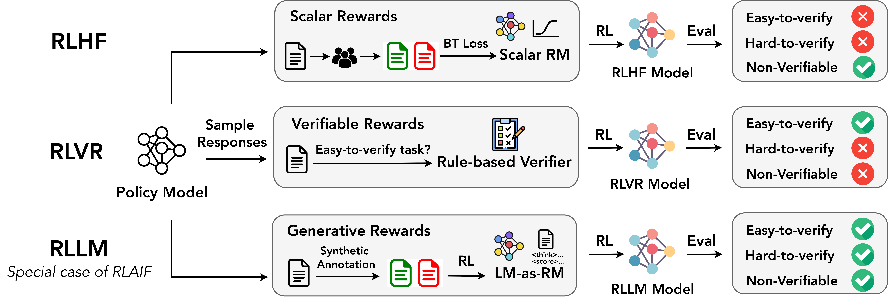
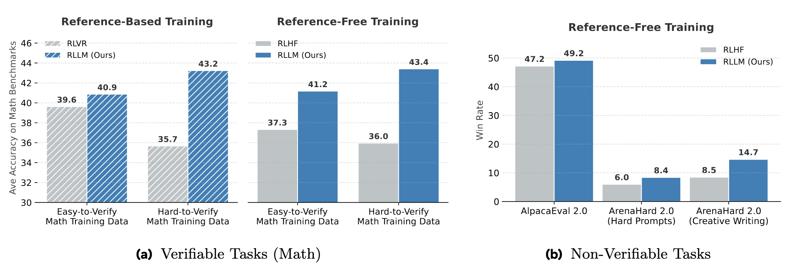
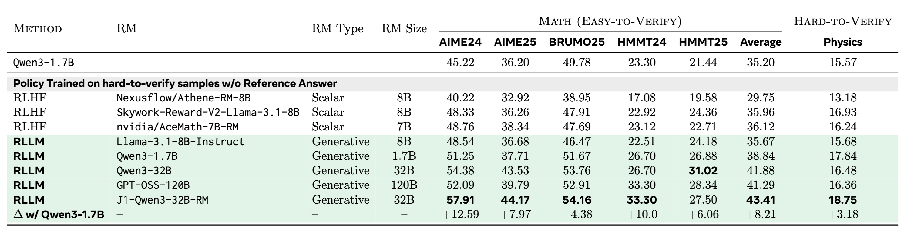
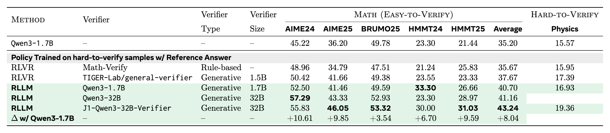
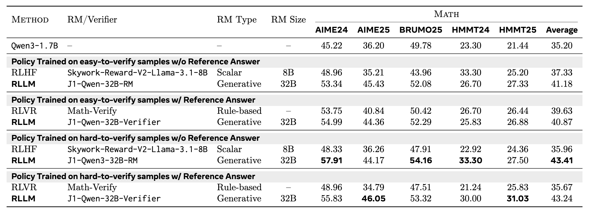
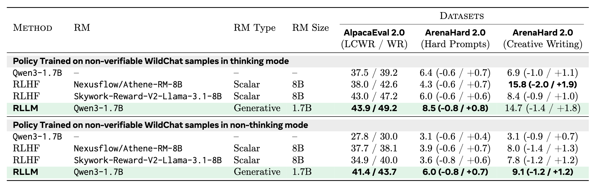
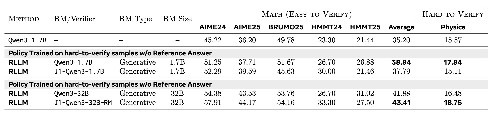
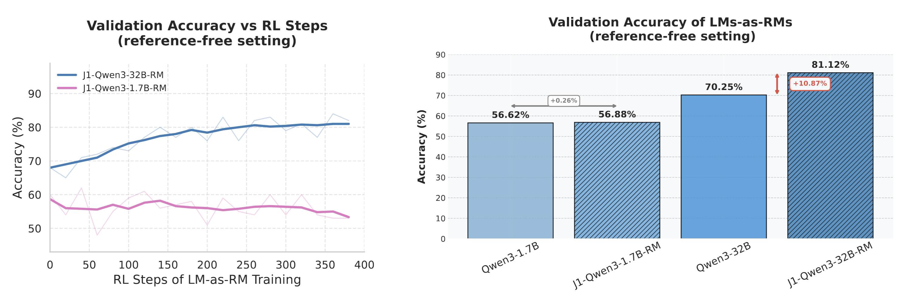
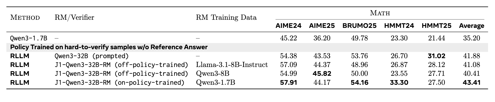
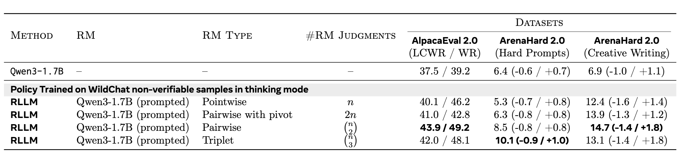

# Unified Post-Training via On-Policy-Trained Language Model as a Reward Model


## Our Contribution

We develop RLLM, a framework for reinforcement learning (RL) that  **unifies** the post-training paradigm, enabling the policy model to excel across **easy-to-verify, hard-to-verify, and non-verifiable tasks**. 

Reinforcement Learning with an LM as Reward Model (RLLM) first trains an LM-as-RM on on-policy synthetic judgments using RL and  uses its generative rewards to optimize the policy itself. 

The LM-as-RM exploits an LLM's:
- (1) reasoning capabilities to produce higher-quality reward signals and
- (2) instruction-following capabilities to allow flexible reward design.

We show that training the RLLM reward model on-policy (via responses sampled from the policy model) yields **improved results**.




*Figure: The Reinforcement Learning with an LM as Reward Model (RLLM) method compared to standard RLHF and RLVR approaches for post-training LLMs.*


## Why This Matters

Post-training for LLMs typically follows one of two paradigms: Reinforcement Learning from Human Feedback (RLHF), which relies on scalar reward models trained from human preference data, or Reinforcement Learning with Verifiable Rewards (RLVR), which depends on rule-based verifiers. Scalar reward models do not generate chain-of-thought reasoning, making them prone to reward hacking and limiting their effectiveness on complex reasoning tasks. Rule-based verifiers, meanwhile, assume access to gold answers that can be both hard-to-obtain and hard-to-verify, limiting their utility to e.g. easily-verifiable math and code problems. 

We show that **RLLM** can serve as a single, unified post-training recipe, enabling the policy model to excel across easy-to-verify, hard-to-verify, and non-verifiable tasks.

We show that on-policy training of the LM-as-RM outperforms both prompted LMs-as-RMs (including a larger GPT-OSS-120B) and off-policy trained ones. Finally, through extensive analyses across a wide range of policy–reward LM pairings -- varying in model size, capability, and training data (easy- vs. hard-to-verify, reference-free vs. reference-based tasks) -- we identify the key ingredients for effective post-training with Language Models as Reward Models.


## How does it work


## Main Experimental Results

We perform a number of experiments across different settings and backbones for both the LM and the LM-as-RM.

Overall, across all these settings, RLLM achieves consistently higher accuracy and win rates than RLVR and RLHF, with particularly large gains when trained on hard-to-verify problems.




*Figure: Performance comparison of post-trained Qwen3-1.7B models on (a) verifiable tasks (average of five math benchmarks) and (b) non-verifiable instruction-following tasks. Models are trained via RLHF (with *Skywork-Reward-V2-Llama-3.1-8B* as scalar-RM), RLVR (with *Math-Verify* as rule-based verifier) and, our RLLM (with *J1-Qwen3-32B* as LM-as-RM). Post-training data for verifiable tasks is either (1) easy-to-verify, (2) hard-to-verify, (3) reference-free, or (4) reference-based.*

Let's dig a little deeper into the results.


### Reference-free setting
We conduct experiments where we compare  post-trained Qwen3-1.7B (Instruct) models using RLLM or RLHF on easy-to-verify and hard-to-verify reasoning benchmarks in the reference-free setting.
All models are trained on hard-to-verify samples. RLHF'ed models are optimized using SOTA scalar RMs. RLLM models are optimized using either prompted LM-as-RM or our trained \methodrm{} LM-as-RM.
We observe improved RLLM results by scaling up the LM-as-RM, with J1-Qwen3-32B-RM improving AIME24 by 12\% on top of a Qwen3-1.7B (Instruct) model.


*Figure: Reference-free setting. RLLM provides strong results compared to RLHF.*

### Reference-based setting
We compare post-trained Qwen3-1.7B (Instruct) models using RLLM or RLVR on easy-to-verify and hard-to-verify reasoning benchmarks in the referenced-based setting. All models are trained on hard-to-verify examples. RLVR models are optimized using either rule-based or model-based verifiers. RLLM models are optimized using either prompted or trained LM-as-RM (functioning as reference-based verifiers). All RLLM variants outperform all RLVR variants.
 

*Figure: Reference-based setting. RLLM provides strong results compared to RLVR.*

### Easy-to-verify vs. hard-to-verify training sets

We also compare RLLM, RLHF, and RLVR across different training datasets -- easy-to-verify, hard-to-verify, reference-free, and reference-based. RLLM on hard-to-verify data with a strong LM-as-RM outperforms all models trained on easy-to-verify data.


*Figure: Reference-based setting. RLLM provides strong results compared to models trained on easy-to-verify data.*

### Non-Verifiable Instruction-following tasks

We also experiment with RLLM on  non-verifiable instruction-following tasks.
We compare the Win Rate (WR) and Length Controlled Win Rate (LCWR) of RLLM and RLHF when training a Qwen3-1.7B policy (either in thinking or non-thinking mode). 
For AlpacaEval 2.0, we use GPT-4o as the evaluator and for ArenaHard 2.0, we use GPT-4.1 as the evaluator. 

RLLM matches or outperforms RLHF, obtaining best win rates on hard prompts of ArenaHard 2.0.


*Figure: Non-verifiable task evaluation. RLLM provides strong results compared to competing approaches.*

### When and Why does this work?

In this section, we investigate the impact of the \emph{generator–verifier gap} on RLLM training, specifically examining how the capability gap between the policy LM and the LM-as-RM influences downstream policy improvements. Recall that for our main experiments, we trained a Qwen3-1.7B policy with a J1-Qwen3-32B-RM where the RM was trained on-policy (by sampling responses from the Qwen3-1.7B policy). Now we ask if we train a weaker 1.7B LM-as-RM on its own responses i.e., J1-Qwen-1.7B-RM, can that also lead to downstream improvements? As shown in~\autoref{tab:gen_ver_gap}, we do not observe further improvements on top of the prompted Qwen3-1.7B-as-RM with J1 training. This result is further evidenced by~\autoref{fig:j1_acc_no_ref}, where we compare the raw accuracy of different LMs-as-RMs on an in-distribution validation set. We observe that \methodrm{} training of a Qwen3-32B model leads to 10\% improvement in judgment accuracy (averaged across 8 seeds) while providing almost no improvement on top of Qwen3-1.7B. In summary, training a Qwen3-1.7B model to evaluate its own responses leads to limited success and consequently, the resultant RM also does not lead to any downstream policy improvements. This underscores the importance of the capability gap between the generator and the verifier for obtaining downstream improvements. In Appendix~\autoref{fig:appendix_j1_traces}, we show examples of correct and incorrect thinking traces generated by J1-Qwen3-1.7B-RM and J1-Qwen3-32B-RM respectively.

Analysis of Generator-Verifier Gap. RLLM post-training of a Qwen3-1.7B policy with a J1-Qwen3-1.7B LM-as-RM does not improve performance over the prompted LM-as-RM baseline while post-training with a stronger J1-Qwen3-32B LM-as-RM improves over the corresponding prompted baseline.



Comparison of RLLM post-training of Qwen3-1.7B with on-policy versus off-policy \methodrm{}-trained LMs-as-RMs. On-policy J1-Qwen3-32B-RM is trained on Qwen3-1.7B responses while off-policy models are trained on either weaker Llama responses or stronger Qwen3-8B responses. On-policy trained LM-as-RM outperforms off-policy trained ones.




### On-policy vs off-policy LM-as-RM training

We compare an on-policy trained LM-as-RM with two off-policy trained RMs. All three RMs are trained on top of the same Qwen3-32B model using the same recipe, differing only in their training data: the off-policy RMs are trained on responses generated either by a weaker Llama model or by a stronger Qwen3-8B model. 

Athough the results show that training improves judgment accuracy for all these models on their respective in-distribution validation sets, the off-policy trained LMs-as-RMs do not transfer to downstream policy improvements. This shows that RM capability improvements measured on static, offline benchmarks (with different data distributions) may not always be indicative of downstream task improvements because of lack of OOD generalization.


*Figure: Comparison of RLLM post-training of Qwen3-1.7B with on-policy versus off-policy J1-trained LMs-as-RMs. On-policy J1-Qwen3-32B-RM is trained on Qwen3-1.7B responses while off-policy models are trained on either weaker Llama responses or stronger Qwen3-8B responses. On-policy trained LM-as-RM outperforms off-policy trained ones.*

### Scaling up reward modeling compute

For our base non-verifiable tasks experiments we employed a pairwise LM-as-RM, as non-verifiable tasks benefit from relative judgments. Here, we also study  the effect of scaling up reward modeling compute by conducting either pointwise, pairwise, or listwise scoring from the LM-as-RM. Since the complexity of pairwise scoring is quadratic in the number of rollouts, we also explore a second pairwise setting where one of the rollouts is chosen at random as a pivot (or reference) rollout to compare against.

We observe that on the hard prompts, win rates improve with more judgments while for the other categories, results mostly saturate at pairwise comparisons. Overall, this highlights the flexibility of an LM-as-RM's rewarding mechanism, allowing increased compute to be spent on evaluation.



*Figure: the effect of scaling up reward modeling compute in RLLM via pointwise, pairwise, pairwise with a pivot rollout, and triplet-based scoring between rollouts methods of conputing reward.*


## Conclusion

We showed that RLLM -- RL with (RL-trained) language models as reward models -- can serve as a single, unified post-training recipe across easy-to-verify, hard-to-verify, and non-verifiable tasks. Through extensive experiments, we demonstrated that RLLM outperforms both RLHF (with scalar RMs) and RLVR (with rule-based rewards), showcasing particularly large gains when training on hard-to-verify tasks.

We also studied the importance of on-policy training of LM-as-RM models alongside the impact of generator-verifier gap and showed that these are important components for successful RLLM training.


## Contributors
Chenxi Whitehouse, Ilia Kulikov, Ping Yu, Jason Weston, Xian Li, Swarnadeep Saha.

## More details
More details can be found in the [full technical report](https://arxiv.org/abs/2603.18886).

## Citation
If you use our training data or benchmark in your own work, please also cite with the following BibTex entry:
```
@article{principia2026,
  title={Reasoning over mathematical objects: on-policy reward modeling and test time aggregation},
  author={Pranjal Aggarwal, Marjan Ghazvininejad, Seungone Kim, Ilia Kulikov, Jack Lanchantin, Xian Li, Tianjian Li, Bo Liu, Graham Neubig, Anaelia Ovalle, Swarnadeep Saha, Sainbayar Sukhbaatar, Sean Welleck, Jason Weston, Chenxi Whitehouse, Adina Williams, Jing Xu, Ping Yu, Weizhe Yuan, Jingyu Zhang, Wenting Zhao},
  journal={arXiv preprint arXiv:2603.18886},
  year={2026}
}
```
