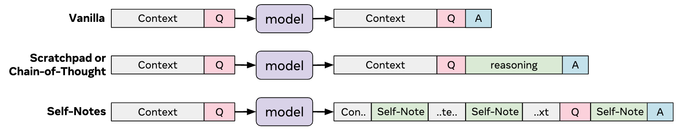
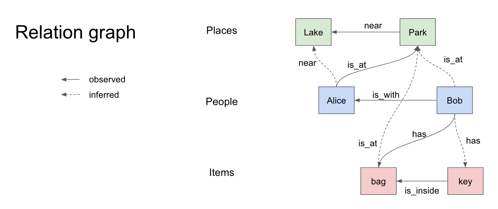

# Self-Notes
This is a repository for our paper [Learning to Reason and Memorize with Self-Notes
](https://arxiv.org/abs/2305.00833).

<p align="center"></p>

### Abstract
Large language models have been shown to struggle with multi-step reasoning, and do not retain previous reasoning steps for future use. We propose a simple method for solving both of these problems by allowing the model to take Self-Notes. Unlike recent chain-of-thought or scratchpad approaches, the model can deviate from the input context at any time to explicitly think and write down its thoughts. This allows the model to perform reasoning on the fly as it reads the context and even integrate previous reasoning steps, thus enhancing its memory with useful information and enabling multi-step reasoning. Experiments across a wide variety of tasks demonstrate that our method can outperform chain-of-thought and scratchpad methods by taking Self-Notes that interleave the input text.

## Toy-Story data generation
This code generates toy-story data that used in the paper.

> Mary is with Daniel.
John has the suitcase.
the key is inside the box.
the ball is inside the basket.
Frank is with John.
Daniel has the basket.
Mary is at the museum.
>
> Q: Where is the basket?
A: the basket is at the museum.

It generates short stories in natural language along with a QA pair. First, it selects random entities and add random relations between them. Along the way, it also infers relations that are not directly observed. This makes it possible to ask questions that needs reasoning over multiple facts.

<p align="center"></p>

### How to use
Run the following command to generate data in `data/` directory
```bash
cd toy_story
python main.py data/
```
To see all possible options, run
```bash
python main.py -h
```
For example, to generate stories with up to 20 statements, questions with 1 or 2 supporting facts and some can't be answered
```bash
python main.py data/ --max-events 20 --filter-nsupports 1 2 --unknown 0.2
```

## Citation
If you use our code in your own work, please cite with the following BibTex entry:
```
@inproceedings{
    lanchantin2023learning,
    title={Learning to Reason and Memorize with Self-Notes},
    author={Jack Lanchantin and Shubham Toshniwal and Jason E Weston and Arthur Szlam and Sainbayar Sukhbaatar},
    booktitle={Thirty-seventh Conference on Neural Information Processing Systems},
    year={2023},
}
```
