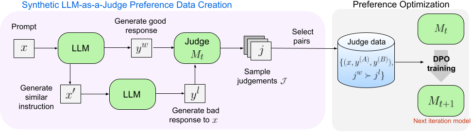

# Self-Taught Evaluators

<p align="center"></p>

Instructions and materials presented here correspond to the [Self-taught evaluators](https://arxiv.org/abs/2408.02666) research project.

# Self-taught evaluator model release

**2024-09-26**

We release the self-taught evaluator model on hugging-face model repo: https://huggingface.co/facebook/Self-taught-evaluator-llama3.1-70B. This model is trained iteratively with supervised fine-tuning (SFT) and direct preference optimization (DPO).

## Inference and Evaluation

We provide example scripts to use the self-taught evaluator as a judge to choose a better response from a pair. We provide set of scripts to reproduce the RewardBench evaluation scores for this model. Please refer to [src/requirements.txt](./src/requirements.txt)

> [!IMPORTANT]
> This model was trained to judge a pair of responses using the specific prompt format from the RewardBench benchmark. Make sure to adopt the same prompt format when you run the model on your data.

#### Example: running the model with a given set of user inputs & pair of assistant outputs.

Note: download example eval data here: https://dl.fbaipublicfiles.com/self_taught_evaluator/example_inputs.jsonl

1. Prepare your inputs similar to ones found in [example_inputs.jsonl](./src/example_inputs.jsonl)

2. Run the script [run_inference_wvllm.sh](./run_inference_wvllm.sh). The generated outputs and parsed judgements will be saved in `example_outputs.jsonl`.

### Reproducing rewardbench evaluation score

Note: download eval data here: https://dl.fbaipublicfiles.com/self_taught_evaluator/rewardbench_inputs.jsonl

1. Run `bash src/run_rewardbench.sh`.

2. Expected output:

```text
Chat            Chat Hard       Safety          Reasoning
0.969           0.851           0.896           0.884

Final score: 90.014
```

## Synthetic Preference Data

The pre-processed training data for preference fine-tuning can be downloaded here: https://huggingface.co/datasets/facebook/Self-taught-evaluator-DPO-data

Below you can find instructions on how to replicate our data generation process.

### Generate worse response
1. Given pairs of (instruction, baseline response), prepare prompts using the template specified in `data/prompts/worse_response.prompt`.
2. Run generation on the prompts from step 1, to generate a "worse response" to the instruction.
### Generate judgement
1. Given tuples of (instruction, baseline response, worse response), we generate judgement using the prompt template specified in `data/prompts/eval_plan.prompt`. To avoid position bias, we generate evaluation plans for both orders of the responses positions. Specifically, for `0_1` order, we prepare the prompt using (instruction, baseline response, worse response), and for `1_0` order, we prepare the prompt using (instruction, worse response, baseline response).
2. Run generation on both `0_1` and `1_0` ordered prompts from step 1 to derive evaluation plans for pairwise preference.
3. Then we apply rejection sampling, where we collect multiple samples of evaluation plan, and only retain examples where the judgement prefers the baseline response to the worse response. To ensure label balance, we retain the same number of examples of `A is better` and `B is better`.

### Generation hyper-parameters

The experiments in the paper used vllm for generation, with temperature=0.7, and top_p=0.9, max_tokens=4096.

### Prepare training data
After generating samples of judgement (e.g. using vllm), run `python src/prepare_sft_data.py` and `python src/prepare_dpo_data.py` to prepare the training data.

## Model training details

Model were trained using the preference optimization recipe from the open-source [fairseq2 library](https://github.com/facebookresearch/fairseq2). Training was executed on SLURM-based cluster using multi-node A100 setup: 3 nodes training for first iteration SFT model and 8 nodes training for the second iteration DPO model that was released. Model selection is done via early stopping based on the pairwise judgement accuracy computed over the helpsteer2 validation set.

**SFT training config and example run command**

Config: [sft_training.yaml](./training_configs/sft_training.yaml)

Run command (within SLURM allocation): `srun fairseq2 lm instruction_finetune ${SAVE_DIR} --config-file ./training_configs/sft_training.yaml`

**DPO training config and example run command**

Config: [dpo_training.yaml](./training_configs/dpo_training.yaml)

Run command (within SLURM allocation): `srun fairseq2 lm preference_finetune ${SAVE_DIR} --config-file ./training_configs/dpo_training.yaml`

## Citation
If you use data, model, or code from this work, please cite with the following BibTex entry:
```
@article{wang2024self,
  title={Self-taught evaluators},
  author={Wang, Tianlu and Kulikov, Ilia and Golovneva, Olga and Yu, Ping and Yuan, Weizhe and Dwivedi-Yu, Jane and Pang, Richard Yuanzhe and Fazel-Zarandi, Maryam and Weston, Jason and Li, Xian},
  journal={arXiv preprint arXiv:2408.02666},
  year={2024}
}
```
