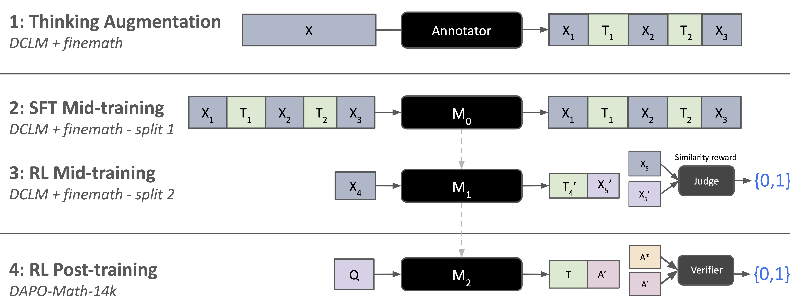
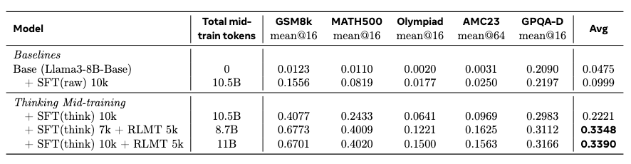
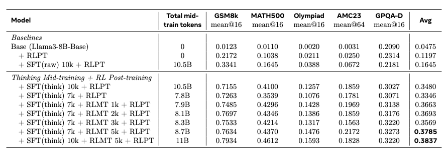

<script>
MathJax = {
  tex: {
    inlineMath: [['$', '$'], ['\\(', '\\)']],
    displayMath: [['$$', '$$'], ['\\[', '\\]']]
  }
};
</script>
<script src="https://cdn.jsdelivr.net/npm/mathjax@3/es5/tex-mml-chtml.js"></script>

# Thinking Mid-training: Reinforcement Learning of Interleaved Reasoning

## Our Contribution

Large language models are typically trained in two stages: pretraining on raw text followed by post-training for instruction-following and reasoning. This creates a fundamental gap where reasoning capabilities must be acquired almost entirely during post-training, as pretraining data lacks explicit reasoning traces. We introduce \textit{thinking mid-training}, an intermediate training phase that bridges this gap by teaching models to reason on augmented pretraining corpora. Our approach consists of three components: (1) a data augmentation strategy that uses a teacher model to enrich pretraining text with interleaved ``thoughts'', or intermediate reasoning steps inserted at semantically appropriate positions, (2) supervised fine-tuning on the augmented corpus to teach model how to interleave thoughts, and (3) reinforcement learning with an LLM judge to optimize the utility of thoughts for predicting subsequent text. Experiments on Llama-3-8B demonstrate that thinking mid-training substantially improves post-training effectiveness: our full pipeline achieves an average accuracy of 0.38 across challenging reasoning benchmarks (GSM8K, MATH-500, AMC23, Olympiad, GPQA-Diamond), compared to 0.12 for direct RL post-training on the base model, a 3.2$\times$ improvement, and more than doubled the existing practices of mid-training with raw data.  Our results suggest that introducing reasoning earlier in the training pipeline results in models that are not only initially better at reasoning, but also better prepared for reasoning-intensive post-training.



*Figure: Our approach teaches models to interleave thinking to fill implicit reasoning gaps in pretraining corpora through three steps: (1) a annotator model demonstrates augmenting pretraining data with interleaved thoughts; (2) SFT mid-training teaches a student when and what to think alongside original content; (3) RL mid-training improves thought generation via an LLM judge. The resulting model achieves stronger performance of general reasoning both before and after standard RL post-training.*

## Why This Matters

Large language models (LLMs) have achieved remarkable capabilities through a two-stage training paradigm: pretraining on vast corpora of unstructured text, followed by post-training on curated instruction-response pairs~\citep{ouyang2022training, touvron2023llamaopenefficientfoundation}. pretraining imbues models with foundational knowledge of language, world facts, and basic patterns, while post-training, through supervised fine-tuning (SFT) and reinforcement learning (RL), teaches models to follow instructions, engage in dialogue, and perform complex reasoning~\citep{wei2022chain, zelikman2022star}. This clearly defined multi-stage process has proven remarkably effective, yet introduces a fundamental tension: reasoning capabilities are not prioritized during pretraining and must be optimized primarily during post-training.

This gap between pretraining and post-training creates several challenges. First, post-training must simultaneously teach both task-specific formats and general reasoning skills, limiting its efficiency. Second, the raw text consumed during pretraining is presented without explicit reasoning traces, leaving models to learn only surface-level patterns rather than the underlying thought processes. Lastly, recent work on reinforcement learning with verifiable rewards (RLVR) has demonstrated that models can acquire substantial reasoning capabilities through post-training alone~\citep{guo2025deepseek}, but this approach may be fundamentally limited by the reasoning foundations established during earlier training phases.

We hypothesize that closing this gap by introducing reasoning earlier in the training pipeline can yield models that are not only better at reasoning out of the box, but also better suited for post-training and ultimately achieve stronger reasoning capabilities. \textit{Our key insight is that pretraining data, while lacking explicit reasoning traces, contains rich opportunities for intermediate thinking which can  be trained by RL:} mathematical derivations benefit from step-by-step explanations, factual passages invite reflection on causes and implications, and narrative text contains implicit logical progressions that can be made explicit.

## How does it work?

We introduce a multi-step procedure for teaching models to reason throughout mid-training and post-training.


### Mid-training Data Thinking Augmentation

We introduce a data augmentation strategy that enriches pretraining corpora with intermediate ``thoughts''. Given a pretraining corpus $\mathcal{D}$, we first partition it into chunks of length $L$:
$\mathcal{D} = \{c^1, c^2, \ldots, c^N\}$, where each chunk $c^i$ represents a contiguous segment of text with $|c^i| \leq L$ tokens.

For each chunk $c^i$, we employ an annotator language model $\mathcal{A}$ to generate an augmented version $\tilde{c}^i$ that interleaves the original content with generated thoughts: 
$$\tilde{c}^i = \mathcal{M}_{\text{teacher}}(c^i; p_t)$$

where $p_t$ represents the prompt (\autoref{fig:thinking_augmentation_prompt}) that instructs the teacher model to insert thoughts at semantically appropriate positions within $c^i$. The resulting augmented chunk $\tilde{c}^i$ takes the form: $\tilde{c}^i = [x_1, \tau_1, x_2, \tau_2, \ldots, x_K, \tau_K]$, where $x_j$ represents segments of the original text and $\tau_j$ denotes the generated thoughts, such that $\text{concat}(x_1, \ldots, x_K) = c^i$. The final augmented pretraining corpus is constructed as:
$\tilde{\mathcal{D}} = \{\tilde{c}^1, \tilde{c}^2, \ldots, \tilde{c}^N\}$.

### Thinking Mid-training

We introduce a two-step mid-training phase. The first is a ``cold-start'' supervised fine-tuning phase which learns how to think on pretraining data. The second is a reinforcement learning phase which learns how to optimally think before predicting the next sequence.

#### Thinking SFT Mid-training

We perform supervised fine-tuning (SFT) mid-training on half of the augmented corpus, which we call $\tilde{\mathcal{D}}_{SFT}$ using standard next-token prediction. Given a base model $\mathcal{M}_{\text{0}}$ parameterized by $\theta$, we optimize the following objective:
$$\mathcal{L}_{\text{SFT}}(\theta) = -\mathbb{E}_{\tilde{c}^i \sim \tilde{\mathcal{D}}} \left[ \sum_{j=1}^{|\tilde{c}^i|} \log P_\theta(\tilde{c}^i_j \mid \tilde{c}^i_{<j}) \right]$$

where $\tilde{c}^i_j$ denotes the $j$-th token in the augmented chunk $\tilde{c}^i$, and $\tilde{c}^i_{<j}$ represents all preceding tokens. Importantly, the loss is computed over the entire augmented sequence, including both the original content tokens $x_j$ and the generated thought tokens $\tau_j$. This allows the model to learn to produce intermediate reasoning steps alongside the original content.

This SFT mid-training phase serves as an intermediate step between initial pretraining and final task-specific fine-tuning, enabling the model to internalize the reasoning patterns demonstrated by the teacher model.


#### Thinking RL Mid-training

While SFT mid-training encourages the model to imitate the teacher's reasoning patterns, it does not directly optimize for the utility of the generated thoughts. To address this, we introduce a reinforcement learning mid-training phase to further refine the model's reasoning capabilities on pretraining data.

Given the second half of the augmented pretraining corpus $\tilde{\mathcal{D}}_{RL}$, we process each chunk $\tilde{c}^i$ by splitting it into a prefix $p^i$ and a suffix $s^i$:
$\tilde{c}^i = [p^i, s^i]$ where $p^i$ consists of the initial $l$ tokens and $s^i$ contains the remaining tokens, with $l < |\tilde{c}^i|$. For each prefix $p^i$, the model $\mathcal{M}_{\text{1}}$ is tasked with generating a sequence of ``thinking'' tokens $\hat{\tau}^i$ followed by a predicted suffix $\hat{s}^i$: $[\hat{\tau}^i, \hat{s}^i] = \mathcal{M}_{\text{1}}(p^i)$, where $\hat{\tau}^i$ represents the model's intermediate reasoning steps and $\hat{s}^i$ is its prediction of the ground truth suffix $s^i$.

To evaluate the quality of the generated suffix, we employ a LLM as a judge. The judge, $\mathcal{M}_{\text{judge}}$ receives both the generated suffix $\hat{s}^i$ and the ground truth $s^i$, and outputs a binary reward $r^i \in \{0, 1\}$ indicating whether $\hat{s}^i$ matches $s^i$ sufficiently well according to predefined criteria (e.g., semantic similarity, factual correctness, or task completion): $r^i = \mathcal{M}_{\text{judge}}(\hat{s}^i, s^i)$.


The RL objective is then to maximize the expected reward over the augmented corpus:
\[
\mathcal{L}_{\text{RL}}(\theta) = -\mathbb{E}_{p^i \sim \tilde{\mathcal{D}}} \left[ \mathbb{E}_{[\hat{\tau}^i, \hat{s}^i] \sim \mathcal{M}_{\text{1}}(\cdot \mid p^i)} [r^i] \right]
\]
where $\theta$ are the parameters of the model. We optimize this objective using DrGRPO \citep{liu2025understanding}.

By incorporating RL mid-training, our method encourages the model not only to imitate the teacher's reasoning steps, but also to generate thoughts that lead to high-quality, goal-directed completions. This approach leverages the strengths of both supervised and reinforcement learning, resulting in models that reason more effectively and produce more reliable outputs during pretraining.


#### RL Post-Training

The final stage of the pipeline is to run standard post-training. Given a set of questions $\mathcal{Q}$ from a post-training dataset, the model $\mathcal{M}_{\text{2}}$ generates thoughts $\tau$ and answer $\hat{y}^i$ for each question $Q^i \in \mathcal{Q}$. We employ a rule-based reward model, $\mathcal{M}_{\text{RLVR}}$ to score the responses compare to the ground truth $y^i$: $r^i = \mathcal{M}_{\text{RLVR}}(\hat{y}^i, y^i)$.

\[
\mathcal{L}_{\text{RLVR}}(\theta) = -\mathbb{E}_{p^i \sim \mathcal{P}} \left[ \mathbb{E}_{\hat{y}^i \sim \mathcal{M}_{\text{2}}(\cdot \mid Q^i)} [r^i] \right]
\]

where $\theta$ are the parameters of the model. We optimize this using DrGRPO.

## Main Experimental Results

### Mid-training Performance
First, we evaluate whether the proposed approach improves reasoning capabilities without further finetuning on downstream tasks. 

We show the Llama3-8b-Base results in \autoref{tab:llama_results}, where we found that simply training on 10B tokens from raw data brings doubles the average performance, although further scaling up data sizes yields slower increase in overall performance. However, SFT on context-augmented data drastically improves average performance from 0.0264 to 0.1249. RL mid-training brings the largest improvement to 0.1896 (\textbf{9$\times$}) despite using much less data. 

We plot the RL-Midtraining rewards alongside the generated thinking length for the LLama3-8b-Base model. We observe a steady increase of rewards, correlated with a steady increase in thinking length.


*Figure: Average reward and thinking length (number of generated tokens before the predicted suffix)  over the course of RL mid-training steps.*
<!--

*Figure: Average thinking length (number of generated tokens before the predicted suffix) during RL mid-training.*
-->
Our proposed approach, thinking mid-training with interleaved reasoning significantly improves over the base model as well as existing practice of mid-training (SFT raw). Specifically, RL mid-training (RLMT) achieves the largest improvement. Numbers next to the training method (10k, 7k, 5k) indicate the number of training steps.


*Figure: Mid-training Evaluations with Llama3-8b-Base.*

### Post-training Performance
We next evaluate how well each mid-training approach prepares the model for downstream RL post-training. We apply standard RLVR post-training to each mid-trained checkpoint using mathematical reasoning tasks with verifiable rewards. Table~\ref{tab:rl_post_training} summarizes the results. The base Llama-3.1-8B model, when directly post-trained with RLVR without any mid-training, achieves an average score of 0.1197. In contrast, our full pipeline SFT mid-training on thinking-augmented data followed by RL mid-training achieves an average of 0.3837 after post-training, representing a 3.2$\times$ improvement. Notably, the gains from thinking mid-training compound with post-training: models that undergo SFT mid-training on thinking-augmented data alone achieve substantially higher post-training performance than those trained on raw data, confirming that reasoning patterns learned during mid-training transfer effectively to downstream tasks. These results demonstrate that thinking mid-training not only improves zero-shot reasoning capabilities but also fundamentally enhances the model's capacity to benefit from subsequent post-training.

We show the RL post-training rewards for different Llama3-8b checkpoints. We see that the models which were RL-mid-trained not only start with higher rewards than the SFT models, but sustain the higher average reward over the course of the 1,000 post-training steps. Furthermore, we observe that as we increase the number of RL mid-training steps, the higher the resulting post-training rewards are.


*Figure: Post-training Evaluations with Llama3-8b-Base. Our proposed approach also leads to better post-training performance. We found SFT on interleaving thoughts augmentation prepares the model for more performance RL post-training, and scaling up RL mid-training (RLMT) consistently improves the downstream RL post-training (RLPT) further. Numbers next to the training method (10k, 7k, ...) indicate the number of training steps.*


### Data Efficiency of RL Mid-training
We further compare the effects of allocating token budgets in SFT vs. in RL. As is shown in \autoref{tab:rl_post_training}, increasing SFT token budget from 7.8B (SFT think 7k steps) to 10.5B (SFT think 10k steps) improves average accuracy from 0.3346 to 0.3480. On the other hand, scaling up RL Mid-train achieves 0.3785 average accuracy with less tokens (8.7B). As pretraining is shifting from compute-bound to data-bound, our approach demonstrates consistent improvement by effectively leveraging compute while less affected by the "data wall".


*Figure: Llama3-8B RL Post-training Rewards. We compare RL post-training of the SFT(think) models with the SFT(think) + RLMT models at different levels of RL mid-training steps. We find that RL mid-training achieves higher rewards than the SFT only models, and in general, the more RL mid-training, the higher the post-training rewards.*

## Conclusion
We have presented thinking mid-training, an intermediate training phase that bridges the gap between pretraining and post-training by explicitly teaching models to reason on augmented pretraining corpora. Our approach addresses a fundamental limitation of current LLM training paradigms: the absence of explicit reasoning traces during pretraining leaves models ill-prepared for the reasoning demands of post-training.

Our framework consists of three key contributions: (1) a data augmentation strategy that enriches pretraining text with interleaved thoughts generated by a teacher model, (2) a supervised fine-tuning phase that teaches models the mechanics of interleaved reasoning, and (3) a reinforcement learning phase that optimizes the utility of generated thoughts for predicting subsequent text. Together, these components create a smooth transition from raw text compression to elaborative reasoning.

Our experiments demonstrate the effectiveness of this approach. On Llama-3-8B, thinking mid-training combined with RL post-training achieves a 3.2$\times$ improvement in average performance across mathematical reasoning benchmarks compared to RL post-training starting from a base model using existing approach. Notably, each component of our pipeline contributes meaningfully: SFT mid-training with thought-augmented data yields a 6$\times$ improvement over the base model, and RL mid-training provides additional gains, particularly on the most challenging competition-level problems. These results suggest that reasoning capabilities benefit from being trained as native behavior earlier in the training pipeline.

Thinking mid-training offers a principled approach to closing the reasoning gap between pretraining and post-training, ultimately enabling models that are better prepared for complex reasoning tasks.

## [TODO] Contributors

## More details
More details can be found in the [full technical report](https://arxiv.org/abs/2601.21343) (see Chapter 2).

## [TODO] Citation
To reference the work in this blog post, please use the following BibTex entry:
```
@misc{tan2026selfimprovingpretrainingusingposttrained,
      title={Self-Improving Pretraining: using post-trained models to pretrain better models}, 
      author={Ellen Xiaoqing Tan and Shehzaad Dhuliawala and Jing Xu and Ping Yu and Sainbayar Sukhbaatar and Jason Weston and Olga Golovneva},
      year={2026},
      eprint={2601.21343},
      archivePrefix={arXiv},
      primaryClass={cs.CL},
      url={https://arxiv.org/abs/2601.21343}, 
}
```
