<script>
MathJax = {
  tex: {
    inlineMath: [['$', '$'], ['\\(', '\\)']],
    displayMath: [['$$', '$$'], ['\\[', '\\]']]
  }
};
</script>
<script src="https://cdn.jsdelivr.net/npm/mathjax@3/es5/tex-mml-chtml.js"></script>

# Towards RL for Superhuman Text: _Unslopping AI_


AI systems have achieved superhuman performance on a cross-section of verifiable tasks through reinforcement learning, but currently remain relatively weak in non-verifiable tasks. For example, their generations exhibit a lack of high-quality writing -- termed _AI slop_. In this work, we present Reinforcement Learning from eXpert-Aligned Rubrics (**RL-XAR**), a new training method that fixes this problem.

It works by:
- (1) first collecting examples of the highest quality human-written texts, and then
- (2) learning LLM judgments via rubrics that score those expert texts higher than model generations; and
- (3) performing RL on the learnt rubrics.

<!-- 
It works by:
1. Collecting examples of the highest-quality human-written texts.
2. Learning LLM judgments via rubrics that score those expert texts higher than model generations.
3. Performing RL using the learned rubrics.
-->

This procedure is iterated until meta-optimization of the rubrics can no longer find a discernible gap.

We test our method on writing scientific paper sections, Pulitzer prize novel continuations and high quality Wikipedia pages, with multiple metrics indicating large improvements over standard training.


## Background

Large language models are pretrained to predict the most likely next token over corpora that
span every level of human expertise, from novice forum posts to expert prose. Maximum-likelihood
pretraining therefore tends to produce continuations that _reproduce_ the quality of its context rather than exceed
it: given mediocre writing the model most naturally continues in kind, and nothing in the
objective pushes generations toward _expert_ quality. Reinforcement learning from human
feedback ([RLHF](https://arxiv.org/abs/2203.02155)) can steer models higher, but it is only as good as the reward it optimizes---and a
reward that reliably recognizes good writing is hard to build. Reward models trained on rankings
from non-expert annotators inherit those annotators' ceiling, so the very quality we care about
most---expert, even superhuman, writing---is the quality such rewards are least equipped to
certify. Progress on expert-level generation thus hinges on a reward signal that recognizes
expert quality _without_ requiring expert supervision at scale.


## The failure of standard LLM Judgements

Successful training hinges on good grading.
We thus first study the reward-design problem in a concrete setting: writing a section from a real academic paper.
A model is given a selected high quality paper _minus_ one section---for
example its abstract, introduction, related-work section or conclusion---and must write the missing section so that it
fits the rest of the paper, using a similar word count to the originally written section. The held-out human original provides a natural, expert-authored
reference, and the task is trivially sourced at scale from the published literature. 

We consider two standard ways to ask a language model to judge writing quality---show it two candidates and ask
which is better, or score each candidate against a pre-designed rubric.
We expect that a good judge should place expert human writing above model writing. We evaluate Opus-4.8 and GPT-5.6-sol as both writers and judges (cross-comparing them).

Our findings are described below.


**A direct pairwise judge prefers the model.** A common protocol is to show a judge
two candidates and ask which is better, e.g.,   given the rubric-free prompt “which version is the better section? Reason step by step, then
decide”---with each call scored in both A/B orders to cancel position bias. This judge prefers the _models_  over the expert human in the majority of cases, between 63.5%-84.6%, depending on the writer and judge setup.

**A standard rubric does not register the gap either.**  While there are many ways to build rubrics here, we prompted GPT-5.6 to build a meta-prompt that given a paper missing the section, generates rubrics specific for judging that section. Switching to these rubric-based  judgments instead shows even more extreme results, with the model being selected as higher scoring 100% of the time.


<p align="center">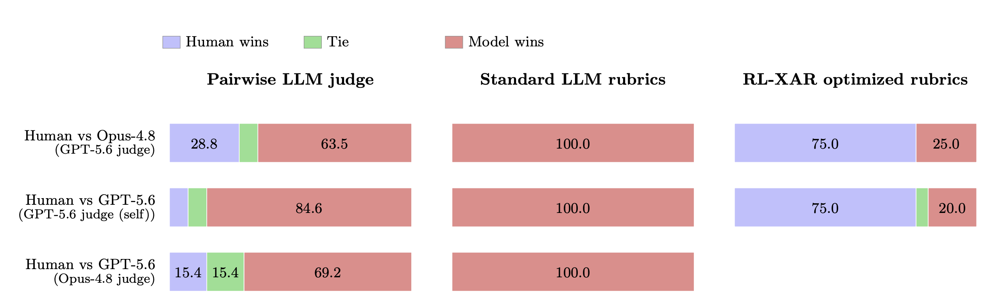</p>

*Figure: **Standard judgements (left, middle) rank the model above the expert human--- meta-optimizing the rubrics to be aligned with human experts reverses this (right).**
  If AI slop is judged to be better than human writing by the LLM grader, then training will encourage more slop.
  On an academic paper section writing task, we find standard pairwise LLM judges or LLM-generated rubrics score GPT-5.6 or Opus-4.8 higher than high-quality human writing. Our RL-XAR (eXpert Aligned Rubrics) approach instead meta-optimizes the rubrics on a training set of high-quality human-written sections, resulting in rubrics that reverse the result, and score the human writing higher on test papers.*


## RL from eXpert Aligned Rubrics (RL-XAR)

The previous section showed the failure to judge expert human writing exhibited by current systems. If AI slop is judged to be better than human writing by the LLM grader we use, then training against that grader will only encourage more slop. Given that we have access to abundant examples of expert human writing, one might naturally ask: _can this be fixed by learning better judgments?_

Our approach to learning rubrics, called eXpert Aligned Rubrics (*XAR*), is simple:
- Identify examples of well-above average / expert human writing, splitting it into context and continuation. 
- Generate competing model-based continuations given the same context, which we expect to be worse writing (i.e., slop). 
- The above data form learning pairs, where humans should be scored higher. This training data is then used to learn to generate rubrics that maximize the scoring *gap* between humans and models. 

Then, to train a model to be better at writing via reinforcement learning (*RL-XAR*) using these rubrics, we iterate the following steps:
1. Learn *XAR* rubrics maximizing the gap between humans and the current model, as described above.
2. Perform reinforcement learning on a training set using the learnt rubrics.
3. Repeat the procedure from step 1 until rubric learning can no longer identify a gap (i.e., we can no longer identify slop in the model).

We note that this approach is reminiscent of [GANs](https://arxiv.org/abs/1406.2661).


## Learning the rubrics: _can an LLM recognize expert writing?_ 

While the learning of rubrics could be done in many ways, in our experiments we use the following simple procedure of **meta-prompt optimization**.
We begin with an initial _meta-prompt_:  given an example context, it asks an LLM to generate rubrics for judging the continuation. We can score the quality of this meta-prompt using the human model gap on a (small) training set.

Our  optimization procedure then iterates a simple refinement loop over a fixed number of iterations. At each
iteration we show an _optimizer_ LLM the current meta-prompt, the human-model gap it
achieves on the training set, and the specific examples where it fails, and ask it to propose  a revision that would widen the gap “for genuine-quality reasons, not superficial tells”.  The meta-prompt is held to a bounded length, so the optimizer must consolidate criteria, rather than
adding ever more requirements. After optimization is complete, we keep the best performing candidate from across the iterations.


### Initial Empirical Investigation
To show the feasibility of our approach, we conduct 7 iterations of meta-prompt optimization on the previously described paper section writing task with a small set of 52 (paper, section) examples, split into 8 papers for training and 5 held out for validation. Muse Spark 1.1 is used as the rubric generator, writer model, and as the final rubric-based judge, and Kimi-K2.6 as the meta-optimizer. We find that the initial rubrics have a _negative_ gap, i.e. the model is preferred over expert human writing, but over meta-optimization iterations, the gap becomes positive at iteration 4, and then rises slightly over further iterations. The optimization both _increases_ the judgment scores of
 human writing  (3.4 to 5.0), and
_decreases_ the judgment scores of model writing (7.6 to 2.7).
The learned rubrics fix the failure of the pairwise judge and standard rubrics.


<p align="center">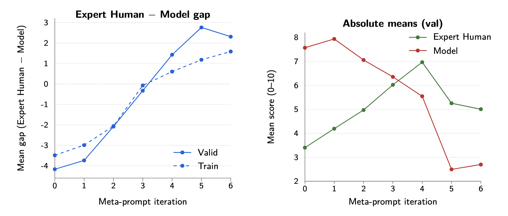</p>

<p><em>Figure: <strong>Meta-rubric optimization.</strong> Left: mean expert human-model (Muse Spark 1.1) gap by iteration for the <em>train</em> and <em>valid</em> splits; the validation
  gap (solid) climbs from -4.2 to +2.76, crossing zero (i.e., where humans are judged on average superior to the model) at iteration 4 and peaking at iteration 5, and roughly tracks the training gap (dashed) throughout—generalization to held-out papers, without overfitting. Right: validation absolute means—the gap increases from both
  directions, with the human's score <em>rising</em> (3.4 to 5.0) as the model's falls (7.6 to 2.7).</em></p>


### Analysis of the Learned Rubrics
The initial rubrics, before learning, tend to cover the paper's specific content---naming the concrete claims, methods, and
results a section must convey---so they yield long, paper-specific coverage checklists. We observe this has the unfortunate effect of creating a “mini-paper” within each written section. Such criteria reward fluent imitation, which restates material from across the whole paper, while
penalizing the selective human original for the detail it deliberately omits. Over the iterations the optimizer rewrites the guidance that  mis-scores
expert prose: docking the human for principled omissions, crediting a compressed summary as fluency, and mistaking surface polish for craft. The learned rubrics thus also tend to reward sectional ownership (i.e., not a miniature of the whole paper), disciplined selection, economy, and precise on-scope detail rather than breadth of coverage. Because the meta-prompt is length-bounded, the criteria settle into a small, stable, relatively paper-independent set that tends to sharpen what it rewards instead of accumulating requirements.


## Main Experiments

### Paper Section Writing

We first apply *RL-XAR* to scientific paper-section writing. 

**Task.** The model is provided the paper with one section removed and must write that section (abstract, introduction, related work, or conclusion) to best fit *this* paper, basing every claim strictly on the paper's actual content, with no invented numbers, results, or citations. 
The task prompt supplies a target word count equal to the original human-written section's length and asks the model to stay within roughly $\pm15\%$ of it. 

**Task data.** We collect 561  CS papers from the [S2ORC corpus](https://github.com/allenai/s2orc), holding out each of their four sections (abstract, introduction,
related work, conclusion) in turn, to form 2,243 (paper, section) training examples; each example
pairs the rest of the paper as context with the held-out human section as the expert reference.
A disjoint set of 90 papers (360 examples) is held out for validation.

**Training.** We reinforcement-learn Qwen3.5-27B, rewarding each generation by the learned rubric as scored by a cross-family Qwen3.8-2.4T-A95B judge. 
For rubric meta-optimization we use Kimi-K2.6. 

**RL-XAR loop.**
Following our method described above, we run three outer iterations of (i) meta-optimizing a
rubric to maximize the expert-human-model gap against the *current* model, where we
(ii) reinforcement-learn the model against the set of so-far collected rubrics. We train two iterations which re-target the failure modes compared to human writing that the previous round's model still exhibits on the first two rounds of rubrics, and use the third round rubrics to assess the model without the bias of retraining.

**Rubric Evaluation.** A model trained on one rubric can learn to satisfy that rubric alone, so we
evaluate every writer against *all three* sets of meta-optimized rubrics and rank by the
_minimum_ of the three human-normalized scores---the worst rubric, allowing no
cherry-picking. We use GPT-5.6 as a rubric judge for evaluation, so we do not evaluate with the same judge used for training.  
RL-XAR carries our 27B model to the top of this leaderboard among all writers: its strongest checkpoint reaches a worst-rubric score of 9.60
(human=10), ahead of every external frontier model. While we believe these rubrics are still potentially biased towards our model (having trained on the first two iterations) and still do not capture a fully accurate measurement of expert human writing, we believe they still reflect improved performance.


<p align="center">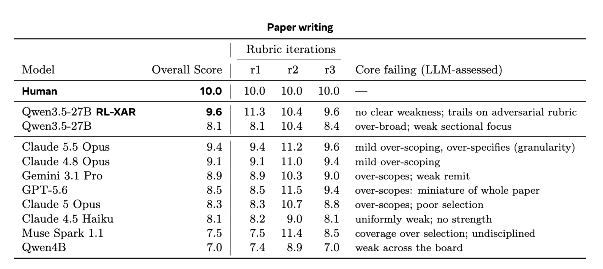</p>

<p><em>Figure: <strong>Test performance on academic paper section writing.</strong> Overall score is the <em>minimum</em> of the three iterations of expert-aligned rubrics using a GPT-5.6 judge, with human-normalized scores.  RL-XAR training of Qwen3.5-27B gives superior performance to its direct baseline Qwen3.5-27B and various frontier models according to these rubrics. The last column is an Opus 4.8 derived assessment of the core failing of each model given their rubric scores.</em></p>


**Expert Human Evaluation** We confirm these automatic gains by evaluating on the author's own papers, of which they are clearly expert. In a blind expert
side-by-side comparison of the RL-XAR model against the baseline Qwen3.5-27B on held-out sections, the RL-XAR writer was preferred by 16 to 2 (an 89% win rate), showing that the rubric-measured improvement corresponds to writing that expert readers actually judge better. We found that RL-XAR wins because the baseline generally has weak 
sectional focusing often creating a “mini-paper”, and simultaneously contains too many unnecessary details, e.g. numerical results when unneeded. Nevertheless, we did not find the RL-XAR generations to be perfect either, and expect better rubric optimization and graders could find more flaws -- which could be reinforced during training, i.e. using our approach with frontier models, rather than Qwen3.5-27B as a writer and Qwen3.8-2.4T-A95B as a judge.


<details>
<summary>See examples</summary>
  <p align="center">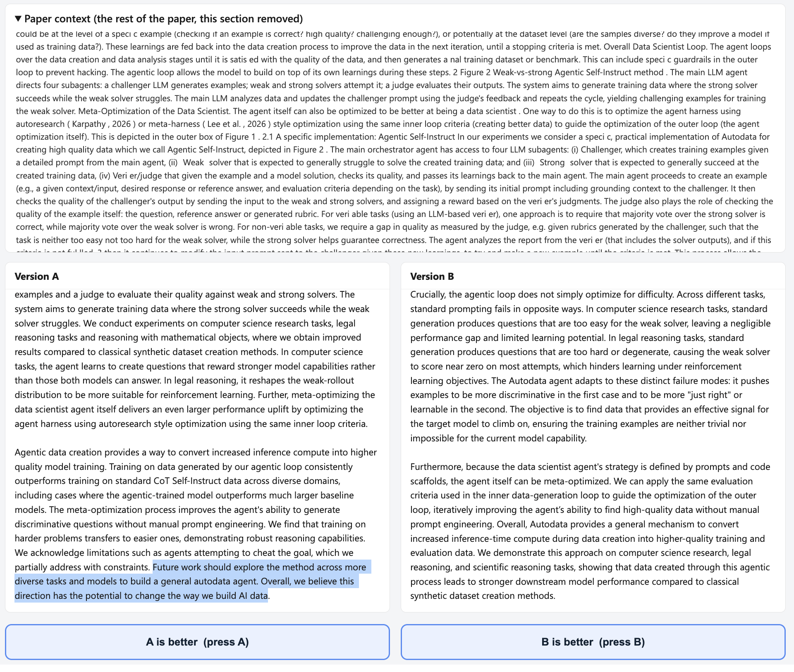</p>
  <p><em>Figure: <strong>Example of paper introduction writing (excerpt).</strong> The baseline Qwen3.5-27B (left) tends to write an over-scoped “mini-paper” for the introduction, including future work, whereas RL-XAR (right) scopes appropriately.</em></p>

  <p align="center">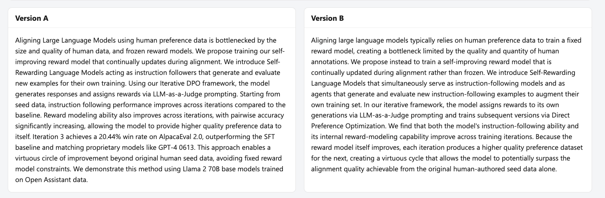</p>
  <p><em>Figure: <strong>Example of paper abstract writing.</strong> The baseline Qwen3.5-27B (left) tends to write too many unimportant details in the abstract, whereas RL-XAR (right) scopes appropriately, following the style of the rest of the paper.</em></p>

</details>


### Story Writing

**Task.** The model is shown a story up to a point where it stops mid-scene and must continue from exactly where it leaves off---matching the established voice, prose style, point of view, characters, setting, and tone---without summarizing, restarting, adding a title, or shifting genre. There is a provided length target (the human continuation's length, within ${\sim}\pm15\%$).

**Task data.** We select books that are public-domain titles from Project Gutenberg, quality-selected by an external human credential (e.g., Pulitzer and Nobel prize-winning authors) and biased toward each author's lesser-read works to limit memorization. Further, for any continuation where a temperature-0 probe reproduces more than 5% of the
reference's 13-grams, or a single contiguous verbatim run of 20 or more words is present, the example is dropped from the data.
We use 2,290 examples for training, 310 for validation. Each pairing consists of the story-so-far as context with the author's verbatim continuation as the expert reference. We further use a disjoint set of 52 examples for rubric meta-optimization with 20 held out for validation, and 60  for final testing.

**Training.** We use the same recipe as before---GRPO on Qwen3.5-27B using a Qwen3.8-2.4T-A95B judge.  We only ran a single iteration of RL-XAR in this case. We used rubrics generated from a meta-prompt optimized via Kimi-K2.6 with a Muse Spark 1.1 meta-prompt rubric generator, writer model, and judge.

**Rubric Evaluation.** We evaluate under the same story rubrics, but switch the judge to GPT-5.6, and report human-normalized scores. 
RL-XAR lifts Qwen3.5-27B from 2.8 to 8.2---the top of all writers, ahead of every frontier model (next best Claude 5 Opus, 6.8). 

**Human Evaluation** We confirm these automatic gains by human evaluation. In a blind  side-by-side comparison of the RL-XAR model against the baseline Qwen3.5-27B on held-out story continuations, the RL-XAR writer was preferred by 19 to 1 (an $95\%$ win rate), showing that the
rubric-measured improvement corresponds to writing that readers actually judge better. We found the baseline to be poor by not following the style of the story well. One noticeable feature is that it often falls back to clich\'ed or poor-quality  similes, e.g. *"the air hung over the table like a warm cloth"* and  *"the wind rustled the leaves, sounding like a whisper of warning, or perhaps a laugh"* that do not match the author's work.


### Authoring Wikipedia Articles

**Task.** The model is given only the article title and the target section heading---not the article body---and must write that body section from scratch to a specified target length, similar to the other two tasks. 

**Task data.** We select Wikipedia articles that carry a Featured- or Good-Article quality tier, and are again biased toward less-popular titles, and pass
the same memorization techniques as mentioned previously. We provide 1,187 training and  162 validation examples. We further use a disjoint set of 42 examples for rubric meta-optimization with 12 held out for validation, and 60  for final testing.

**Training.** We use a recipe identical to stories, optimizing the rubrics for this setting. 

**Rubric Evaluation.** We report results using the learnt Wikipedia rubrics, but using a separate GPT-5.6 judge. Here, we find RL-XAR moves Qwen3.5-27B only from 2.7 to 4.0: the gains are small and the model stays well below both the human and the frontier writers (GPT-5.6 7.9, Claude 5 Opus and Muse 7.2). Wikipedia section writing is the hardest of the three domains for this recipe, in part due to the inadequacy of the  Qwen3.8-2.4T-A95B judge, which is analyzed in the next section.


<p align="center">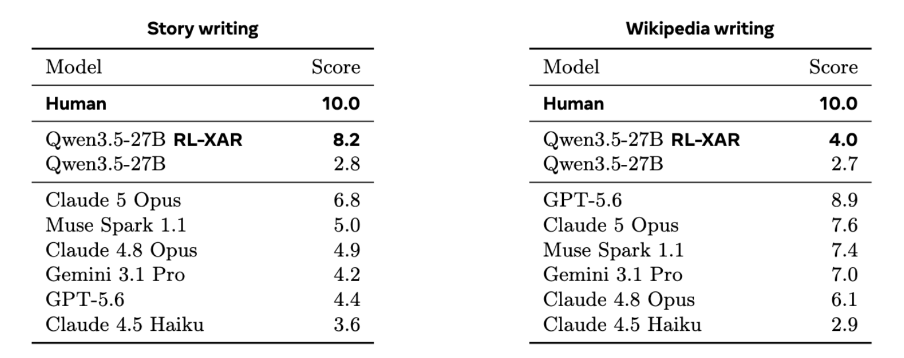</p>

*Figure: **Test performance on story continuation (left) and Wikipedia section writing (right).** Human-normalized rubric scores judged by GPT-5.6 are reported. Only a single iteration of RL-XAR is performed in each case, which gives large gains on the reported rubric on story writing (left) and moderate gains on Wikipedia writing (right). For Wikipedia, it appears the  model or Qwen3.8-2.4T-A95B judge used during training is too weak a grader to perform better.*


## Analysis, Ablations & Additional Experiments


**The Judge matters** Our results so far show the rubrics matter. Here, we show the quality of the LLM judge evaluating those rubrics is just as important. A weak judge simply cannot differentiate between expert human and model writing.


<p align="center">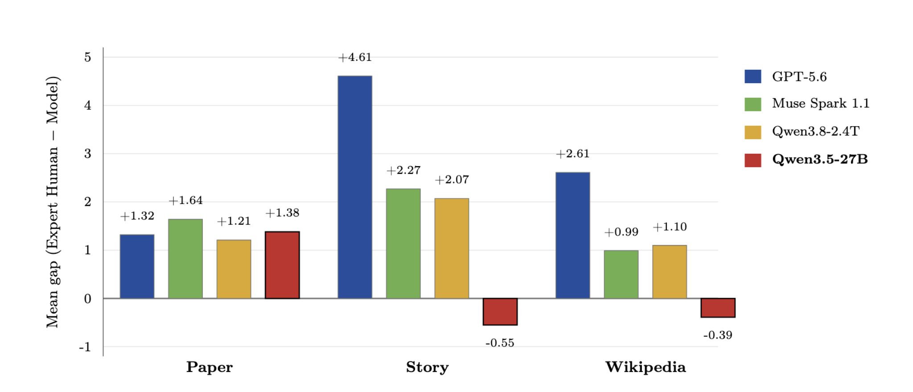</p>

<p><em>Figure: <strong>Comparison of Judges, averaged over XAR-optimized rubrics.</strong> Mean human-model gap (writer = Muse Spark 1.1; positive = human favored) for each judge,   with judges in decreasing capability order. On Story and Wikipedia Qwen3.5-27B (red) is the only judge to turn <em>negative</em>, ranking the model  <em>above</em>  human writing (-0.55 story, -0.39 wiki); on Paper the four judges are close and all human-favoring. A weak grader is incapable of seeing the gap.</em></p>
    

**The Meta-Optimizer matters**
We compare Muse Spark 1.1, Opus 5 and Kimi K2.6 as rubric meta-optimizers, each averaged over 3 seeds, reporting the human-model validation gap of Muse Spark 1.1 as a paper section writer. We find that Kimi and Opus can find a positive gap, but Muse Spark 1.1 struggles. Likely, weaker models struggle even more.
Finally, we note we used a simple iterative refinement meta-optimization method, when many [other methods](https://github.com/stanfordnlp/dspy) exist. We conducted preliminary experiments on a GEPA optimization variant, but it did not yield superior results to our main reported results, and we leave such investigations for future work.


<p align="center">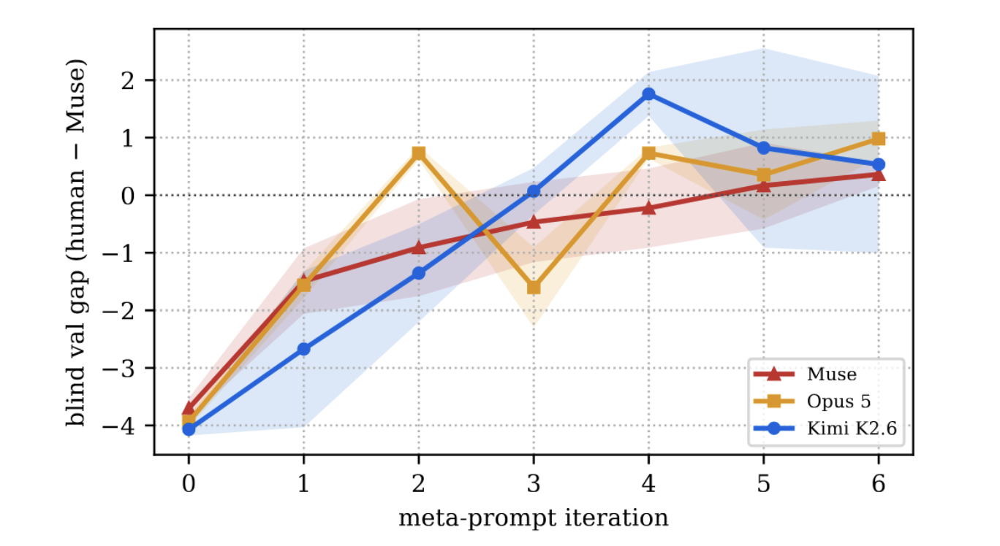</p>

*Figure: **Different Rubric Meta-Optimizers.** Mean (human-model) gap per optimizer, averaged over three seeds.*


**Expert humans matter** Using examples of expert human writing matters for rubric optimization. We validate this by using papers judged to be low, medium and high quality human writing, and evaluating them against our learned rubrics. Comparing humans to GPT-5.6 we observe a gap of +1.39 for high quality human writers, +0.95 for medium quality and only +0.37 for low quality. Hence, using low quality writing against a strong model writer would likely be unable to find useful rubrics or a human-model gap. Additionally, if the learned rubric measures genuine quality, the human-model gap should be larger for better written human papers and smaller for weak ones, which is what we observe.

<p align="center">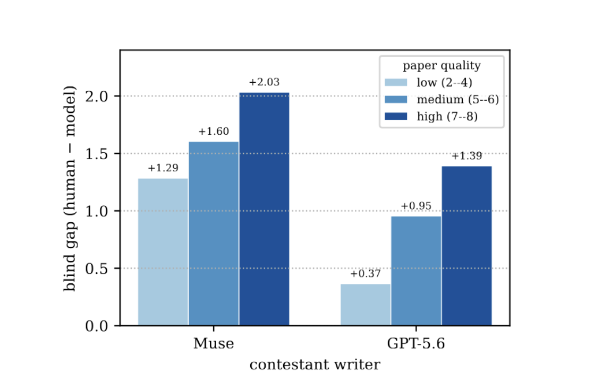</p>

*Figure: **Expert humans matter**. Human-model gap by paper human writing-quality bin (low/medium/high, light to  dark), comparing with two models (Muse Spark 1.1 and GPT-5.6).  If the learned rubric is measuring genuine quality, the human-model gap should be larger for better written human papers and shrink for weak ones, which is what we observe.*


**Rubrics generalize across strong Judges.** If two different judges are both strong enough, we observe that one can optimize rubrics for one judge, and we see those rubrics work for a different judge. For example, we show this below for GPT-5.6 and Muse Spark 1.1 judges.


<p align="center">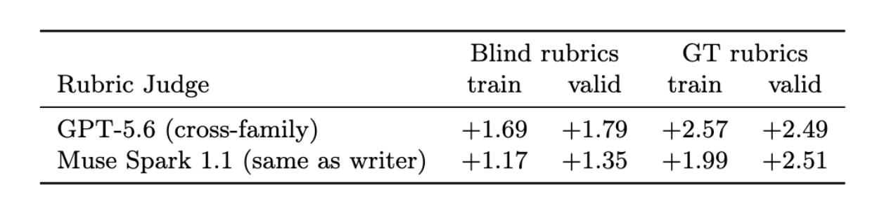</p>

*Figure: **Cross-judge robustness of rubrics:** mean gap  (human-Muse Spark 1.1) on the paper section writing task,
    scored by the cross-family GPT-5.6 judge versus the Muse Spark 1.1 judge. The human is preferred under both judges on every
    split and variant. Ground Truth (GT) rubrics are built by including the hidden section as input when generating rubrics via the meta-prompt, thereby biasing scores towards the human-written completion.  GT rubric scores are thus higher across the board.*


**Length constraints and rubrics**
In early experiments we found that standard models, given the task of paper section writing without a specific instructed length constraint, tend to write overlong sections -- as much as two or three times as long as the hidden original human sections. This tends to allow them to score more highly on the given set of rubrics, similar to other [instruction following settings](https://arxiv.org/abs/2406.17744). We therefore chose to define length-constrained tasks instead, i.e. to write a section similar to the original human length. Strong models are capable of this, although we observed an unwanted side effect that they tend to reserve a lot of chain-of-thought thinking towards this constraint (e.g., word counting).


**The need for iterative rubrics.**
For paper section writing, we note that in the first iteration of RL-XAR training an evaluation of (11.0, 7.0, 8.4) is obtained across the three rounds of rubrics. Round 1 rubrics are optimized, giving a high score, but at the cost of round 2 rubrics, which are not optimized -- a score of 7.0 being far below the starting point 10.4 of Qwen3.5-27B. Iteration 2 training restores the performance of round 2 rubrics to baseline model performance, while scoring highly across the other two sets of rubrics.

**Training rubrics online.**
We also briefly experiment with a fully online (co-training) objective where the writing generator is optimizing for the rubrics, and the rubrics are simultaneously being trained to optimize the human-model gap for the current policy -- for the latter, generated rubrics are rewarded by the normalized gap.
While we leave subsequent experiments for future work, our first results in this direction on the story task are positive, with a gain from 2.8 (Qwen3.5-27B) to 6.0 (online RL-XAR) using the same fixed (learnt) rubric applied in our earlier experiments.


<p align="center">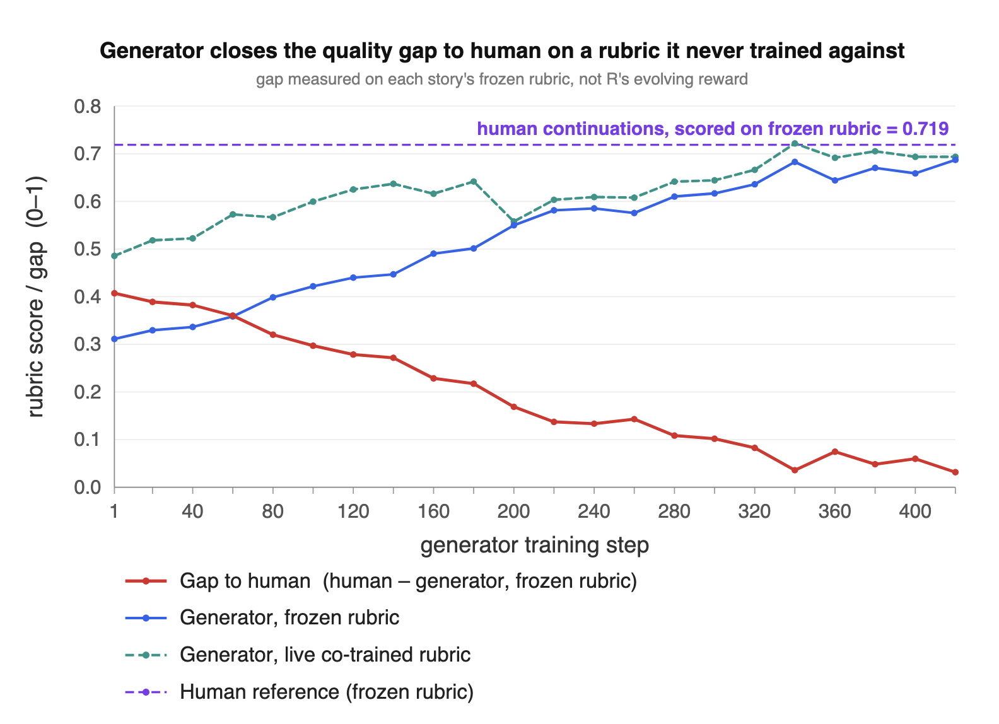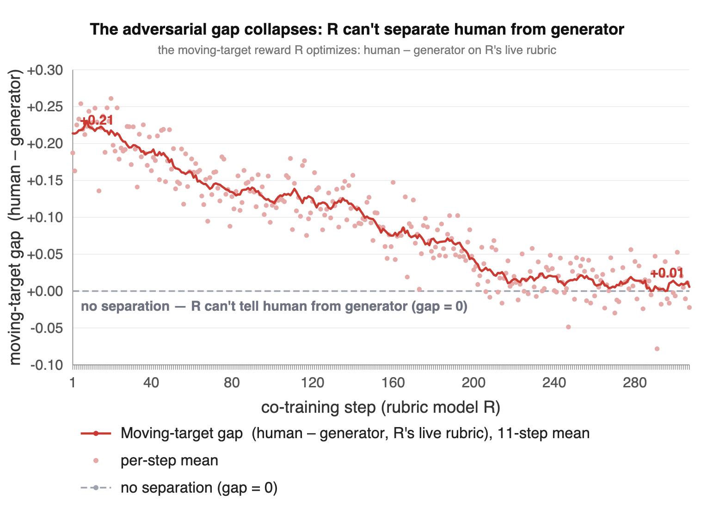</p>


## Conclusion 
We introduced **RL-XAR**, Reinforcement Learning from eXpert-Aligned Rubrics, a recipe that
turns readily available expert human writing into a learned, expert-aligned reward and then optimizes
against it. Its key step meta-optimizes a rubric generator to maximize the gap
between expert human text and current model generations, iterating until no discernible gap
remains; standard RL against the resulting rubrics then improves writing quality. Across three
domains---writing academic paper sections, Pulitzer- and Nobel-grade story continuation, and Wikipedia
section writing---RL-XAR yields large gains over the base model.


## Contributors
Jason Weston, Ilia Kulikov, Swarnadeep Saha

## More details
We plan to put a full technical report on arXiv soon.

## Citation
You can cite this blog (before the full paper is released) here:
```
@article{weston2026unslop,
  title   = "Towards RL for Superhuman Text: Unslopping AI",
  author  = {Weston, Jason and Kulikov, Ilia and Saha, Swarnadeep},
  year    = "2026",
  month   = "September",
  url     = "https://facebookresearch.github.io/RAM/blogs/unslop_ai/"
}
```
